# FromThePage

FromThePage is a open source or hosted transcription platform which is a great way of transcribing manuscripts. It has a long history of working with cultural heritage institutions and offers powerful full page transcription software that can be used either by public volunteers or a private group of collaborators. It offers export of this data as TEI or as IIIF Annotations. 

There are many different use cases for this product but to focus on one that is given on their website: Classics professor, Adam Rabinowitz, at the University of Texas uses FromThePage to run a class based project where students are first asked to find a collection of letters in the University library and are then given access to FromThePage to transcribe them. The letters are are from a collection of a Texas Judge and Legislator Alexander Watkins Terrell who tried to convince the University to buy the ancient city of Troy. Once the students have done the transcription it is assessed by the course tutor and they are given access to a larger part of the archive which has already been transcribed. They are then have to write a report using the source material on whether the university should have purchased these antiquities in the 1890s. You can see further details on this use case in the [FromThePage blog](https://content.fromthepage.com/transcription-for-pedagogy/).

There is a step by step guide below and accompanying video on uploading a manifest into FromThePage and starting to transcribe it. The step by step guide is shorter than the video as it miss out some steps and skips some of the questions there were asked in the original workshop.

<iframe width="560" height="315" src="https://www.youtube-nocookie.com/embed/TkhEnlI708A" title="YouTube video player" frameborder="0" allow="accelerometer; autoplay; clipboard-write; encrypted-media; gyroscope; picture-in-picture" allowfullscreen></iframe>

## Step 1 - Find content

FromThePage will import images from a Manifest so you can follow the guide given in [Finding Yale Manifests](../../basics/finding_yale.md) but note you will need a version 2 IIIF manifest.

For this guide I will be using the following item from the Yale University:

[https://collections.library.yale.edu/manifests/30907745](https://collections.library.yale.edu/manifests/30907745)
 
 _[Peruvian Pamphlets 60](https://collections.library.yale.edu/catalog/30907745)_
 
Which is from the Beinecke Rare Book and Manuscript Library collection.

## Step 2: Sign up for a Free Trial

FromThePage is available open source for you to install on your own infrastructure but it also offers a paid for hosting service. We will be using a trial version of the hosting service for our guide. You can see a full [pricing guide](https://fromthepage.com/pricing) on the FromThePage website. The trial login is free and you don't need to add any payment details. To sign up for a new trial account go to:

[https://fromthepage.com/users/new_trial](https://fromthepage.com/users/new_trial)

## Step 3: Start a Project

Once you have a login navigate to your Dashboard by using the link at the top of your web page which is highlighted below. Then click Start a Project.

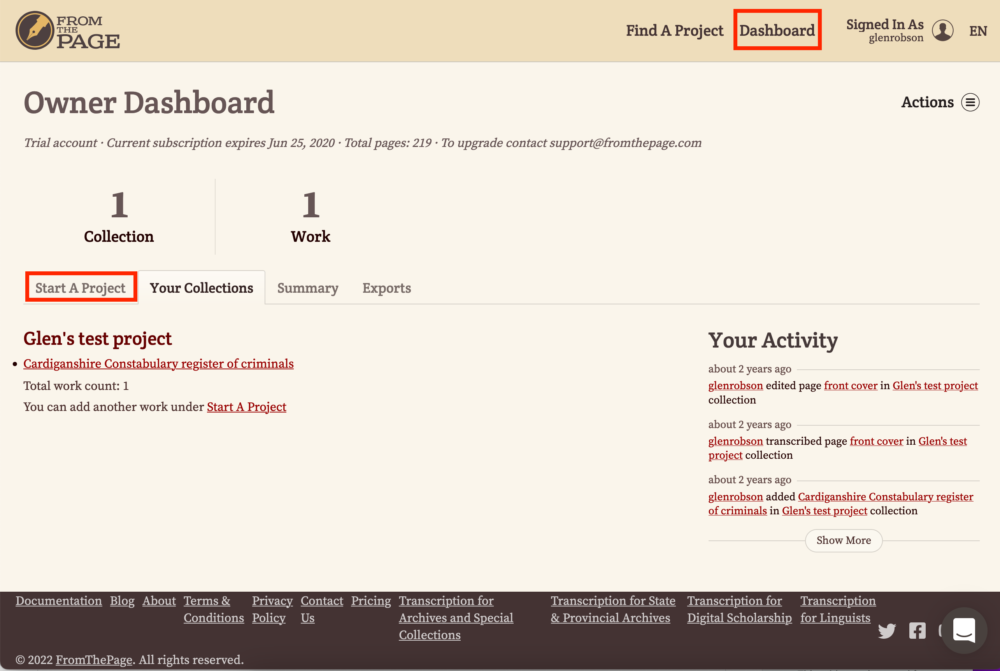

This will show you a list of ways to import material but for this project we would like to click the Import a IIIF Manifest or Collection. Once this is clicked a text box will appear and you can paste your Manifest link and click Import. 

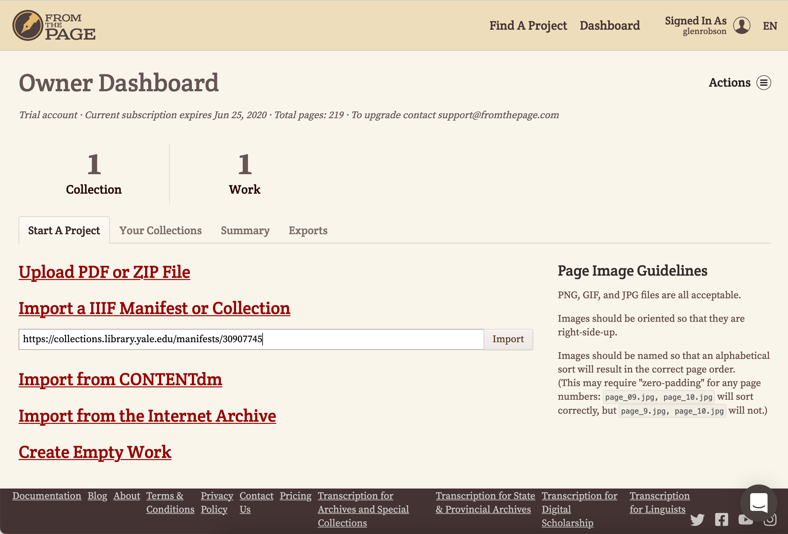

Next we have to choose a collection as projects can have multiple manifests in them. If you scroll to the bottom and select New Collection in the drop down.

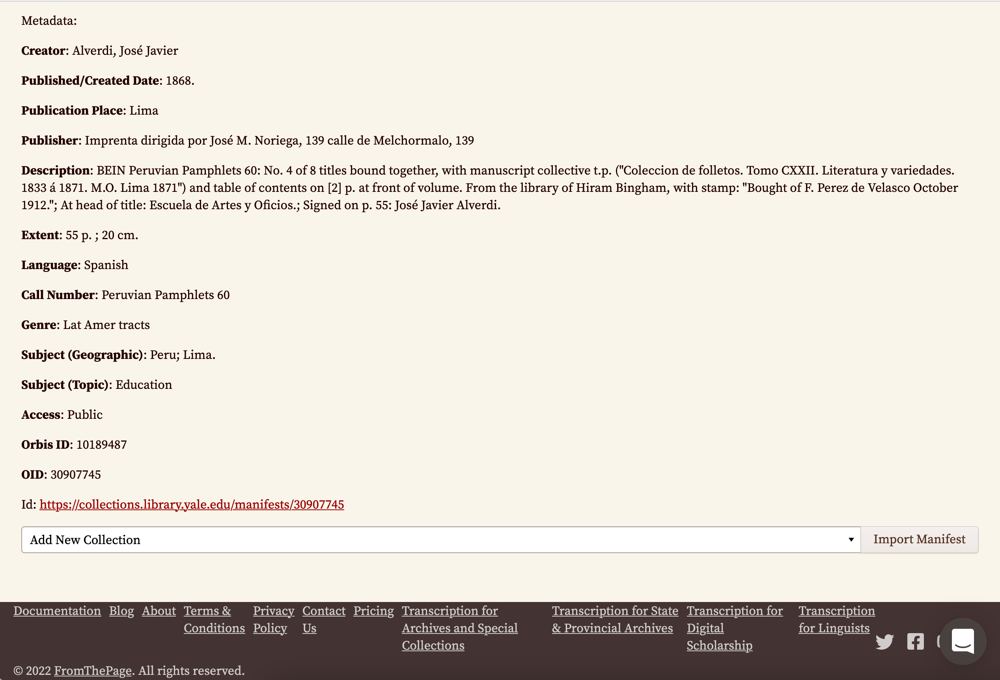

Once you select New Collection the following dialog will appear. Enter a collection title and optional description then click Create Collection. 

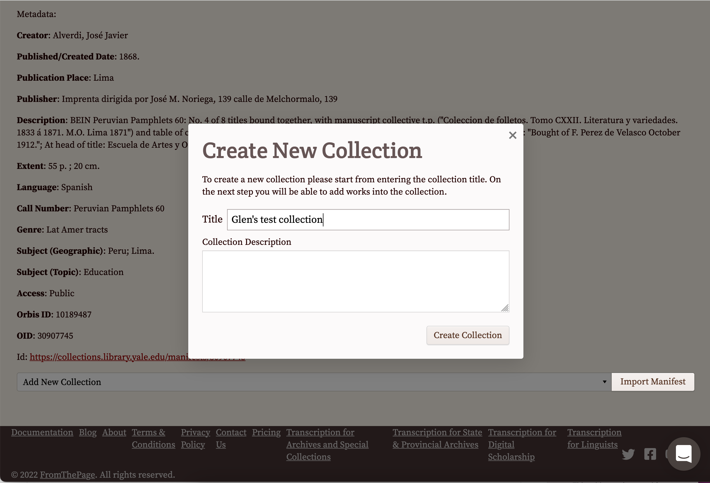

Now we have our collection we can click Import Manifest. This may take a few minutes if your Manifest has a lot of pages. 

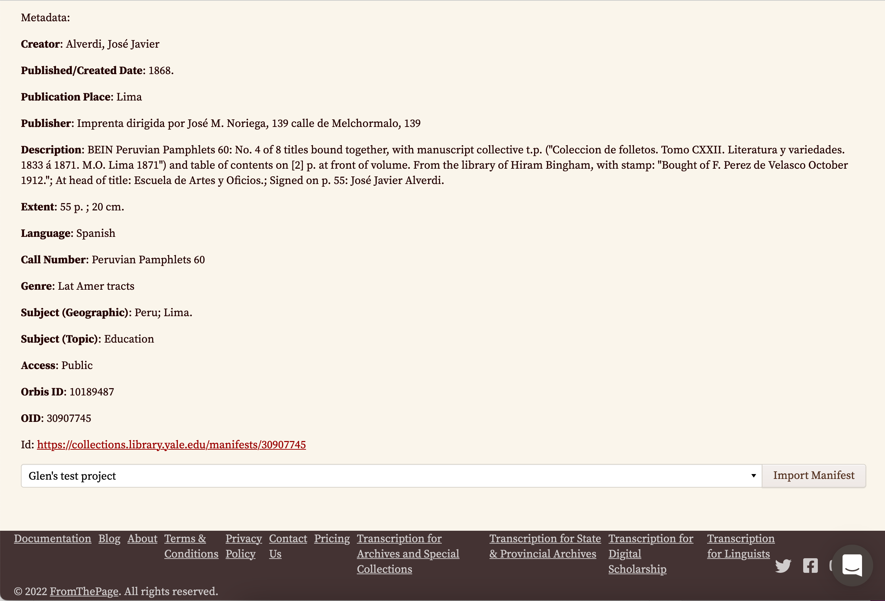

You will now be taken to a page which shows you all of the pages or canvases in the Manifest. 

## Step 4: Start Transcribing

From the list of Canvases page choose a page to transcribe and click the help transcribe link. 

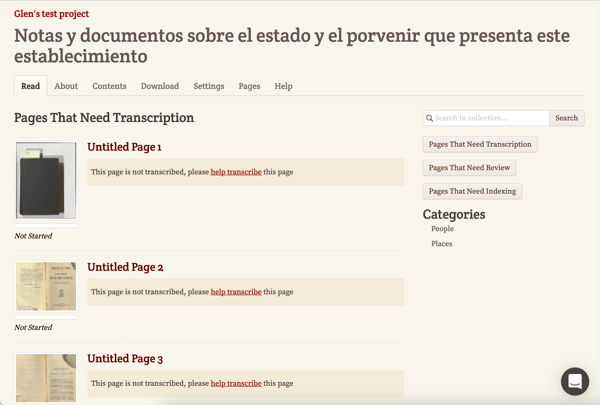

You will now be taken to a screen where you can do the transcription. This has your image on the left hand side which can be zoomed to make out difficult characters and a text box on the right where you can enter your transcription. FromThePage has a powerful wiki markup interface where you can enter controlled vocabularies and this is covered in the video at the top of this guide. 

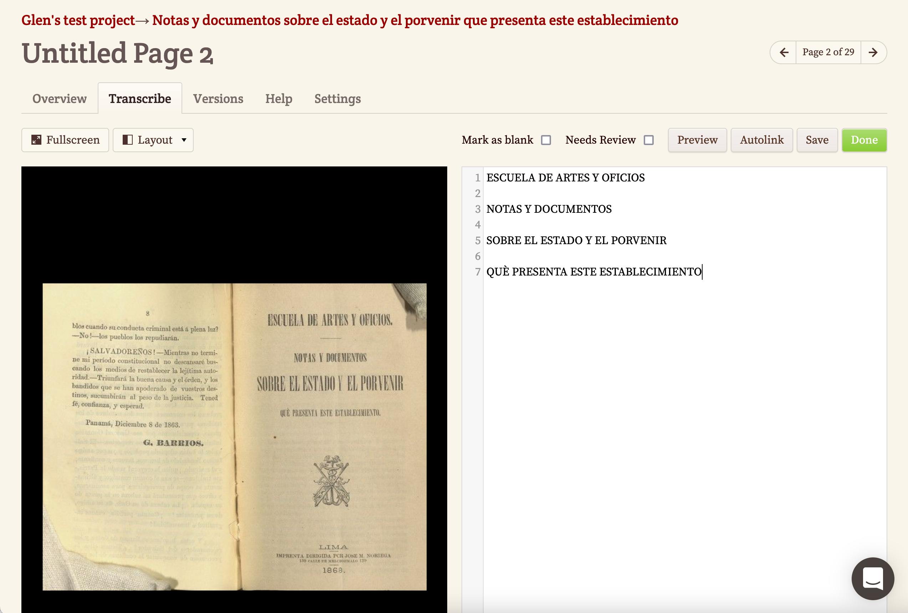

Once you have finished your transcription click Save.

## Step 5: Open up access to your transcriptions

Before we look at exporting we need to open up access to the IIIF API for our collection. At the Top of the transcription page there is a link to your collection. Mine is called 'Glen's test project'. 

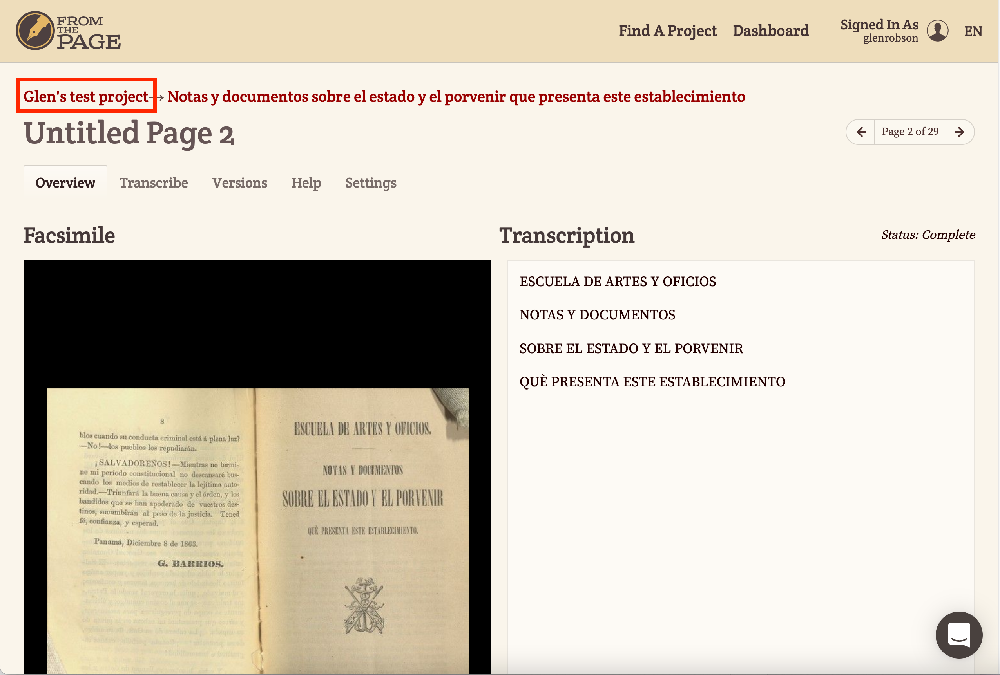

On the collection page select the collection settings.

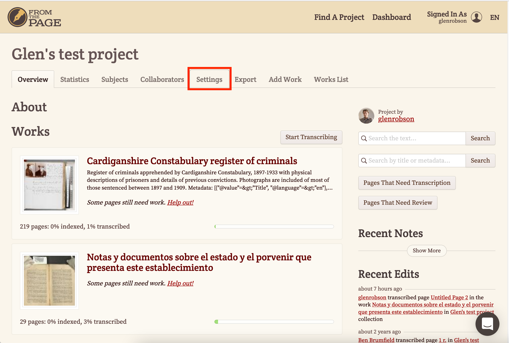

Then scroll down the settings page until you see the API Access section and click the Open API button. This will mean you can access the IIIF manifest in the next stage. If this is not present then your Manifest will be available but it won't show any annotations in Mirador. 

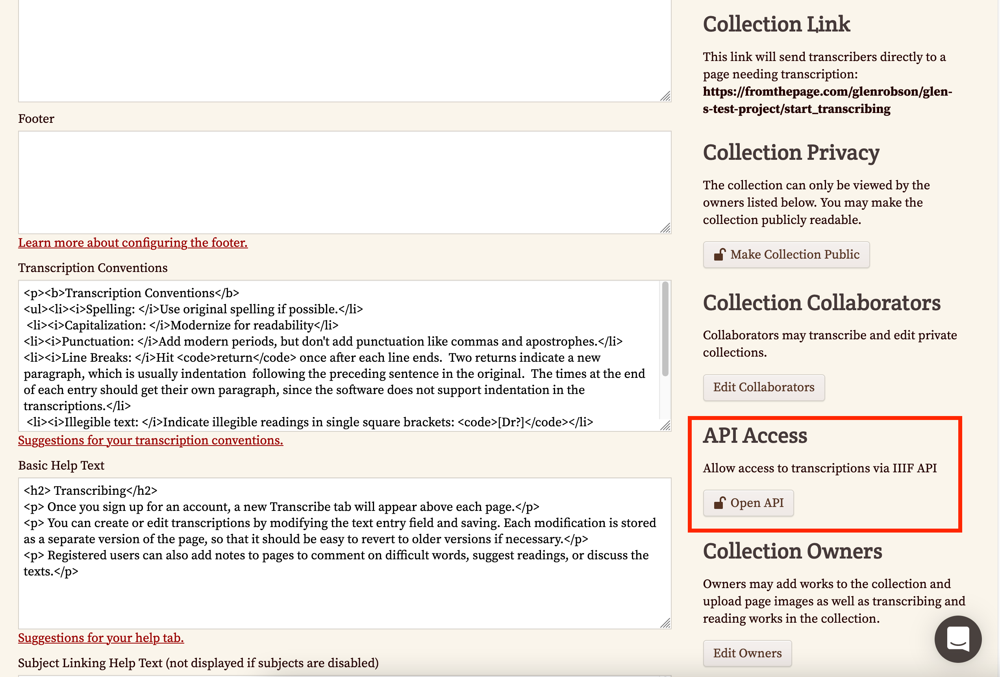

## Step 6: Export

Now we have done some example transcriptions lets see if we can export them and view them in a separate IIIF viewer. We are going to use Mirador as this allows you to view annotations. 

The first step is to get to your object details page and you can do this by clicking your project details as highlighted below.

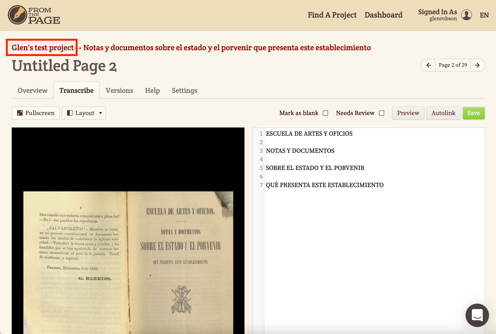

Now we need to go to the Export tab.

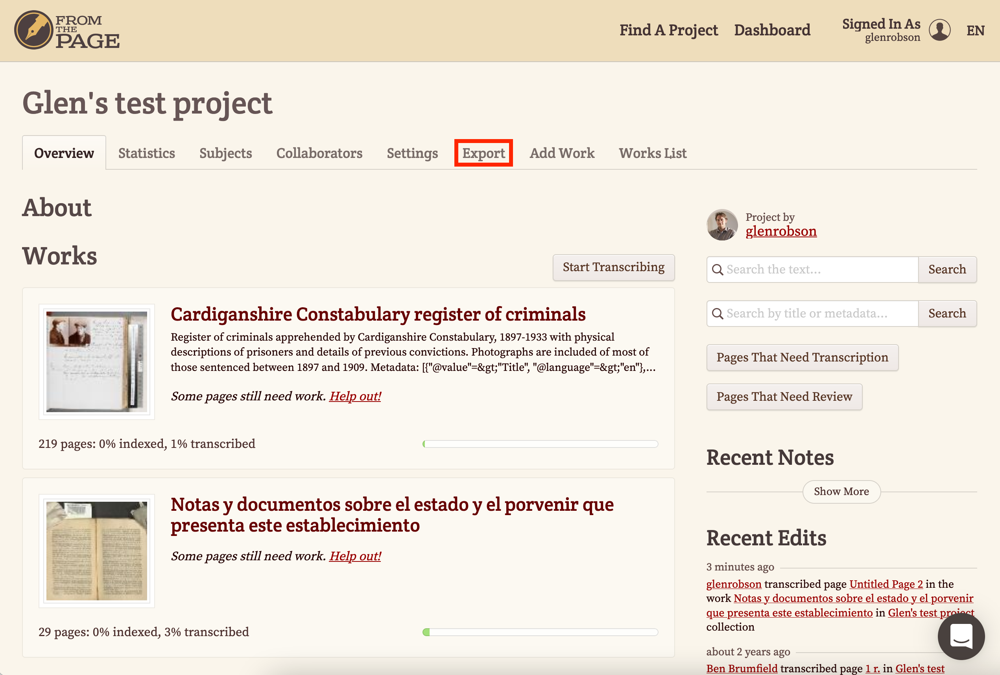

This will show you all of the material that you have transcribed. You can download a TEI transcription or in our case we would like to use a IIIF version of the transcription. Right click on the IIIF link and select Copy link.

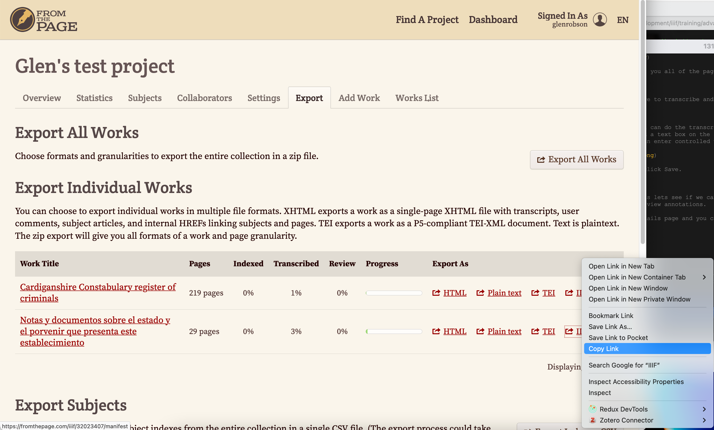

This link will be to a IIIF manifest which contains the transcriptions. We now want to open this up in Mirador and you can add your Manifest URL which you have just copied on to the end of the following URL:

https://projectmirador.org/embed/?iiif-content=

So it will look something like this:

[https://projectmirador.org/embed/?iiif-content=https://fromthepage.com/iiif/32023407/manifest](https://projectmirador.org/embed/?iiif-content=https://fromthepage.com/iiif/32023407/manifest)

In Mirador you should click on the hamburger symbol at the top left to access the Manifest details. Then if you are on a page which has a transcription you should see a orange dot next to the speech symbol. If you click this it should show the annotations you created in FromThePage. 

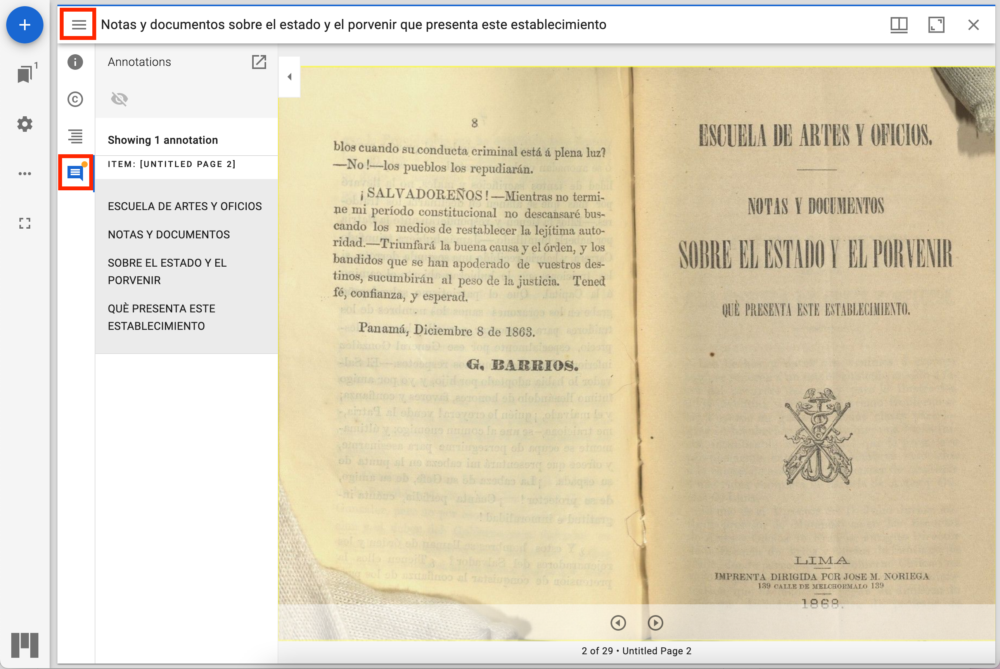

