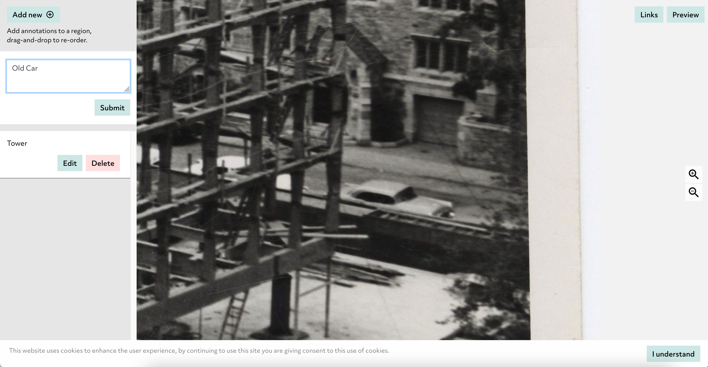

# Omeka

Omeka is a system which allows you to create a website and is primarily focused on Digital Humanities projects and making collections and their interpretation available. There are two versions in use today; [Omeka Classic](https://omeka.org/classic/) and [Omeka S](https://omeka.org/s/). IIIF support is available in both but as Omeka S is the latest version we will be focusing on this version for our tutorial. Out of the box Omeka S supports the linking of IIIF images into a Omeka S Website. There are various modules available which extend this support and we will discuss a few options in this workshop. 

To demonstrate the capabilities of Omeka S we will start with a Use Case from the University of Ghent which was presented at the IIIF 2022 conference in Cambridge by Lise Foket. Once we have looked at their implementation we will go through the steps to replicate this project using the demo instance of Omeka S. 

## Use case - University of Ghent DH department

The use case presented at the IIIF conference was a group project looking to increase digital skills for a class of students taking a Masters of Cultural Sciences course. The participants were split into small groups and were asked to create a small website using Omeka on the theme of a Belgium tradition or a Belgium place. The project was undertaken in the context of teaching the 15 digital competencies they defined as essential for the 2019-20 academic year. These are:

1. Discover
2. Source criticism 
3. Capture 
4. Collect 
5. Modeling 
6. Data cleanup 
7. Enrich  
8. Automate 
9. Analyse 
10. Visualize 
11. Store
12. Spread/Share 
13. Collaborate 
14. DH Discipline 
15. Society & ethics 

For a definition of each competency please see the [Digital Literacy in the Faculty of Arts and Philosophy paper](https://www.ghentcdh.ugent.be/projects/digital-literacy-faculty-arts-and-philosophy) (English pages 5-7). In the [paper](https://docs.google.com/presentation/d/18sGIGzdls5Q_EXLMZvL3d7Ya1nvyCzAC/edit#slide=id.p5) given by Lise Foket at the IIIF conference there was a review on how they met these digital competencies with the Omeka task.

The project was undertaken using the following workflow:


### Add digital items
In this project they used a number of Omeka S modules to directly add images to Omeka S and get access to IIIF images and Manifests. The module they used was called [IIIFServer](https://omeka.org/s/modules/IiifServer/) and this provides a IIIF image server and manifest generator. We will not be able to use this module on the demo Omeka S instance but this is useful if you want to combine IIIF images available at Yale with content that is not available as IIIF. 

### Add metadata, tags and mapping
Omeka S has extensive metadata editing capabilities and we will see this in the demo instance later. It is possible to add tags to content and also geo-locate images. 

### Create web pages, Use storiies and Exhibit 
Creating Web Pages is the one of the main features of Omeka S and with the possibility of embedding IIIF enabled tools like [storiiies](https://storiiies.cogapp.com/) and [exhibit](https://www.exhibit.so/) provide a rich interactive method of telling stories with collections.

You will see in the guide below that we are limited to using IIIF Images not Manifests in the demo Omeka S instance but there are a couple of useful modules which allow you to work with Manifests and embed either the [Universal Viewer](https://omeka.org/s/modules/UniversalViewer/) or [Mirador](https://github.com/Daniel-KM/Omeka-S-module-Mirador).  

### Share the collection
For the Ghent project unfortunately the projects couldn't be shared due to copyright issues with the source material but there are a couple of example Omeka S projects which are similar:

 * [Looking at interior design through historical crime scene photographs](https://www.omeka.ugent.be/interieurdesign/s/plaatsdelict/page/welcome)
 * [An exhibition on the Belgium artist Yvonne Serruys](https://www.omeka.ugent.be/YvonneSerruys/s/in-het-spoor-van/page/welcome)

Both websites are in Dutch but can be translated using Google translate:

[https://translate.google.co.uk/?sl=cy&tl=en&op=websites](https://translate.google.co.uk/?sl=cy&tl=en&op=websites)

For the exercises below we will be creating a public website but note the demo instance of Omeka S is reset every couple of days and the data is removed. 

# Hands on Omeka S

Using the Ghent project as an inspiration we are going to use content from Yale University to build a simple Omeka S website. We will use the workflow explained above with IIIF images from Yale manifests.


## Step 1: Add digital items

The first step is to find some IIIF images to work with. As mentioned previously through a module it is possible to load Manifests into Omeka but out of the box Omeka only supports the IIIF Image API. In later steps we will be associating a geographical location with the item so please find something that can be associated with a map. 

To find a Yale manifests to work with please follow the instructions in [Finding Yale Manifests](../../basics/finding_yale.md).

Once we have a manifest we need to choose an image to work with. Follow the instructions in [Finding images in Manifests](../../day-two/image-servers/images_in_manifest.md) to find a IIIF Image URL.

If you are struggling to find a manifest you can use the following example:

 * [Photograph of Beinecke construction](https://collections.library.yale.edu/catalog/2037663)
 * [Manifest](https://collections.library.yale.edu/manifests/2037663)
 * Image URL: [https://collections.library.yale.edu/iiif/2/1133457](https://collections.library.yale.edu/iiif/2/1133457)

Now we have a IIIF image we need to upload it to Omeka S. We will be using the demo/sandbox version of Omeka S which can be accessed at the following URL:

[http://dev.omeka.org/omeka-s-sandbox/login](http://dev.omeka.org/omeka-s-sandbox/login)

You can use the following login usernames and passwords:

 * ***User:*** omekasdemo1@example.com ***Pass:*** omekasdemo1
 * ***User:*** omekasdemo2@example.com ***Pass:*** omekasdemo2
 * ***User:*** omekasdemo3@example.com ***Pass:*** omekasdemo3

For further details on this sandbox version please see the [Omeka website](https://omeka.org/s/download/#sandbox) and please note sandbox content is reset every Monday, Wednesday, Friday, and Sunday.

Once you have logged in you should see the screen below. To connect a IIIF image we are going to add a new Item. Click on one of the two `Items` links highlighted in the image below:


Once you have clicked the items link you will see all items that have been uploaded to this instance of Omeka. As this is a sandbox you will see a set of default images and also any images that people have added since the instance was last reset. We are going to add a new item and link it to the IIIF Image URL we retrieved earlier. 

Click the Add new item button highlighted below:


We will be coming back to add metadata but select the Media tab to add the IIIF image:


From the Media tab you can add various digital resources either directly via upload or in our case where we will add a link to our IIIF Image. Select the IIIF Image box on the right hand side to add it to the resource.


Once you have clicked on the IIIF Image media type on the right hand side you should see a box appear in the center which will allow you to enter a title for your image and a IIIF Image URL. 

***Note:*** Omeka requires the info.json at the end of the IIIF Image URL. So the URL you got from the earlier process will look something like:

 `https://collections.library.yale.edu/iiif/2/1133457`

To add the info.json just add `/info.json` so it looks as follows:

 `https://collections.library.yale.edu/iiif/2/1133457/info.json`


You can now move on to the next step where we will add metadata to our item. 

## Step 2: Add metadata, tags and mapping

If you switch back to the Values tab you can now add some brief metadata.

 1. Select Image as the class or type of the item
 2. Add a title for your item
 3. Add a description


### Tags

Omeka S has a powerful metadata editing functionality and allows you to associate any Linked Data ontology to your item. Out of the box it supports Dublin Core, a Biblographic Ontology and foaf (Friend of a Friend). For the pruposes of this demonstration we are going to treat tags as `foaf:topics` or `dcterms:subjects`. The process for doing this is as follows:

 1. Use the search bar to filter the metadata fields for `topic` and select the topic option. This will add a topic block to the center panel.
 2. You are then given an option of whether to enter this value as either:
   * A text string as given in box 3.
   * An Omeka resource if you want to relate it to another item in Omeka or create topics within Omeka
   * A URI which links this item to an external authority as seen in box 4.
 3. If you chose to add the topic as text you will be presented with a text box
 4. If you chose to add the topic as a URI you will be given the option to enter a linked data URI and label
  

 

### Mapping

Next we are going to link this item to a geographical place and for this we are going to switch over to the Mapping tab. Use the map to zoom into where you would like to place your map marker and click the map marker button on the left hand side. This will change your mouse pointer to a map marker and click on the map where you would like it to be set:


Now we have created our IIIF image item, added some metadata and linked it to a geographical place. We can now add it to Omeka by clicking the Add button at the top right of the New Item screen.

## Step 3: Create web pages 

Now we have created an item we want to create a website to show the item in context. In Omeka this is done through the use of Sites and you can have multiple Sites in a single Omeka instance. Click the Sites link highlighted below and click the Add new site button:


Now enter a title and description for your web site then click Add:


Now we have created our Site we need to associate the item we uploaded with our site. To do this click on the Items link on the left. Hopefully your item will be at the top but there is also an advanced search option. Once you have found your item click the pencil icon to edit it.


Once your item is open click the Sites tab highlighted to get to the area where you associate this item with your site. The sites on the right hand side are ordered by user so select your user (likely to be DEMO 1, DEMO 2, DEMO 3 or DEMO 4 depending on which login you chose) and then select your site.


Once your site is selected you should see the following. Now click Save to save your item now you have edited it.


Now go back to you site by clicking the Sites link highlighted and then the pencil symbol next to your site.


Now click the Pages link on the left. Here we can see the Welcome page. We could add a new page but for this demo we will just edit the Welcome page so click the pencil symbol next to Welcome.


Omeka builds pages by adding blocks of content. You will see you can edit the Title and URL slug. The URL slug is the part of the URL that appears in the website link and is best left alone at this point. Feel free to edit the Title.


If you edit the HTML welcome text you will see it pops up a text editor where you can add style and formatting. There is also a source button where you can directly edit the underlying HTML.


Now we want to add our item as a block. To do this click the Media Embed option. This will add a Media Embed block to the centre screen. Change the Alignment to be Center and click the Add attachment to assign our item.


Clicking the Add attachment button will give you the screen below where you can select your item. If your item is not present ensure you have added the item to the site as discussed above.


Once you have selected your item ensure you click the Apply changes button at the bottom right of the screen to add your item to the media embed.


We can now preview out site to check it is looking OK. Click the save button to save your changes then click the View button which will open your site in a new Browser Tab. 


If all has gone well you should see something similar to the following:


Now we can switch back to our page in Omeka and add a Map block to show where this item is located. Click the Map by attachments block and add your attachment as you did with the Media element.


Then click Save at the top right and then click the View button to see if your map has now appeared. 


## Step 4: Use Storiiies and Exhibit 

We can now expand our website to include interactive IIIF tools like Storiiies or Exhibit. We will start with Storiiies as we have covered Exhibit in the [Working with Exhibit](../../exhibit/exhibit.md) tutorial. 

Storiiies is similar to Exhibit but only works with a single image rather than a Manifest. As we are working with single image in this workshop it is a good choice for us. Navigate to the Storiiies editor:

[https://storiiies-editor.cogapp.com/](https://storiiies-editor.cogapp.com/)

and add in your IIIF URL. For storiiies you don't need the info.json at the end. You will also need to give your story a title and your email address. You will get an email with your storiiies link if you later want to edit it. 


Once you have created your story you will be presented with your image on the right/centre and an add annotations button on the top left. If you zoom into the image then click add annotation you can associate text with the area of the image you are looking at. 


Once you have added a few annotations by moving around the image and clicking add annotation you should see something similar to:



You can click the Preview link to see a version you can click through but for Omeka we need to embed this viewer into the Omeka site. To do this click the Links link at the top right then copy the HTML given in the embed box. It will look something like this:

```
<iframe width="100%" height="600" src="https://storiiies.cogapp.com/viewer/9c3cd/Beinecke-Library-?embed=true" title="Beinecke Library "></iframe>
```


Now switch back to your Omeka S instance and open up the welcome page for editing. Add a HTML block to your page. I've moved my HTML block to the top of the page but this is optional. To change the order click on the hamburger symbol (three horizontal bars) and drag to re-order.

Once you have a HTML block click the source button.


Paste in the code you copied from storiiies and click OK:


Then click save page and view to see if your story now appears on your site. 


### Exhibit

Embedding Exhibit is very similar. To access the embed HTML click the share link at the bottom then copy the embed code highlighted in the image below. Add this copied HTML to a HTML block as detailed for storiiies. 


## Step 5: Share the collection

The final step is to share your project with others. As we have been using the public version of Omeka your website is now available to anyone with the URL until the data is reset. The URL to share is the one you are looking at when you click the View button of a page.

# Conclusion

Hopefully we have demonstrated how to make a powerful IIIF driven website with Omeka using only the tools it provides by default. There are many modules which could be used to enhance this website but I think even out of the box Omeka is a powerful tool. Particularly in a class room setting as outlined with the Ghent use case. 

You should now be able to play around with your data in Omeka S and create extra pages and really add detail to the images you are working with.
