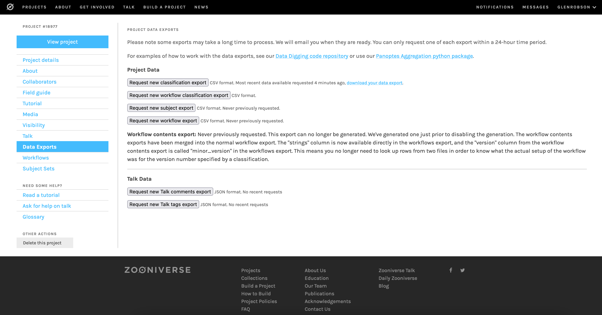

# Zooniverse

This is the most popular crowdsourcing or citizen science tool and it started out as a project called Galaxy Zoo which enabled volunteers to tag and classify a large number of galaxies. It has since morphed into a general crowdsourcing tool and is used by many cultural heritage institutions to involve the public in their collections. 

To give you a flavour of the type of projects that Zooniverse run here are a few examples:

 * [Ensemble@Yale](https://www.zooniverse.org/projects/haasarts/ensemble-at-yale/about/research) a project to identify cast and staff from historical theater programs.  
 * [MEASURING THE ANZACS](https://www.zooniverse.org/projects/zooniverse/measuring-the-anzacs/about/research) a project from New Zealand to create a rich index of persons who served in the New Zealand military in World War 1.
 * [Saint George on a Bike](https://www.zooniverse.org/projects/artem-dot-reshetnikov/saint-george-on-a-bike/about/research) a project to generate a machine generated textual description of an image using source data collected from volunteers.

Recently the British Library worked with Zooniverse to add IIIF support. This was demoed in a recent IIIF community call and the [video is available](https://www.youtube.com/watch?v=DINVrp7ojHw). 

Below is a step by step guide to creating a crowdsourcing project using the Zooniverse project builder.

## Step 1 - Find content

Zooniverse will import images from a Manifest so you can follow the guide given in [Finding Yale Manifests](../../basics/finding_yale.md) but note you will need a version 2 IIIF manifest.

For this guide I will be using the following item from the Stanford University:

[https://purl.stanford.edu/xs238yz7087/iiif/manifest](https://purl.stanford.edu/xs238yz7087/iiif/manifest)
 
 _[The clans of the Scottish Highlands](https://exhibits.stanford.edu/beautifulbooks/catalog/xs238yz7087)_
 
Which is a highly illustrated book and I will be asking volunteers to identify pages with illustrations and also pages which are blank. 
 
## Step 2 - Sign in or register for Zooniverse

Navigate to the Zooniverse website:

[https://www.zooniverse.org/](https://www.zooniverse.org/)

If you haven't already got a login you can create an account by registering:


Now you have logged in or registered you should see a link at the top of the screen to build a new project. 


Click the create project button and add a project name, short description and longer description:


## Step 3 - Import IIIF images (Subject Sets)

Subject sets is where you add the images that you are going to be working on. Once you have created your project navigate to the Subject Sets page but do not click the create new set button. The IIIF import is currently hidden so you need a special URL to access it. 


Once you are on the subject sets page your URL should look something like:

https://www.zooniverse.org/lab/18977/subject-sets/

Now if you add `iiif` to the end of this URL you should get to the IIIF Import page:

https://www.zooniverse.org/lab/18977/subject-sets/iiif

This will look as follows and then paste your Manifest URL into the box and click Fetch Manifest.


It will now show you the Metadata contained in the manifest and also sample images. If it looks OK click Create a subject set:


You will see it creating subjects which are equivalent to pages or canvases in a Manifest. You can then click on the link at the bottom to view your Subject Set.


## Step 4: Workflows

Now we have uploaded our images to Zooniverse we want to create a workflow which is a collection of tasks that we are going to ask the users to undertake. Click the Workflows link on the left and the New workflow button.


You will be asked to create a title for your workflow. You will now enter a long page where you can configure your workflow. A workflow is made up of a number of tasks. Tasks can either be for the whole image or you can ask the user to create shapes like rectangles to identify particular parts of images. 

For this example I am going to ask the users if the page contains an illustration or if its a blank page. The first step is to click the add task button which gives you a list of task types and for this example we want to ask a question. 


Now we can add our question with optional help text.


If you now scroll down you can see you can add answers by clicking the + button. 


Now you have to configure the Subject Set to ensure the images are shown and also turn on pan and zoom functionality which is optional but helpful for larger images. 


You are now ready to preview your crowdsourcing application. 

## Step 5: Testing

If you scroll down to the bottom of the workflow page you should see a "Test this workflow" button. If you click this a new tab will open showing your workflow with associated image. 


## Further considerations

### Going live to the public

It looks like there is a fairly rigours process before projects can be made live and involves a group of beta tests. Here is a note from the zooniverse website:

_"In order to launch publicly and be featured on zooniverse.org/projects, teams must go through beta review, wherein a team of Zooniverse volunteer beta testers give feedback on the project and answer a series of questions that tell us whether the project is 1) appropriate for the platform; and 2) ready to be launched. Anyone can be a beta tester! To sign up, visit https://www.zooniverse.org/settings/email. Note: the timeline from requesting beta review to getting scheduled in the queue to receiving beta feedback is a few weeks. It can then take a few weeks to a few months (depending on the level of changes needed) to improve your project based on beta feedback and be ready to apply for full launch. For more details and best practices around using the Project Builder, see https://help.zooniverse.org/getting-started/."_

From [the zooniverse blog](https://blog.zooniverse.org/2020/06/24/the-zooniverse-a-quick-starter-guide-for-research-teams/). 

According to the Visibility part of the project builder you would also need:

_"To be eligible for beta review, projects also require:_

 * _at least 100 subjects in active workflows_
 * _content on the Research and FAQ pages in the About page"_

The 100 subjects are pages/canvases in a manifest.

For small projects it may be possible to add collaborators and there is a Tester collaborator who can access private projects and run the classification tasks. 

### Exporting data

The project builder has a Data Exports area which looks as follows:



The Request new classification export button will generate an export of the data you have captured through your workflows. Once you click the button an email will be sent letting you know when the data is available. Once you have the email you can return to this page and download your export. 

The CSV file includes an Annotations field which for the example I used above looks like:

```
[
    {
        "task":"T1",
        "task_label":"Does this page contain an illustration?",
        "value":"No"
    }
]
```

it also contains a subject data field which looks like:

```
{
    "77806810": {
        "retired":null,
        "Date":"1845-47",
        "Type":"text",
        "Title":"The clans of the Scottish Highlands: illustrated by appropriate figures, displaying their dress, tartans, arms, armorial insignia, and social occupations",
        "Format":"print",
        "Subject":"DA880.H7.L7",
        "Coverage":"England--London",
        "Language":"eng",
        "#priority":107,
        "Publisher":"Ackermann and Co.",
        "Identifier":"lccn: 12036289",
        "Contributor":"Scheller, J. C (binder)",
        "Description":"from original sketches by R. R. McIan Esq. with accompanying description and historical memoranda of character, mode of life \u0026c., \u0026c., by James Logan, Esq.",
        "PublishDate":"2019-01-18T23:30:43Z",
        "iiif:canvas":"https://purl.stanford.edu/xs238yz7087/iiif/canvas/xs238yz7087_107",
        "iiif:manifest":"https://purl.stanford.edu/xs238yz7087/iiif/manifest","Available Online":"[https://purl.stanford.edu/xs238yz7087](https://purl.stanford.edu/xs238yz7087)"
    }
}
```

Most of this data has come from the Manifest but importantly it also includes a `iiif:canvas` and `iiif:manifest` field so the annotation can be linked back to the IIIF resource. There is code available to do this conversion called [iiif-annotations](https://github.com/zooniverse/iiif-annotations) but the code may have to be customised for different tasks and workflows. The iiif-annotations project is designed to work with the British Library playbills project and you can see the IIIF annotations in Mirador and Annona on the following page:

[https://glenrobson.github.io/iiif_stuff/zooniverse/Mar_2022/](https://glenrobson.github.io/iiif_stuff/zooniverse/Mar_2022/)
