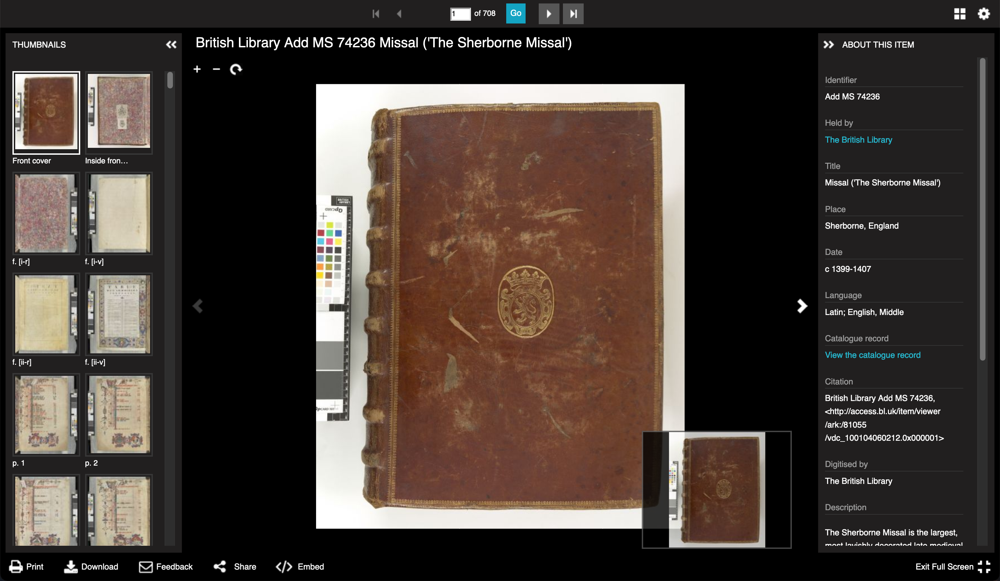
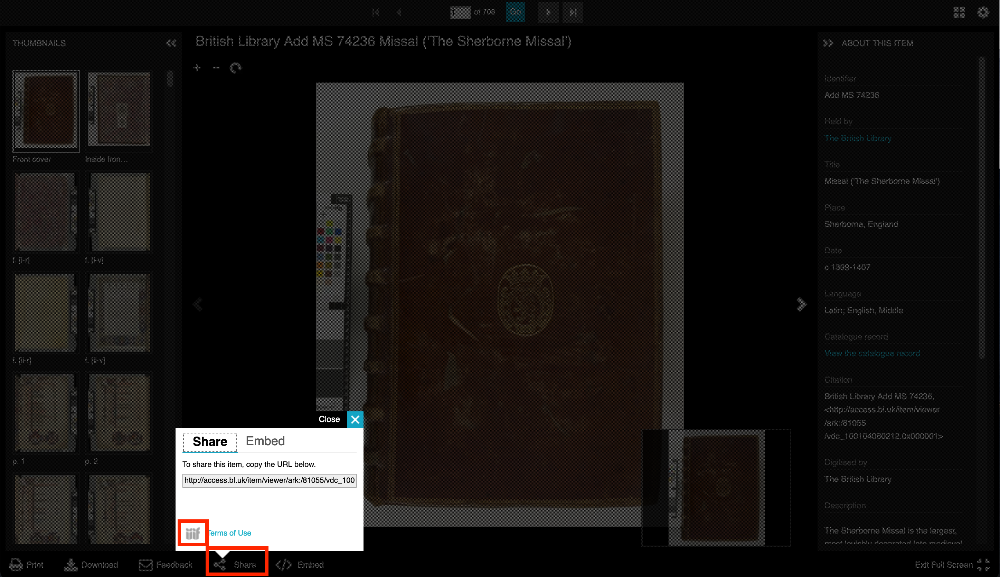
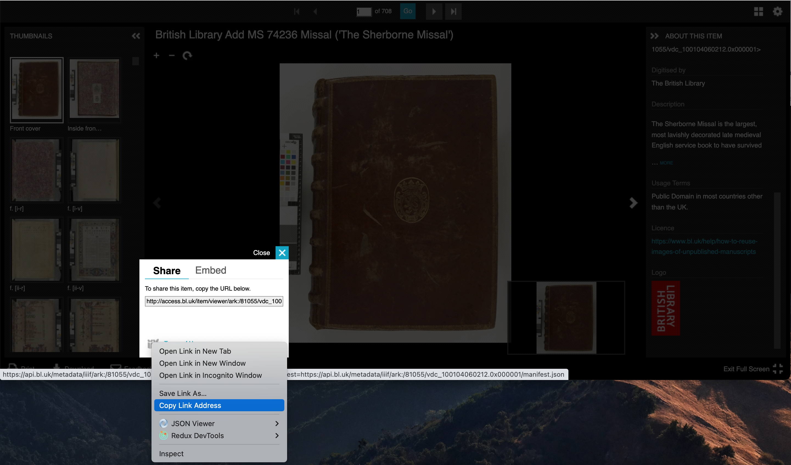

# Finding British Library Manifests

For this exercise we are going to find a British Library IIIF Manifest we can start annotating. This is made much easier by the [BL collection guide](https://www.bl.uk/collection-guides/iiif) which shows the collections that are available in IIIF. Once you have found a item this guide will show you how to access the IIIF Manifest and copy the URL.

Using the [BL collection guide](https://www.bl.uk/collection-guides/iiif) find a digital object and open it up in the Viewer. Once you have found your item it should look as follows:



Now we have found the item we want to get the 'IIIF Manifest' for this item. As mentioned earlier the Manifest is a JSON document that contains links to all of the images and metadata that goes into a digital item. We are going to find the link to the IIIF Manifest and copy it. It might be worth copying this into Notepad or something similar so you can use it later. 

To find the manifest click the 'share' link at the bottom of the viewer and then right click on the IIIF icon and select 'Copy link' or 'Copy Link Address' in Chrome:

***Note:*** some collections like the Google printed books collection do not currently allow sharing so the share button will not be present.




You can see the copy link from Firefox in this image: 



The copied link should look something like:

```
https://api.bl.uk/metadata/iiif/ark:/81055/vdc_100104060212.0x000001/manifest.json?manifest=https://api.bl.uk/metadata/iiif/ark:/81055/vdc_100104060212.0x000001/manifest.json
```

You can see the link to the manifest is created twice in this link so it can be cleaned up by removing everything after the `?` to leave:

```
https://api.bl.uk/metadata/iiif/ark:/81055/vdc_100104060212.0x000001/manifest.json
```

Some IIIF viewers and tools will be able to cope with the manifest being repeated but if possible its best to remove everything after the `?`. 


