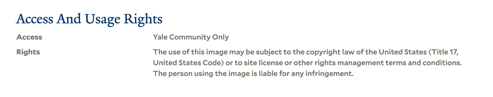

# Finding Yale manuscripts

There are four guides on the IIIF guides site for different parts of Yale University:

 * [Yale Center for British Art](https://guides.iiif.io/guides/collections.britishart.yale.edu/)
 * [Yale Peabody Museum](https://guides.iiif.io/guides/collections.peabody.yale.edu/)
 * [Yale University Art Gallery](https://guides.iiif.io/guides/artgallery.yale.edu/)
 * [Yale University Library](https://guides.iiif.io/guides/collections.library.yale.edu/)

## Viewing Manifests in a Viewer

To give you an example of how to open a Manifest in a viewer lets take this page:

https://collections.britishart.yale.edu/catalog/tms:1772

Which has the following Manifest:

https://manifests.collections.yale.edu/ycba/obj/1772

We can view it in the Universal Viewer by going to:

https://universalviewer.io/

and in Mirador:

https://projectmirador.org/

Once you have found your Manifest it is a good idea to keep this in a note somewhere as we will be using this link quite a few times in this course. 

## Caveats  

### IIIF Version 2 or 3

By default many of the IIIF resources available from Yale are using IIIF version 3 which is the latest and greatest IIIF version. Unfortunately some of the tools that are demonstrated today only work with IIIF version 2. Specifically Zooniverse, FromThePage and the section on working with annotations and Mirador will only work with v2 Manifests. 

The Museums support both version 2 and 3 but will by default show version 3. To get to a v2 version you will need to edit the URL. For example this is a link to a v3 manifest:

https://manifests.collections.yale.edu/yuag/obj/157210

and to access a v2 version you would need to request:

https://manifests.collections.yale.edu/v2/yuag/obj/157210

i.e. insert `v2/` after the yale.edu part. 

Yale Library only supports version 3 currently but we do have the following examples of v2 library material:

* [ 1971 1063 ]( https://collections.library.yale.edu/catalog/30907105 )
* [ 1976 425 ]( https://collections.library.yale.edu/catalog/31908820 )
* [ 1977 2677 ]( https://collections.library.yale.edu/catalog/31909872 )
* [ 1983 Folio 33 ]( https://collections.library.yale.edu/catalog/31909085 )
* [ 1996 320 ]( https://collections.library.yale.edu/catalog/31908903 )
* [ 2008 +298 9 ]( https://collections.library.yale.edu/catalog/30907366 )
* [ 533ex As79 1852 ]( https://collections.library.yale.edu/catalog/31923311 )
* [ 844 Oa5 1874 1 ]( https://collections.library.yale.edu/catalog/31923315 )
* [ Arabic MSS 430 ]( https://collections.library.yale.edu/catalog/31921578 )
* [ Arabic MSS suppl. 598 ]( https://collections.library.yale.edu/catalog/31920968 )
* [ Aya32 H3 C765 1803 ]( https://collections.library.yale.edu/catalog/31915615 )
* [ Beinecke MS 182 ]( https://collections.library.yale.edu/catalog/31921292 )
* [ Beinecke MS 234 ]( https://collections.library.yale.edu/catalog/31907127 )
* [ Beinecke MS 352 ]( https://collections.library.yale.edu/catalog/31920965 )
* [ Beinecke MS 357 ]( https://collections.library.yale.edu/catalog/31921943 )
* [ Beinecke MS 464 ]( https://collections.library.yale.edu/catalog/31444394 )
* [ Beinecke MS 483.8-9 ]( https://collections.library.yale.edu/catalog/2004121 )
* [ By61a St28 ]( https://collections.library.yale.edu/catalog/31909578 )
* [ DA486 M3 ]( https://collections.library.yale.edu/catalog/31907977 )
* [ Euro Tracts S8 1648 +F295 ]( https://collections.library.yale.edu/catalog/30907495 )
* [ Fielding F750L 1 ]( https://collections.library.yale.edu/catalog/31921537 )
* [ Folio AN28 N276 N279 ]( https://collections.library.yale.edu/catalog/31910136 )
* [ Fv6413 +2133 ]( https://collections.library.yale.edu/catalog/30995458 )
* [ GEN MSS 1287 ]( https://collections.library.yale.edu/catalog/31902465 )
* [ GEN MSS 373 ]( https://collections.library.yale.edu/catalog/31031568 )
* [ GEN MSS 440 ]( https://collections.library.yale.edu/catalog/31255796 )
* [ Hd18 38 ]( https://collections.library.yale.edu/catalog/31920731 )
* [ Hebrew +65 ]( https://collections.library.yale.edu/catalog/31909764 )
* [ Hfd39 217k ]( https://collections.library.yale.edu/catalog/31910146 )
* [ Ik D631 754 ]( https://collections.library.yale.edu/catalog/31922484 )
* [ Ik L867 727 ]( https://collections.library.yale.edu/catalog/31922510 )
* [ Ik Sw55 Ei729 1 ]( https://collections.library.yale.edu/catalog/31921557 )
* [ Im D661 780c ]( https://collections.library.yale.edu/catalog/31908551 )
* [ Is94 t1 2 ]( https://collections.library.yale.edu/catalog/31922516 )
* [ JWJ -V3 H19 R75 ]( https://collections.library.yale.edu/catalog/31910407 )
* [ JWJ Zan D853 +Q1 ]( https://collections.library.yale.edu/catalog/31912890 )
* [ MLz860 734B ]( https://collections.library.yale.edu/catalog/31922615 )
* [ NZ +Z700Lq ]( https://collections.library.yale.edu/catalog/31922308 )
* [ Osborn b101 ]( https://collections.library.yale.edu/catalog/31910642 )
* [ Osborn b203 ]( https://collections.library.yale.edu/catalog/31910731 )
* [ Peruvian Pamphlets 60 ]( https://collections.library.yale.edu/catalog/30907745 )
* [ Purdy 155 ]( https://collections.library.yale.edu/catalog/31911431 )
* [ Speck Music B37 43 ]( https://collections.library.yale.edu/catalog/31911484 )
* [ Speck Music D39 1 ]( https://collections.library.yale.edu/catalog/31912933 )
* [ Speck Music K46 n826 ]( https://collections.library.yale.edu/catalog/31911558 )
* [ SSg42 65 ]( https://collections.library.yale.edu/catalog/31907970 )
* [ UT2345 D365 ]( https://collections.library.yale.edu/catalog/30995450 )
* [ UvL12 C6 682n ]( https://collections.library.yale.edu/catalog/31922443 )
* [ UvL12 C6 685 ]( https://collections.library.yale.edu/catalog/31922311 )
* [ Uzn73 841B ]( https://collections.library.yale.edu/catalog/31923320 )
* [ WB 26210 ]( https://collections.library.yale.edu/catalog/31908565 )
* [ Zc10 881na ]( https://collections.library.yale.edu/catalog/31912297 )
* [ Zc13 E3 +In33 ]( https://collections.library.yale.edu/catalog/30850659 )
* [ Zc52 +837cjb 1 ]( https://collections.library.yale.edu/catalog/31912744 )
* [ Zc52 +837cjb 2 ]( https://collections.library.yale.edu/catalog/31912732 )
* [ Zc52 857tfk ]( https://collections.library.yale.edu/catalog/31912753 )
* [ Zc52 906sp ]( https://collections.library.yale.edu/catalog/31912764 )
* [ Zc52 919ci ]( https://collections.library.yale.edu/catalog/31912773 )
* [ Zc58 901jg ]( https://collections.library.yale.edu/catalog/31922501 )
* [ Zc72 +930rk 10 ]( https://collections.library.yale.edu/catalog/31912831 )
* [ Zc72 +930rk 11 ]( https://collections.library.yale.edu/catalog/31912834 )
* [ Zc72 +930rk 5 ]( https://collections.library.yale.edu/catalog/31912825 )
* [ Zc72 943to ]( https://collections.library.yale.edu/catalog/12511833 )

### Access outside of Yale

Some items are restricted to only being accessible on the Yale campus. This will mean although you can access the manifest and images you will not be able to use the tools on this course. An example of this type of material can be seen below:

https://collections.library.yale.edu/catalog/31909488

and the way to tell if this is an item that falls in this category is to scroll to the bottom of the catalogue page and look for the Access and Usage rights similar to this:

