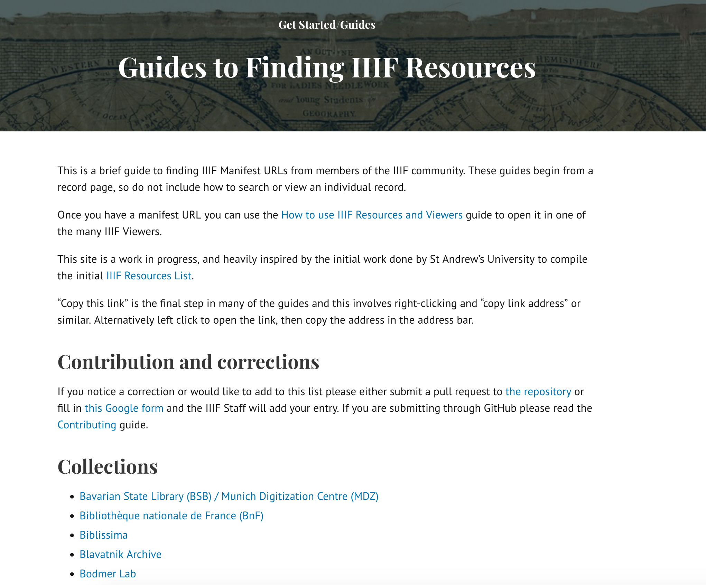

# Finding IIIF Manifests

One of the problems that the IIIF Community is struggling with is how to find IIIF resources. One method that the community is using to solve this problem is to create a list of guides showing how to access IIIF manifest for various institutions. 

This is currently available on the beta version of the IIIF website at the following location:

 [https://beta.iiif.io/guides/finding_resources/](https://beta.iiif.io/guides/finding_resources/)

but we hope to go live with our new site tomorrow so this will then live at [https://iiif.io/guides/finding_resources/](https://iiif.io/guides/finding_resources/). 

This is a community effort and if your institution isn't listed then please feel free to add it to the [Github Repository](https://github.com/IIIF/guides) or fill in the following [Google form](https://forms.gle/S6LLjBy2o4iEBR8C9).

If you look through the different collections listed you will notice there are many ways to get the link to a Manifest and this is also something the community is looking to standardise. 

# Task: Find a Manifest

Using the guides site above find a Manifest you would like to annotate. We will use this Manifest in the Annotating Mirador section and also in the hands on annotations session at the end. 

