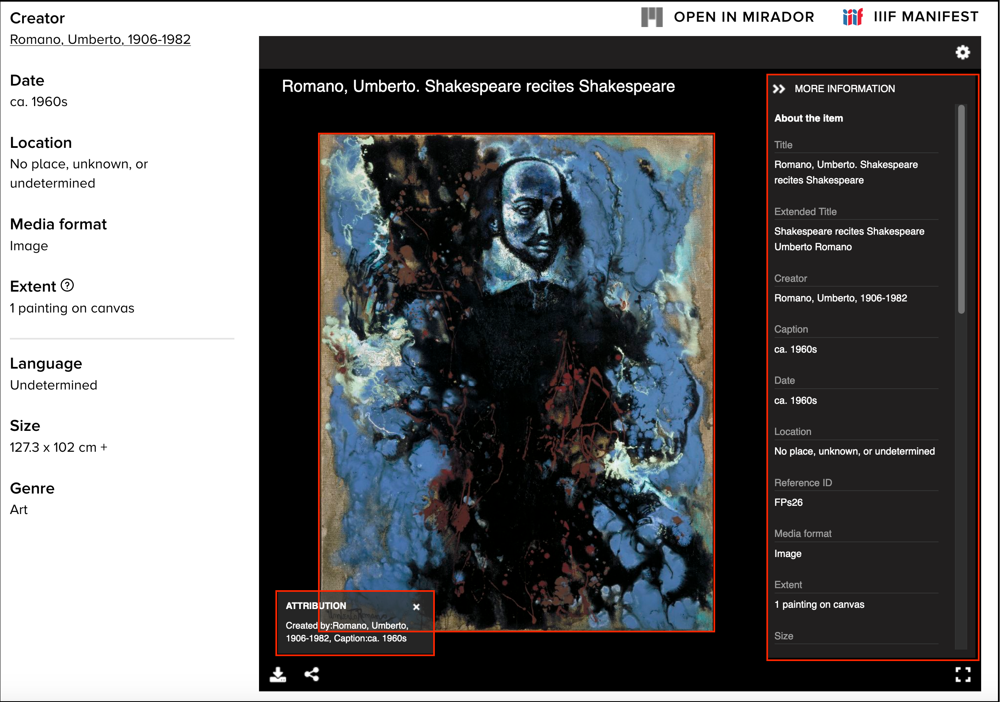

# IIIF Manifests

For the purposes of this workshop we need to introduce one of the core aspects of IIIF which is a Manifest. This is a JSON document which describes a digital resource. It contains:

 * Descriptive metadata like labels, rights and other information
 * Links to Images and AV resources
 * Ordering of Images in sequences and table of contents

A IIIF Manifest is the thing you view in a viewer like Mirador or the Universal Viewer. A viewer reads the manifest to understand what images should be shown.  Take this example from the Folger Shakespeare Library where the descriptive metadata and image information has been highlighted:

This digital object is available in the Folger [here](https://collections.folger.edu/detail/romano-umberto-shakespeare-recites-shakespeare/70ef8129-098e-4d33-b7dd-13c9499c4bd7). The Manifest for this object is available [here](https://server.collections.folger.edu/iiif/manifest/from-dap-id/70ef8129-098e-4d33-b7dd-13c9499c4bd7.json).

For this course it is not important to understand how the Manifest works but as demonstrated in the IIIF introduction it is possible to take a Manifest from one place and open it in another viewer. For example the Folger manifest can be opened in Mirador by following [this link](https://projectmirador.org/embed/?iiif-content=https://server.collections.folger.edu/iiif/manifest/from-dap-id/70ef8129-098e-4d33-b7dd-13c9499c4bd7.json). 

In the hands on annotation session discussed later we will be taking a Manifest from an institution and then adding annotations.

