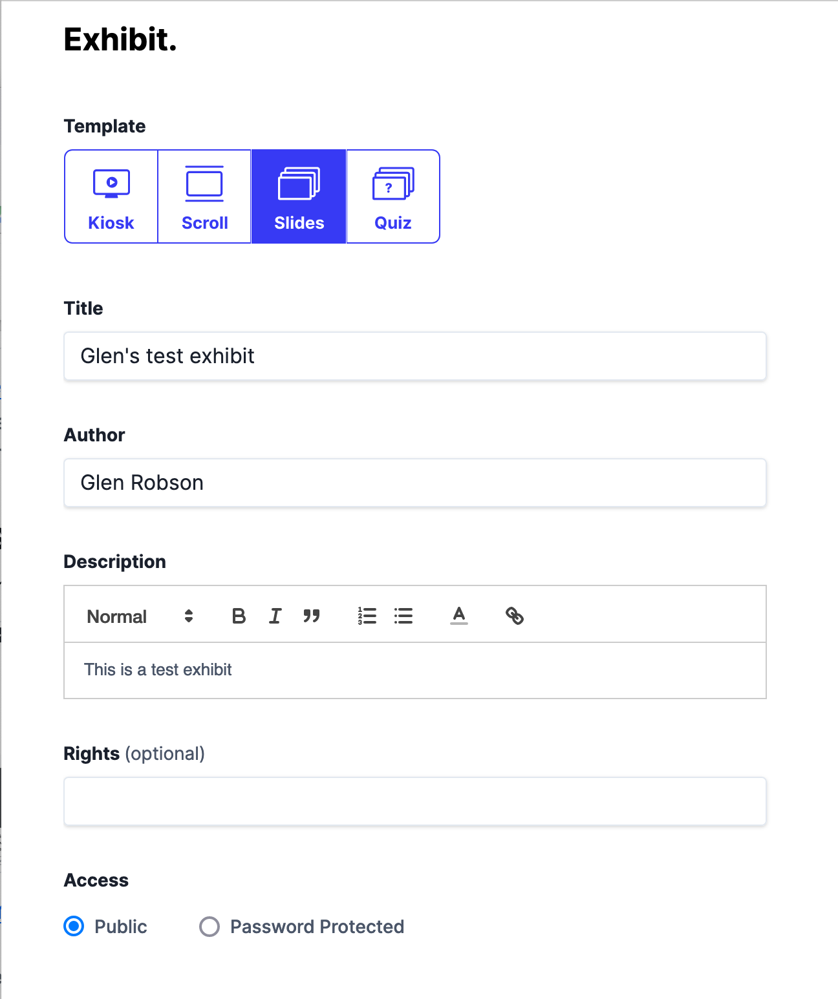
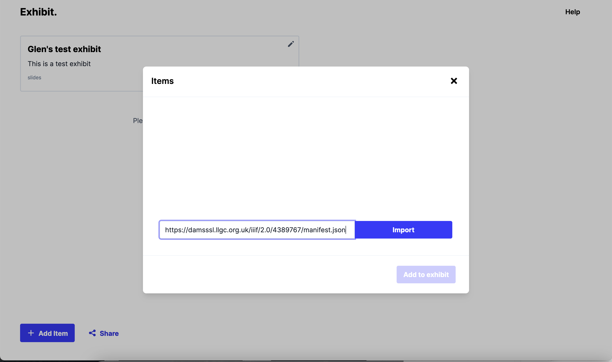
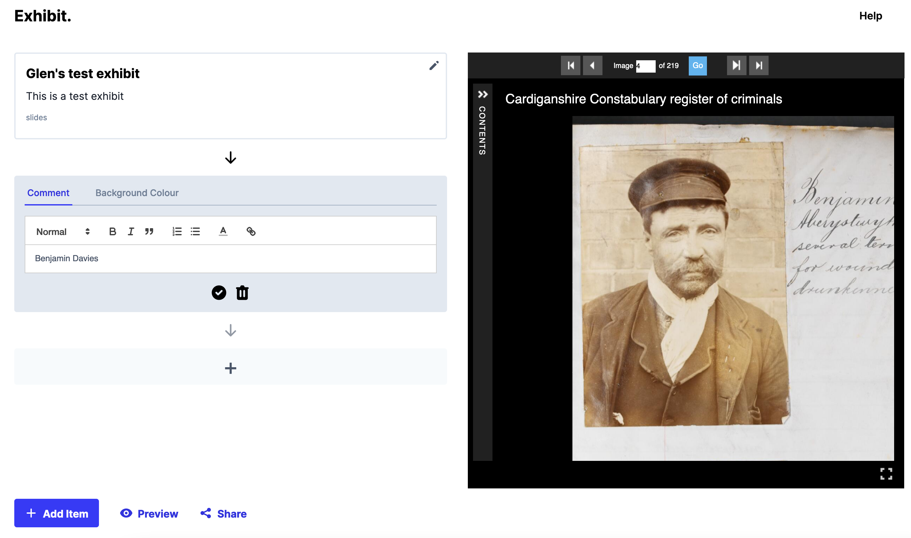

# Exhibit

This is a tool which uses a simple workflow to create annotations in then present them to the user as a story or Exhibit. It is possible to have multiple manifests and images as was shown in the Book of Remembrance use case earlier. 

https://www.exhibit.so/

## Step 1 find a Manifest

If you haven't already go back to the [Finding Manifests](../basics/guides.md) guide and find a Manifest from one of the public collections. My personal favourite is:

https://damsssl.llgc.org.uk/iiif/2.0/4389767/manifest.json

## Step 2 Create an exhibit

Either click on the create exhibit button on the Exhibit website or click this link to start a new project:

https://www.exhibit.so/exhibits/create

Then fill in the exhibit details ensuring you click the robot and terms and conditions check boxes:

## Step 3 Add your Manifest to the Exhibit

Click the Add Item button and paste in the URL to your manifest. 

You can add multiple manifests but for this example we will only add one so then click the X symbol on the addItem screen.

## Step 4 Create your slides

To create a slide or view, click the + symbol below your exhibit description. This will place a text box where you can add your description of the image shown on the right hand side. You can use the image controls to zoom into the correct location of the page which you want to describe. 

Once you have finished click the tick symbol at the bottom of the comment box.

Now you can add as many annotations as you want and once you have finished you can click the Preview or Share links to share the presentation with others. 

Here is a copy of the demo Exhibit:

https://www.exhibit.so/exhibits/RuilttXUAU8O1Rbvt5lW
