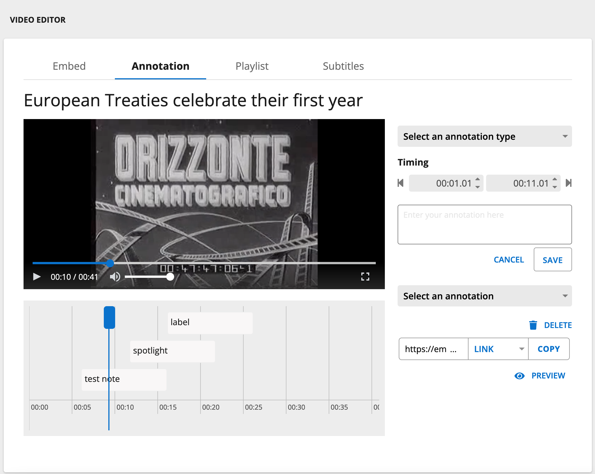
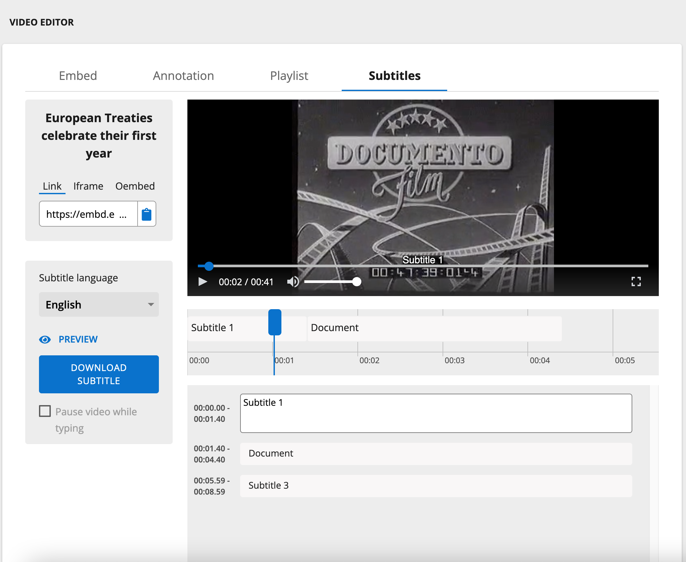

# Audio and Visual Annotations

In the last few years there have been a number of tools developed to support Audio and Visual annotations. A/V was added in IIIF version 3 so it is a relatively recent addition and the tool support is rapidly improving. 

## Timeliner

Timeliner is an annotation tool for music education. It allows students and educators to describe the structure of a piece of music (or any audio), creating a hierarchy of parts and visualising the parts as nested bubbles. 

https://cultural-heritage.digirati.com/our-work/timeliner/

<iframe width="100%" height="415" src="https://www.youtube-nocookie.com/embed/gn37PAO9X2s" title="YouTube video player" frameborder="0" allow="accelerometer; autoplay; clipboard-write; encrypted-media; gyroscope; picture-in-picture" allowfullscreen></iframe>

## Europeana Video Editor

Another powerful annotation tool for AV is the Europeana Video Player/Editor. As well as playing IIIF AV resources the EU Player also has annotation functionality that allows you to create general annotations and also video subtitles. 

https://video-editor.eu/

### Annotations 

### Subtitle editing

## AudiAnnotate

AudiAnnotate is a publication platform for audio transcriptions created by various existing audio tools like [Sonic Visualiser](https://www.sonicvisualiser.org/). The idea is that you can use your existing tool workflow to create a transcription then upload it to AudiAnnotate. AudiAnnotate will then convert the transcription into IIIF annotations and use a IIIF viewer to displayer the results. You can see a list of projects here:

http://audiannotate.brumfieldlabs.com/

and one project example here:

https://tanyaclement.github.io/sexton_sweetbriar_1966/pages/anne-sexton-class-visit-at-sweetbriar-college-1966.html#?c=&m=&s=&cv=

AudiAnnotate uses GitHub for storage so it can be run as a free service.
