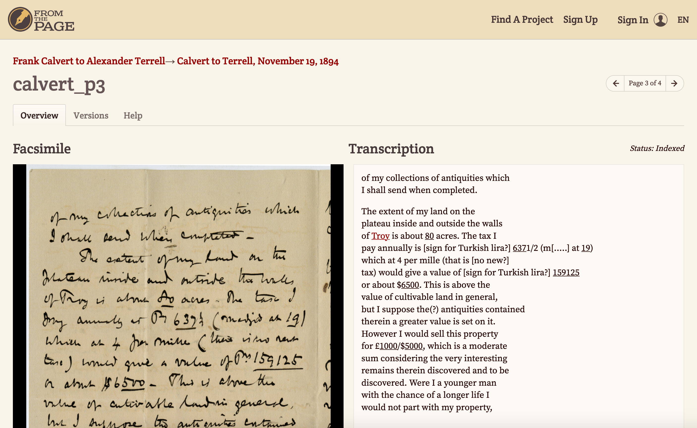

# Transcription for Pedagogy

I came across [this article](https://content.fromthepage.com/transcription-for-pedagogy/) on using an annotation system called FromThePage for teaching. FromThePage is a transcription tool that provides a wiki like interface for transcribing IIIF Manifests. You can see a full list of features on the [about FromThePage](https://content.fromthepage.com/about/) site. It is open source but also offers a hosted transcription interface. 

For a more in depth workshop including and how to sign up for a trial membership and annotate your own manifests please see the [FromThePage guest presentation](https://training.iiif.io/iiif-online-workshop/GuestPresentations.html#crowdsourced-transcription-using-fromthepage--iiif) which is part of the 5 day IIIF online training.

The pedagogy use case mentioned in the article has the following stages:

## Step 1: Find the Archival Collection

In this case this is a physical challenge where students are tasked with going to the archive to find a set of letters. You could imagine this would also work in a digital only session where students are tasked with finding items in an online catalogue. 

## Step 2: Transcribe

Once the Students have found the material the course tutor sends round a link to the students so they can start transcribing the letters. 

## Step 3: Review and Edit

Once the students have finished their assigned transcriptions the course tutor is able to review and edit the transcriptions to provide the students with feedback. 

## Step 4: Write a Paper.

Finally using the archival material they are now familiar with they are asked to write a report using the letters as historical sources. 

# Review

This is a use case which could be used in a wide variety of situations particularly with the wealth of IIIF material available. With FromThePage being hosted you don't need any infrastructure to support the project as long as the material you are working with is available as IIIF.
