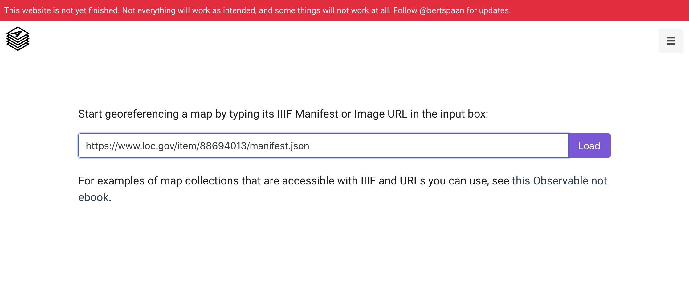
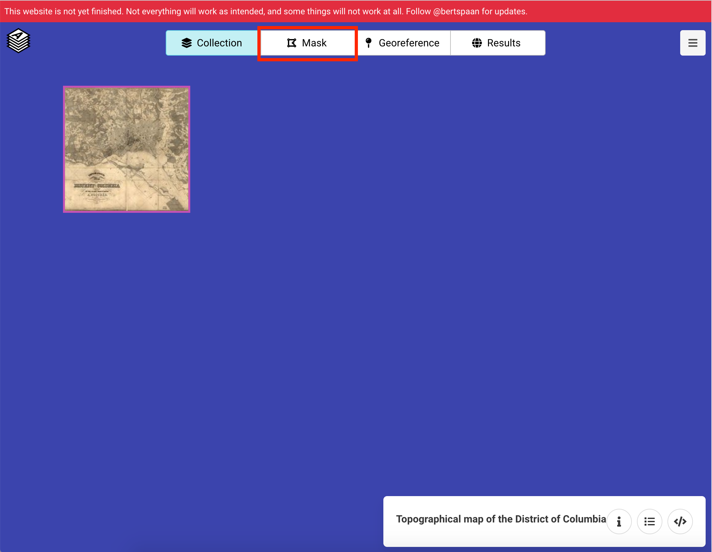
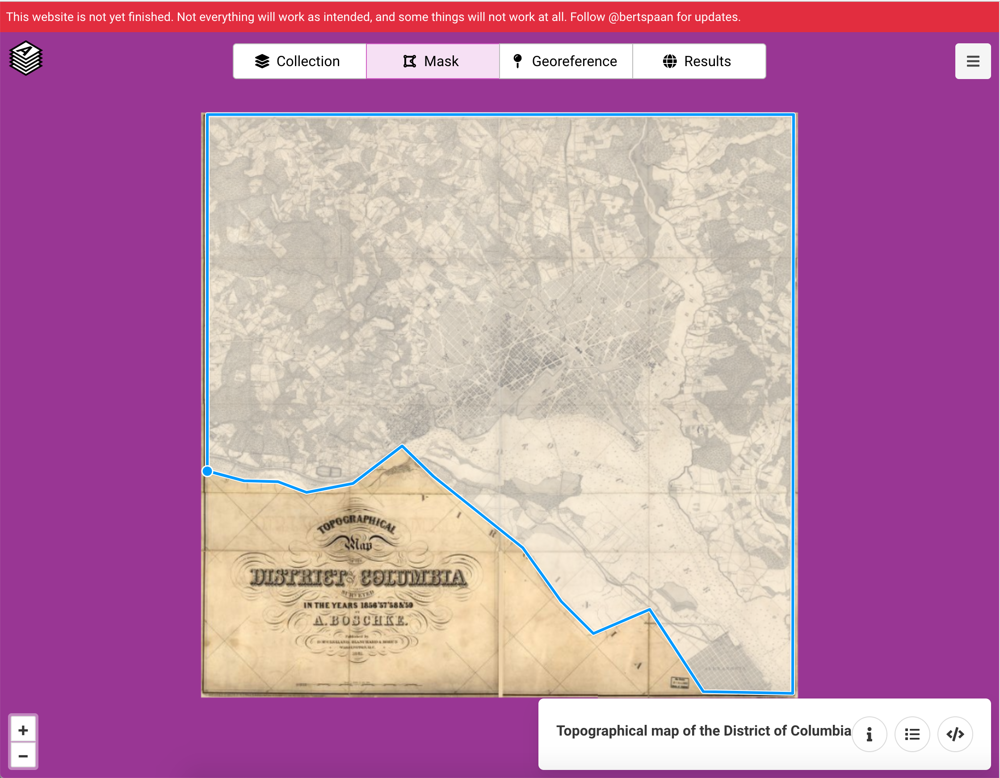
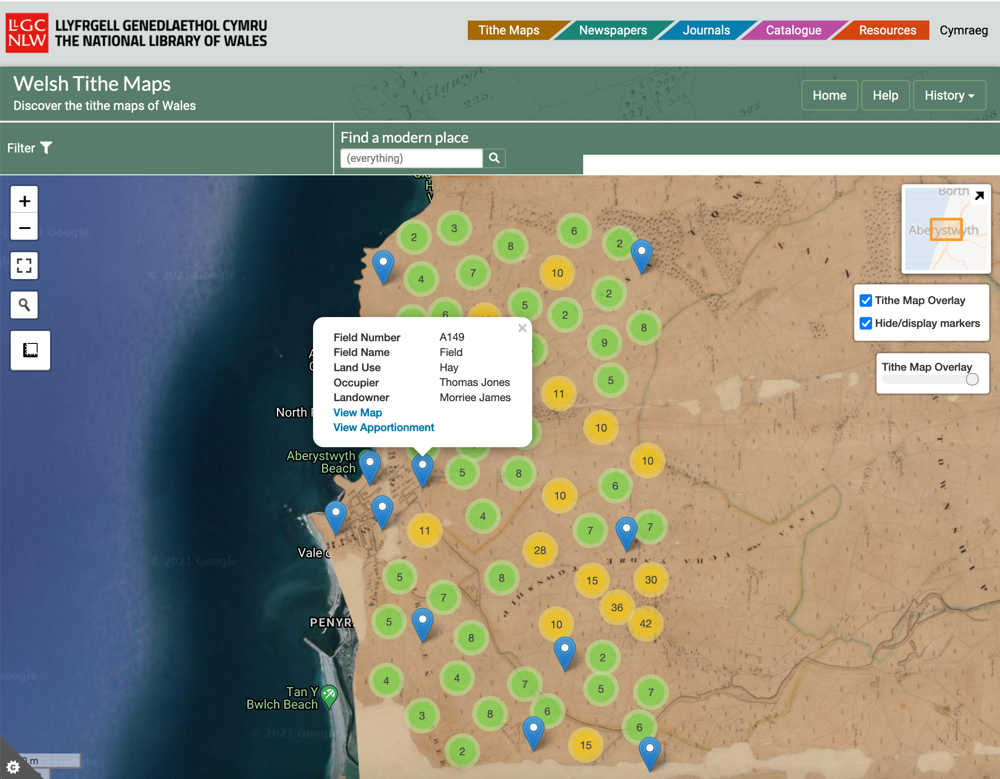

# Annotations and Maps

One of the nice things about IIIF is that it is constantly evolving. By allowing a standard interface to access Cultural Heritage objects it allows new tools to be developed and one of these is [AllMaps.org](https://allmaps.org/). This tool allows you to Geo-reference a IIIF Map so it can be overlaid onto a modern map. 

It starts the same way as many of the solutions discussed earlier with a IIIF Manifest. For this example I am going to use a map of Washington D.C. from the Library of Congress:

 * [https://www.loc.gov/resource/g3850.cw0678500/?r=-0.34,0,1.679,0.982,0](https://www.loc.gov/resource/g3850.cw0678500/?r=-0.34,0,1.679,0.982,0)
 * [Manifest](https://www.loc.gov/item/88694013/manifest.json)

The first stage is to navigate to [https://editor.allmaps.org](https://editor.allmaps.org) and enter the Manifest URL:

The second stage is to navigate to Mask to start geo-referencing. 

The first process of geo-referencing is to cut out the parts of the image that contain the map. This is called Masking. In this example part of the Map contains the title so is cut out of the Map that needs geo-referencing. 

Now the real geo-referencing can start. Select a point on the modern map and then select the corresponding location on the IIIF map. Once you have added enough points allmaps will be able to warp and fit the historical map on top of the modern map.

You can then view the resulting transformation by clicking the modern map. 

This type of geo-referencing can be very useful if you are trying to co-locate different data for example maps from different periods or annotations from related documents. 

For example there is this [Cynefin project](https://www.library.wales/digitisation-projects/places-of-wales/about-places-of-wales) from the National Library of Wales which shows the 1800s Tithe maps of Wales linked to apportionments which detail land use at the time the maps were created:

https://places.library.wales/browse/52.415/-4.084

This was a crowdsourcing project which used a similar Geo-referencing tool called [Georeferencer](https://georeferencer.com/).

