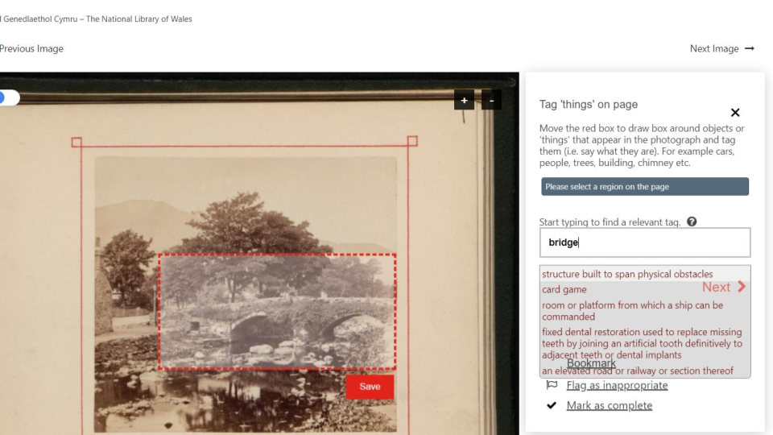
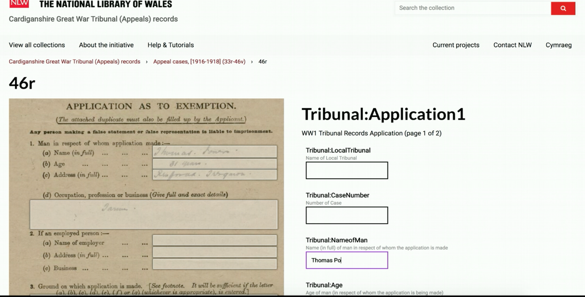
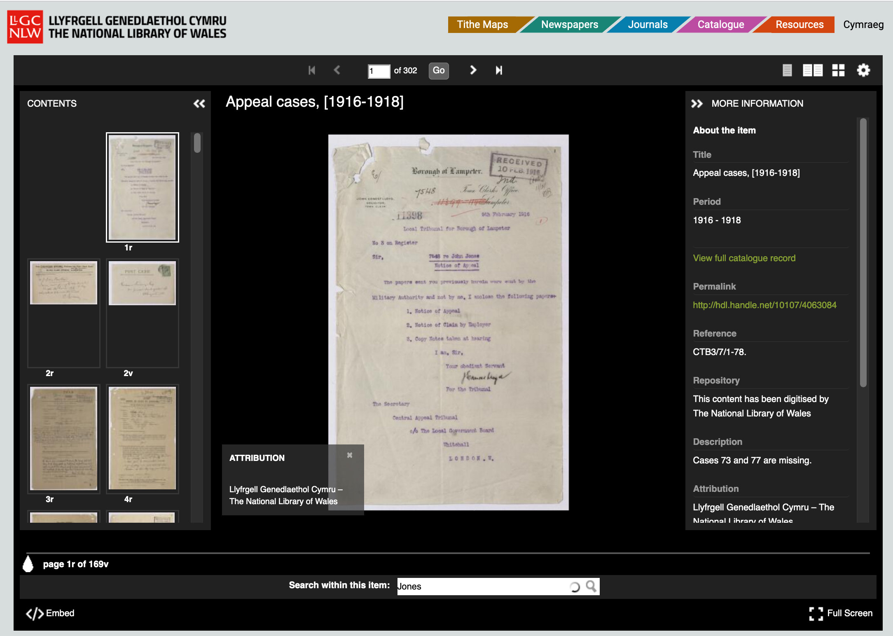
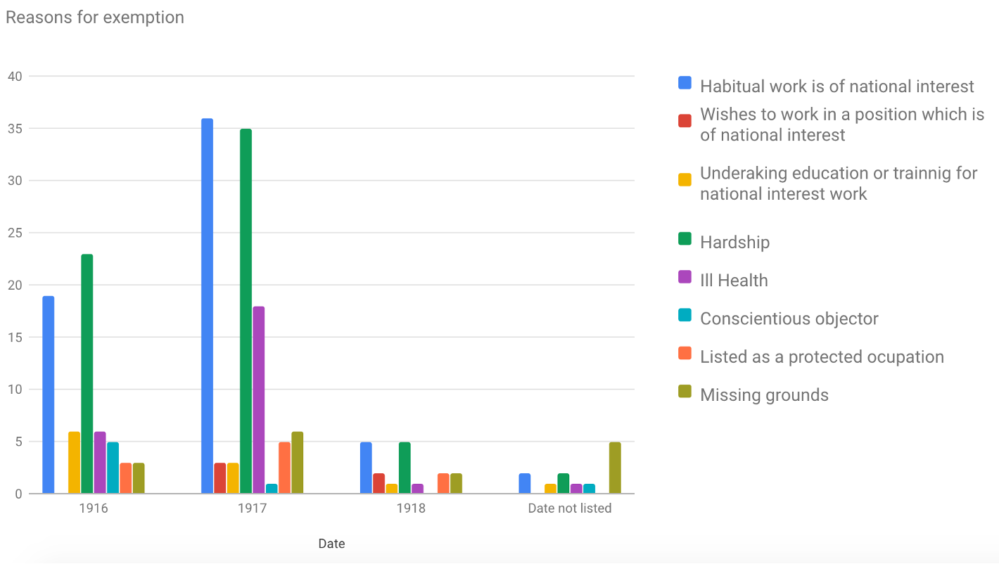

# Pandemic Crowdsourcing with Wikidata

During the COVID Pandemic I saw this tweet from an old colleague at the National Library of Wales.

<blockquote class="twitter-tweet">
Our volunteer team have just started an exciting new project to tag the location of things depicted in our <a href="https://twitter.com/hashtag/openaccess?src=hash&amp;ref_src=twsrc%5Etfw">#openaccess</a> images using the <a href="https://twitter.com/hashtag/IIIF?src=hash&amp;ref_src=twsrc%5Etfw">#IIIF</a>. The data will be saved to <a href="https://twitter.com/hashtag/Wikidata?src=hash&amp;ref_src=twsrc%5Etfw">#Wikidata</a> - <a href="https://t.co/TZIcdr3Llk">https://t.co/TZIcdr3Llk</a> <a href="https://t.co/gIbapKxh1h">pic.twitter.com/gIbapKxh1h</a>
&mdash; Jason Evans (@WIKI_NLW) <a href="https://twitter.com/WIKI_NLW/status/1222123409330536449?ref_src=twsrc%5Etfw">January 28, 2020</a></blockquote>  

This is another great idea for allowing volunteer engagement without having to setup a large amount of infrastructure. Jason made use of a tool called [Wikidata Image Positions](https://wd-image-positions.toolforge.org/) which allows users to tag different regions of an image with an entity from Wikidata. This could be generic tags like farm, windmill, cattle or horse but can also be specific tags like Aberystwyth or the particular Church depicted in a painting. 

Jason was able to manage the project using a spreadsheet which contains links into the tool like this one:

[https://wd-image-positions.toolforge.org/item/Q21614047](https://wd-image-positions.toolforge.org/item/Q21614047)

which opens up one of the images ready for volunteers to start annotating. All the volunteers needs is a Wikipedia login. 

The Wikidata Image Positions tool also creates a IIIF Manifest which can be used in a normal IIIF Viewer. See [this example manifest](https://wd-image-positions.toolforge.org/iiif/Q21614047/P18/manifest.json) and the [Manifest in Mirador 3](https://projectmirador.org/embed/?iiif-content=https://wd-image-positions.toolforge.org/iiif/Q21614047/P18/manifest.json).

For this project the images need to be on Wikimedia so will work with any type of Image. If you already have IIIF Images then these would also need to be uploaded to Wikimedia but through the use of a [IIIF Manifest property](https://www.wikidata.org/wiki/Property:P6108) it should be possible to map the annotations back to the original IIIF images. 

# The Madoc Crowdsourcing System

Extending this project further the National Library of Wales also embedded this feature into a more classic crowdsourcing application called [Madoc](https://github.com/digirati-co-uk/madoc-platform). This allows a more controlled volunteer process and links the Wikidata entries to the original IIIF Image.

The National Library of Wales have also used this Crowdsourcing system to get volunteers to transcribe other material including a 15,000 pages of a collection of WW1 Welsh Tribunal Records. These are the applications made by people in Ceredigion, a county in Wales for exemption to national service. You can see below that Madoc can be configured to customise the data captured. 

The volunteers completed the transcription in about 6 months and the data is made available in a similar way to the Book of Remembrance. The annotations are searchable using the Universal Viewer on the [project webpage](https://www.library.wales/discover/digital-gallery/archives/cardiganshire-great-war-tribunal-appeals-records#?c=&m=&s=&cv=&xywh=-1229%2C-1%2C6135%2C5714):

The NLW have also made the source annotations available for research:

[https://github.com/NLW-paulm/Welsh-Tribunal-annotations](https://github.com/NLW-paulm/Welsh-Tribunal-annotations)

and similarly it is possible to create various visualisations of the data including looking at the reasons for exemption:

A full write up of this investigation is available [here](https://iiif.gdmrdigital.com/ww1-tribunal/index.html).

