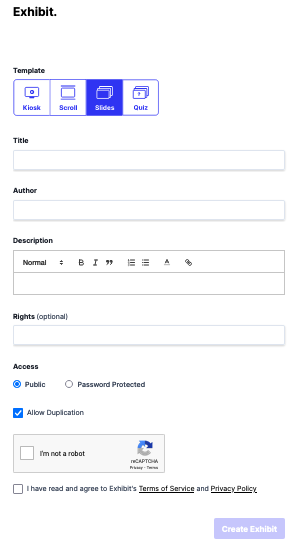
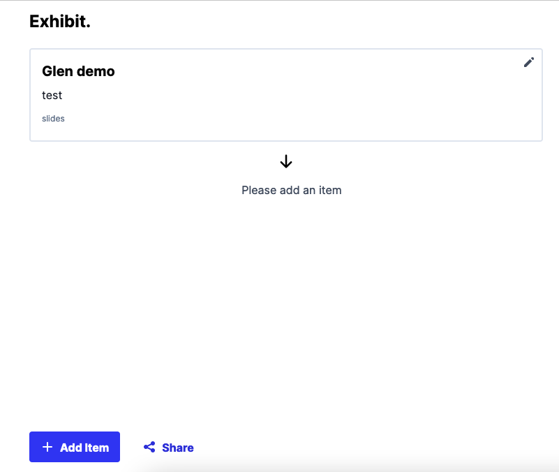
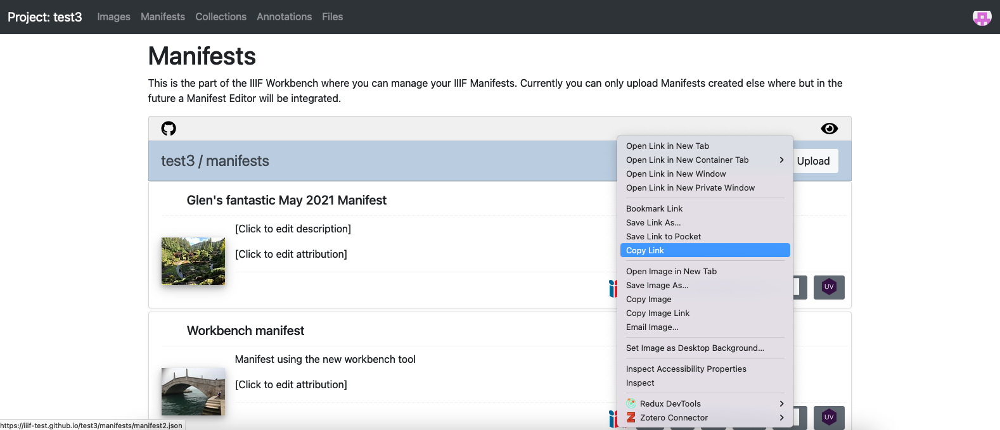
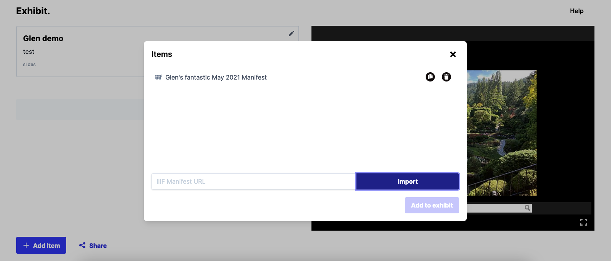
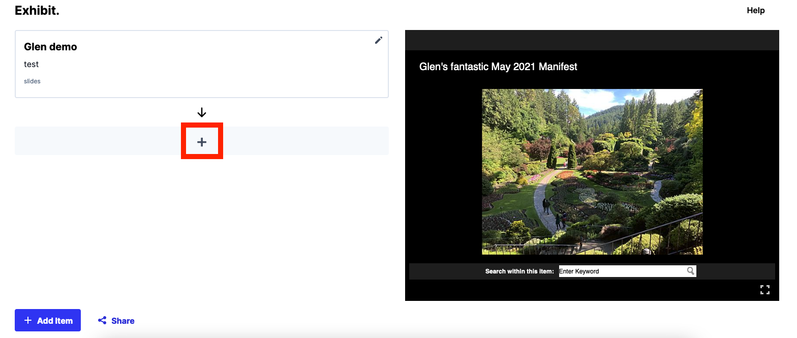
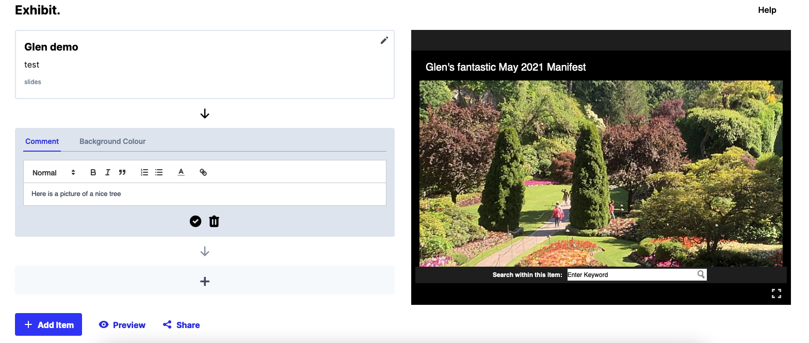

# Extra - Create an Exhibit

<iframe src="https://player.vimeo.com/video/716825099?h=d4ee6b8255" width="640" height="360" frameborder="0" allow="autoplay; fullscreen; picture-in-picture" allowfullscreen></iframe>

If you have successfully uploaded your Manifest to the Workbench you may want to create an exhibit using a IIIF compatible tool. An example of an exhibit I created is here:

<iframe src="https://exhibit.so/exhibits/vjxZwSD0sgKKzQhU4r7i?embedded=true" width="1024" height="768" allowfullscreen frameborder="0"></iframe>

This tells the story of a ship called the Canganian and brings together IIIF resources from Newspapers to Manuscripts to make the presentation. 

## Step 1: Create an Exhibit

Navigate to:

[https://www.exhibit.so/](https://www.exhibit.so/)

Scroll to the bottom until you see the 'Create an Exhibit' button. Click this and you will be taken to the following screen:

On this screen you can choose the following type of presentation:

 * Kiosk - this will auto play the slides and is useful for a public display terminal
 * Scroll - 'slides' will be presented in a single long web page and uses will scroll down to read the story
 * Slides - the default and allows uses to press right or left to navigate the different parts of the story. 
 * Quiz - Similar to the Slides option buy you can ask your viewers to answer a questions

For this tutorial we will focus on the slides option. Fill in a Title, Author and Description for your exhibit and agree to the Terms and Conditions and tick the I am not a robot button. Then click "Create Exhibit". 

You will then be presented with the following screen:

The first thing to do is to add your Manifest. If you switch back to the workbench ([https://workbench.gdmrdigital.com/](https://workbench.gdmrdigital.com/index.xhtml)) in another browser tab. Navigate to your Manifest and right click the IIIF icon and select "Copy link":

Now switch back to the Exhibit tool and click the Add Item button and it will show this dialog:

Paste the Manifest URL into the text box and click import. You should see the manifest load in the background and the manifest title in the Items dialog:

Click the cross to close this dialog.

Now we have the manifest loaded we want to create a 'slide'. Click the + on the left hand side of the screen underneath the Title and description:

Enter a description of what you would like to show and then zoom the right hand image into an area of the image you would like to highlight. 

Once you are happy with the description and zoom click the tick symbol to save the annotation. 

You can now add a number of different slides to tell your story. You can also add different Manifests using the Add Item button.

Once you are happy click the Preview button which will show you what your presentation looks like:

<iframe src="https://www.exhibit.so/exhibits/CJkH4G1vIncsNAtMKXYC?embedded=true" width="640" height="480" allowfullscreen allow="autoplay" frameborder="0"></iframe>

You can find Manifests from various institutions by going to the IIIF Guides website:

[https://guides.iiif.io/finding_resources/](https://guides.iiif.io/finding_resources/)
