# Training Workbench

This option takes advantage of a Website called [GitHub](https://github.com/) which provides among other things a small amount of free Web Space called [GitHub Pages](https://pages.github.com/). This process is similar to the one mentioned in the [Static tiles](static-tiles.html) task but instead of having to install and run the software locally this is provided as a cloud service for the training. 

As mentioned in the previous chapter, the IIIF Image API defines the following structure:

`http://host:port/identifier/region/size/rotation/quality.format`

and it is possible to generate images that fit this URL structure and conform to the IIIF Image API using a tile generator. This will generate the minimum required amount of files to implement the IIIF Image API. It does have some limitations, the main one being it is not possible to request images of a size that haven't been pre-generated. This type of pre-generated IIIF Image is known as a `Level 0` implementation. 

The workbench will generate these tiles and upload them to your own GitHub account and has a number of advantages over the Internet Archive option:

 * Images are owned by you on GitHub
 * Support for IIIF version 3
 * Faster access to images

The main disadvantage of this route is the one mentioned above in that it uses static images so you can not request custom sizes or regions, only the ones that have been pre-generated. This option will still allow you to use these images in Manifests and will perform the same for most annotation use cases. 

This solutions is suitable for those that want to use IIIF images but don't have the organisational support or funding to run an image server. The main stages for this process are as follows:

1. Register for a GitHub account
2. Login to the Workbench
3. Create your project
4. Upload your images
5. View your image

These steps are detailed below with screen shots.

## Stage 1: Register for a GitHub account

Create an account by going to [Github](https://github.com/) and clicking signup.

 * Create Username, password, email

    

 * Complete verify puzzle

    

 * Choose free option

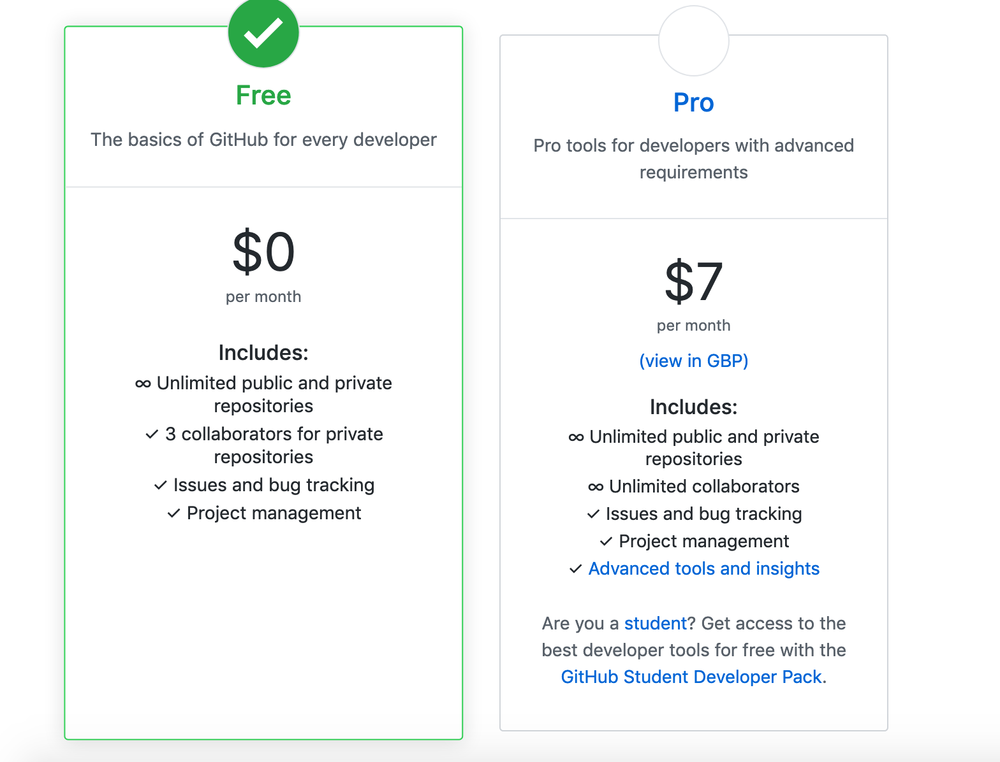    

 * Customise experience (skip this step)

    

 * Verify email address

    

 * Success!!

    

## Stage 2: Login to Workbench
In this stage we will go to the workbench and login using the GitHub account we just created. By using the GitHub account to login it allows the Workbench to create a Repository where it can store your uploaded images. If you ever lose access to the Workbench software the files will be safe and accessible on your GitHub account. 

Navigate to the Workbench: [https://workbench.gdmrdigital.com/](https://workbench.gdmrdigital.com/)

You should see the following screen:

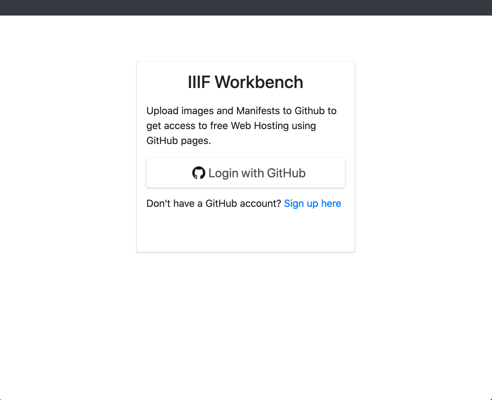

Click the Login with GitHub button.

This will either ask you to login as shown in the following screen shot or if you are already logged in take you straight to the permissions page.

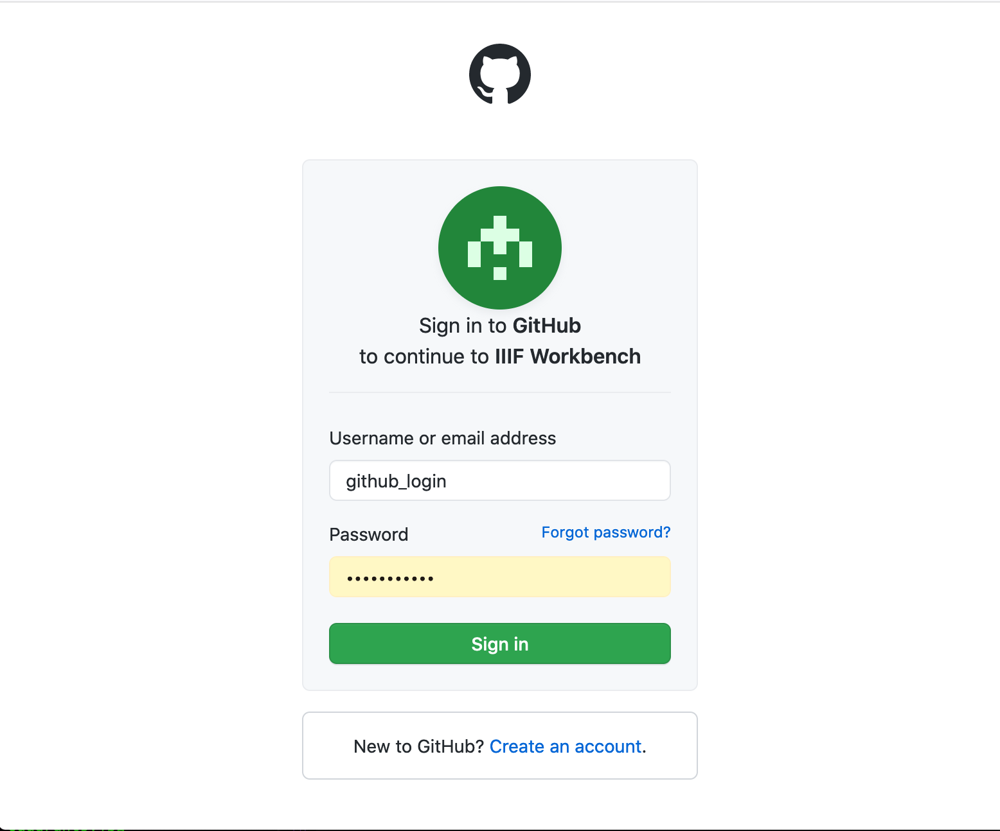

Next you will see the following permissions page. This is asking you if you are happy for the Workbench to write to your GitHub account. Click Authorize. 

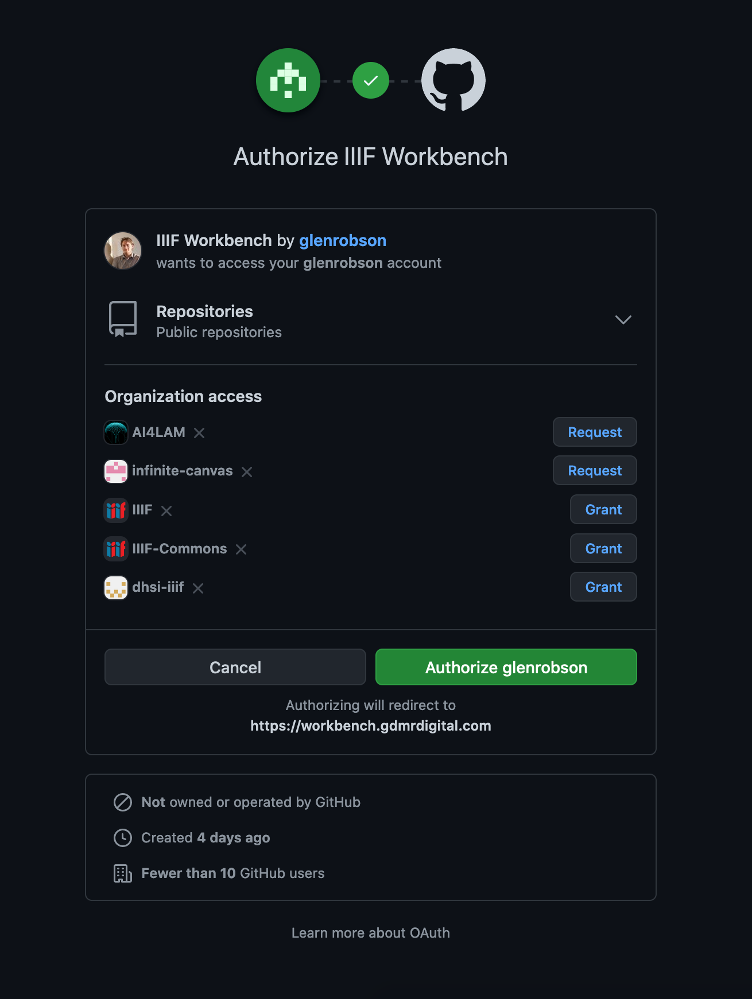

You should now be taken to the projects page:

You have now successfully logged into the Workbench using your GitHub username and password. Once you have been through the Authorisation step once your browser and GitHub will remember that you have given permission and it should log you straight in.  The next stage is to create your project.

## Stage 3. Create your project

A project is a place to store the images and manifests you are working on. You can have multiple projects for every GitHub account but note each project is limited to 1GB in size. In the GitHub terminology a project in this case is equivalent to a GitHub Repository. 

To start click the Create Project button:

and enter a name for your project. Note the name can only contain letters, numbers or the following symbols `-` and `_` so don't add any spaces. 

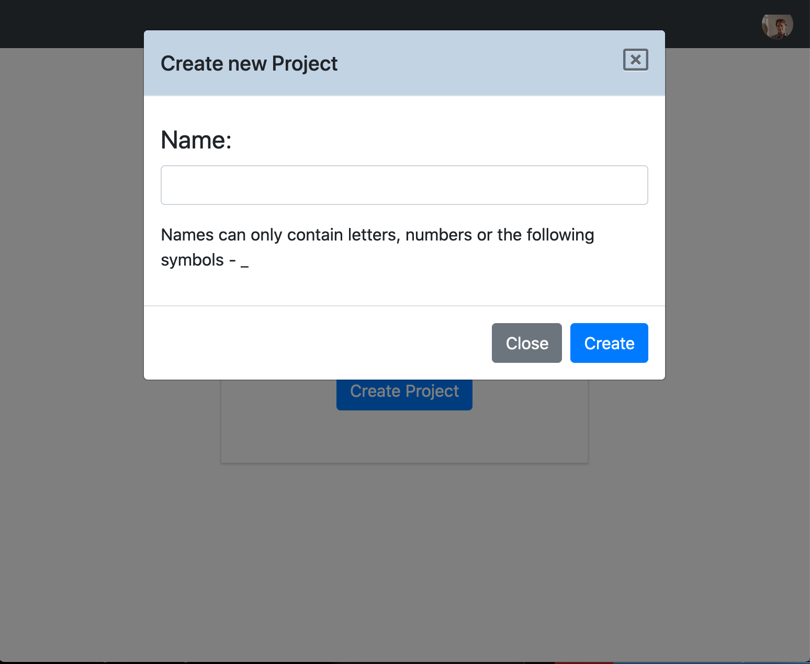

Click create. This will take a few seconds but will setup an empty project on GitHub and then forward you onto the images part of the Workbench. 

You are now ready to upload your images.

## Stage 4. Upload your images

This stage will allow you to upload an image from your computer to the workbench which will convert it into IIIF tiles and store them on GitHub. To start click the upload button and you will see the following screen:

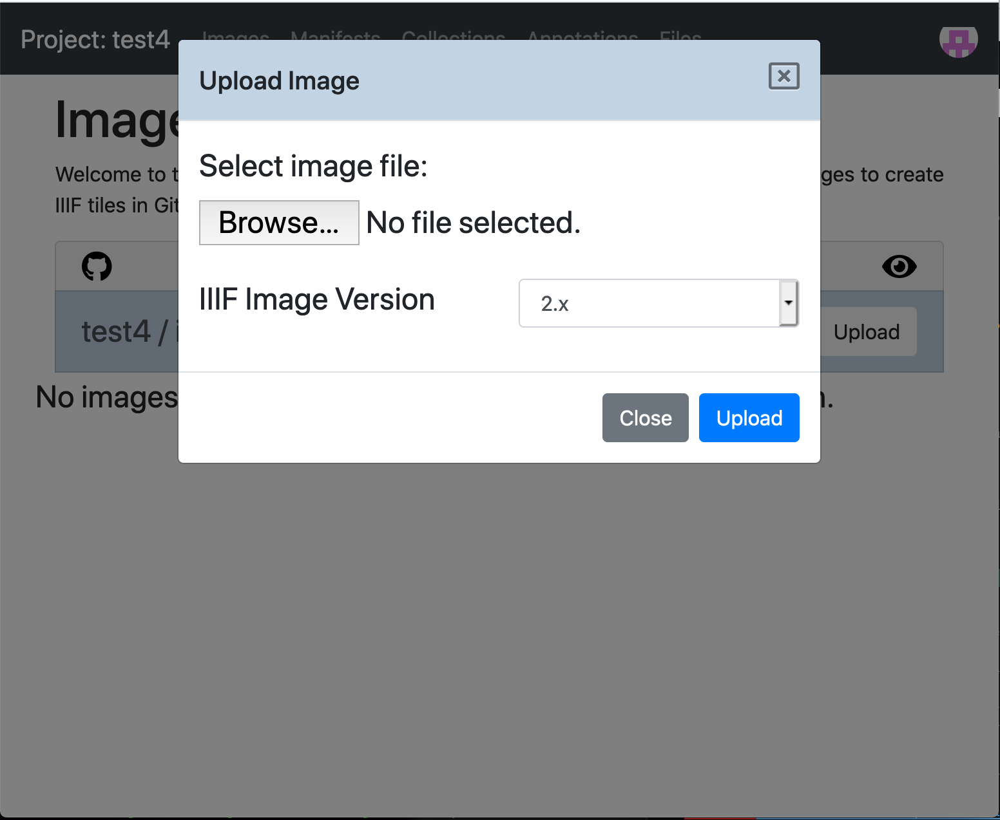

Click the Browse button and select an image on your computer. Once you have an image a `Name` box will appear which allows you to choose the name for your IIIF image. This will appear in the ID of the IIIF image so can't contain spaces and other characters. 

Next select the IIIF Image version either version 2 or 3. For this guides please select version 2 so they can be used in a version 2 manifest. 

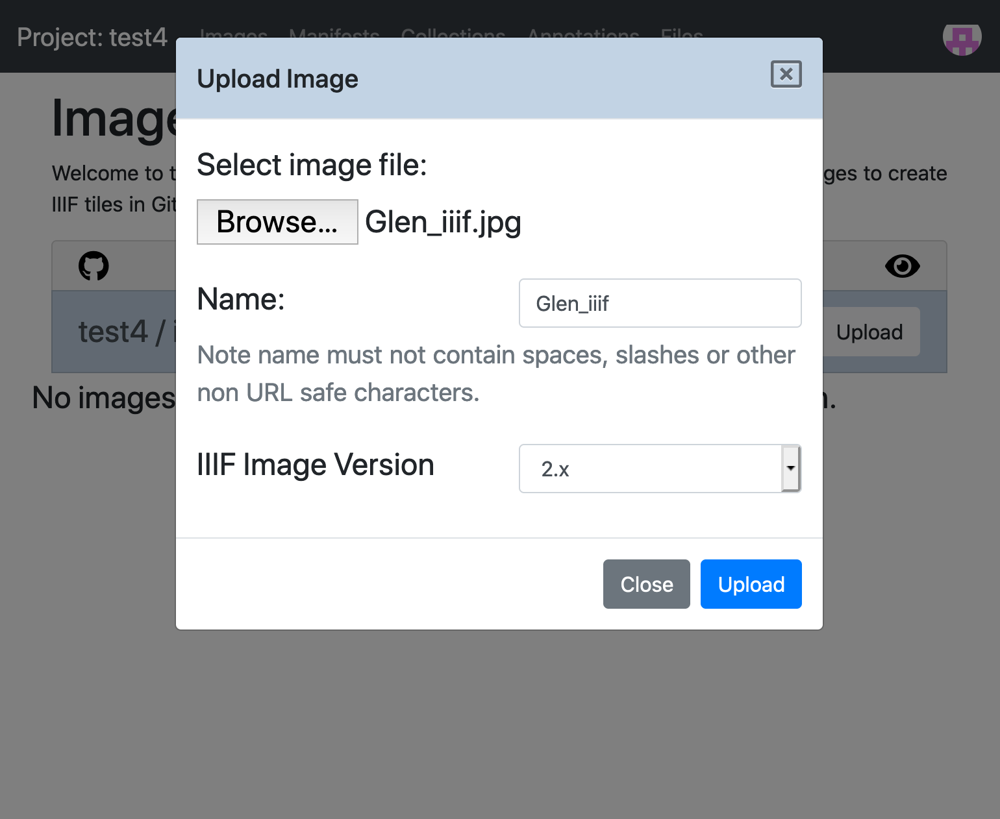

Then click upload. This will upload the image to Github, create the Image tiles and upload the files to GitHub. This can take a couple of minutes and you will see the following screen while the image is processing:

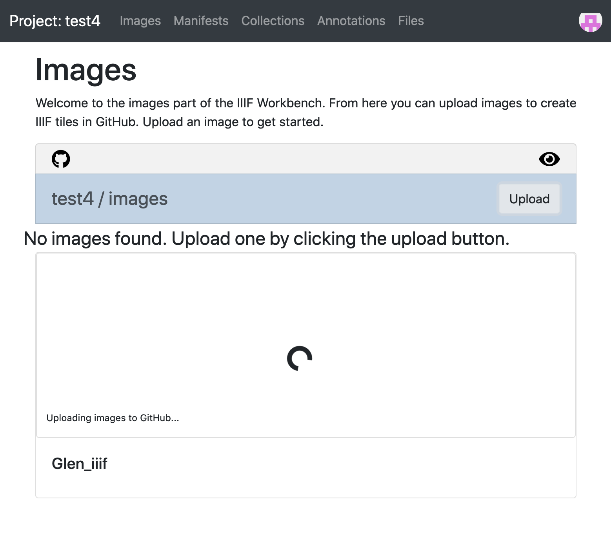

Once it has finished processing you should see a thumbnail of your image. 

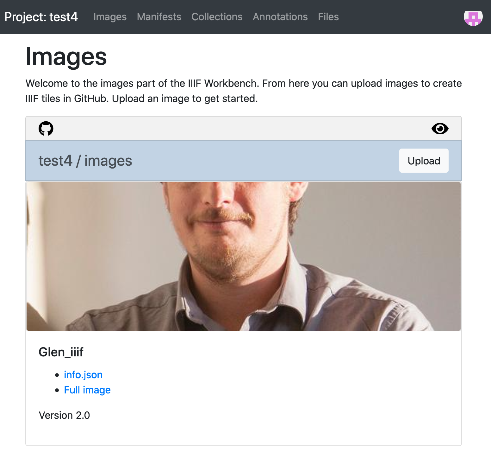

You have now uploaded an image and the next stage is to see if it has worked. 

## Stage 5. Viewing your images

Underneath each of your images you should see two links. One to the `info.json` which we will use later and one to the full image. If you click the Full image link:

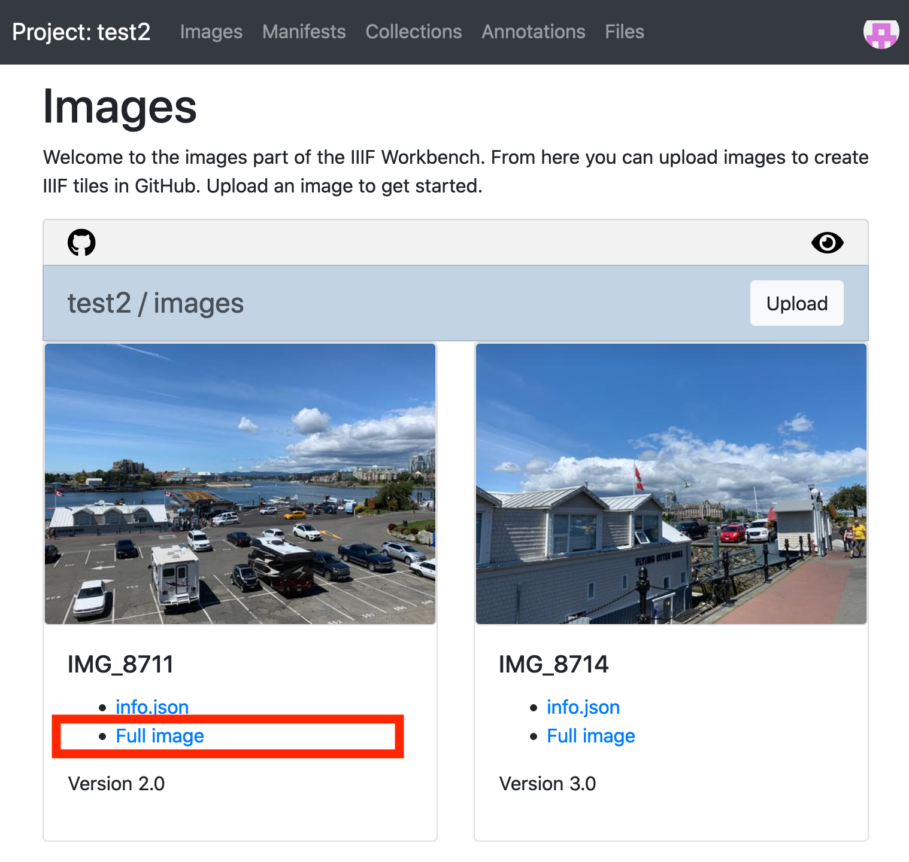

This will open the largest size of your image and the URL will look something like:

https://iiif-test.github.io/test2/images/IMG_8711/full/full/0/default.jpg

And note the end of the URL is a IIIF url asking for the `full` region, `full` size, `0` degrees rotation, `default` quality and a `jpg` file format. 

To view this in a zoomable viewer we need to copy the URL to the `info.json`. If you right click on the `info.json` link and select copy link. This should copy a URL similar to the following to your clipboard:

https://iiif-test.github.io/test2/images/IMG_8711/info.json

This is called a link to your Info.json and you should be able to open your images in the following two zoomable viewers by appending the link to your info.json to the end: 

 * [Leaflet: http://mejackreed.github.io/Leaflet-IIIF/examples/?url=<info.json link>](http://mejackreed.github.io/Leaflet-IIIF/examples/?url=https://iiif-test.github.io/test2/images/IMG_8711/info.json)
 * [Openseadragon: http://iiif.gdmrdigital.com/openseadragon/index.html?image=<info.json link>](http://iiif.gdmrdigital.com/openseadragon/index.html?image=https://iiif-test.github.io/test2/images/IMG_8711/info.json)
 * Note not all software works with level 0 images. 

If you want to see the tiles that have been generated click the GitHub symbol on the top left:

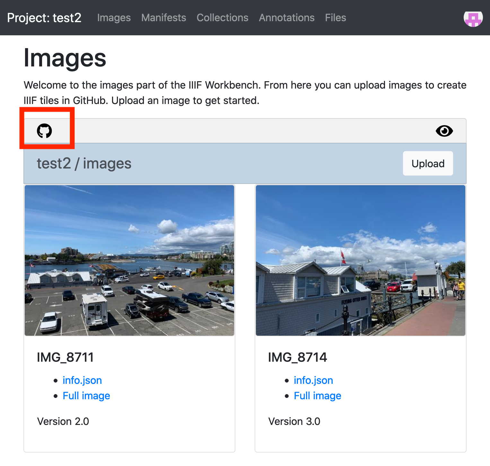

this will open GitHub and show the files that it has generated. 
