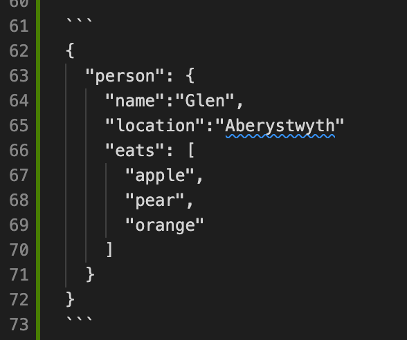

# Manually Editing a Manifest
The concepts of the Presentation API can be difficult to grasp until we actually start building a manifest.

Learning by doing: In production systems (such as a digital library's image collection), manifests can get very big and are usually machine generated, but for getting the basic concepts down, there's no substitute for editing a manifest "by hand."

## Save a Copy
Save a copy of the Manifest you created in the last lesson as `manifest2.json`.  Edit `manifest2.json` for this section.

That way you'll be sure to have a working version that you can fall back on.

To do this in VS Code, if you right click on `manifest.json` in the Explorer window and select copy and then right click again below the `manifest.json` file and click paste it will create a copy called `manifest copy.json`. Rename this (by right clicking on the file and selecting Rename) to manifest2.json.  

## View the Manifest Copy
Load the Manifest in the [Universal Viewer](http://universalviewer.io).  The URL of the copied Manifest for this section should be http://127.0.0.1:5500/manifest2.json

## Edit Your Manifest
There are some important elements of the Manifest that we did not add or edit using the online editor.  The goal of this exercise will be to edit or add them manually.  Each task is linked to the specification for the property that you will need to edit or add to the Manifest.

1. Provide a short [description](https://iiif.io/api/presentation/2.1/#description) of this manifest -- the content is up to you.
1. Modify the [attribution](https://iiif.io/api/presentation/2.1/#attribution) to the manifest that names the source of the images
1. Add the [viewingHint](https://iiif.io/api/presentation/2.1/#viewinghint) to indicate that the item is paged (i.e., should display in two-up book reader mode). 

***Note:*** the Universal Viewer at http://universalviewer.io has a bug which means it doesn't respect the viewingHint and will always show the manifest as `paged`. To test the viewingHint use this development version of the UniversalViewer that has the fix: https://www.universalviewer.dev/

1. Assert a Creative Commons 4.0 by-nc-sa [license](https://iiif.io/api/presentation/2.1/#license).
1. Add properties to the [metadata](https://iiif.io/api/presentation/2.1/#metadata) following the pattern described in [Language of Property Values](https://iiif.io/api/presentation/2.1/#language-of-property-values). 

Hints:
  - After each step, reload the Manifest in the [Universal Viewer](http://universalviewer.io) and confirm that the changes appear.  Remember that the URL of the Manifest for this section is http://127.0.0.1:5500/manifest2.json because you are editing the copy.
  - Consult the [sample Manifest](https://iiif.io/api/presentation/2.1/#c-example-manifest-response) in the specification to find examples of these properties.
  - If your Manifest doesn't load, first check for missing quotes or commas.


## A short introduction to JSON

JSON is a structured language related to HTML and XML and defines a method of separating and structuring data that is designed for a computer to read. It is possible to edit JSON by hand but care must be taken to ensure you adhere to the rules set out in the JSON standard. 

The basic structure of a JSON object is as follows:

```
{
  "key":"value",
  "name":"Glen",
  "location":"Aberystwyth"
}
```

In this example JSON each of the rows is called a key value pair where the key is on the left and the value is on the right. For example the key 'name' has the value 'Glen'. Note that each key value pair has a `,` at the end apart from the last key value pair which doesn't. The `{}` brackets means this is a JSON Object with keys and values. 

The following example denoted by `[]` (Square brackets) is for a list of items:

```
[
  "apple",
  "pear",
  "orange"
]
```

Note again every item in the list has a `,` at the end apart from the last one. 

JSON objects and lists can be embedded which creates nested structures and this is where matching brackets becomes important so the Computer can understand which keys are part of which object. 

```
{
  "person": {
    "name":"Glen",
    "location":"Aberystwyth"
    "eats": [
      "apple",
      "pear",
      "orange"
    ]
  }
}
```

The indentation is not important for the computer in processing JSON but is important for humans so its possible to see where the brackets matchup. 

Below there is a screen shot of the same JSON in VS Code and it draws vertical lines between the brackets so you can tell which brackets match.

