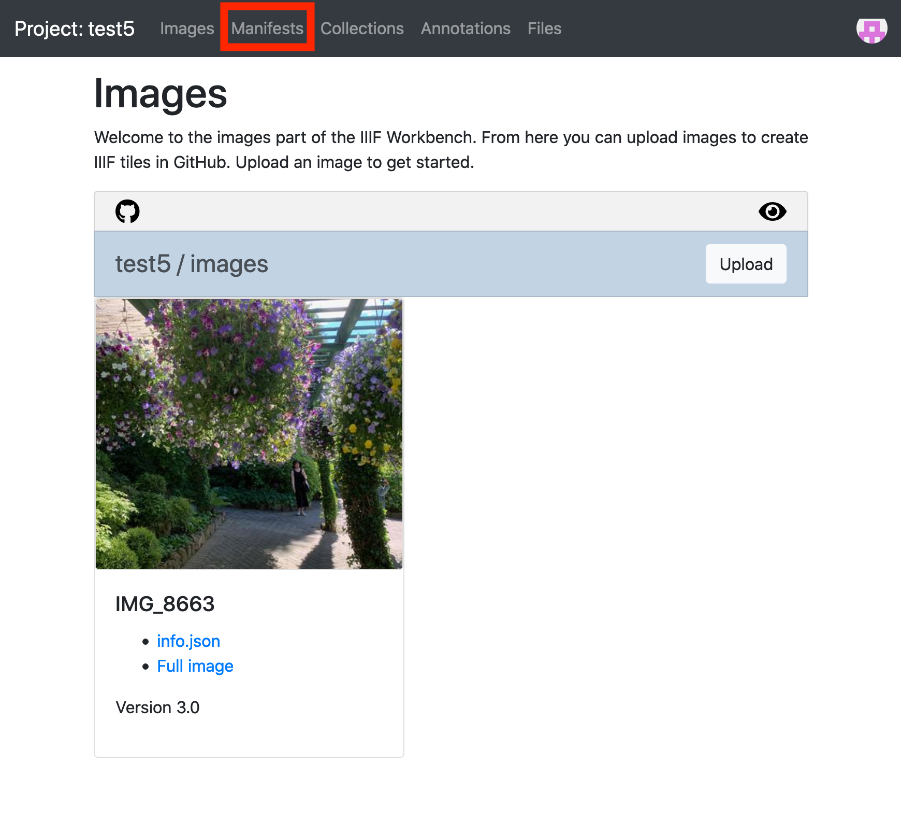
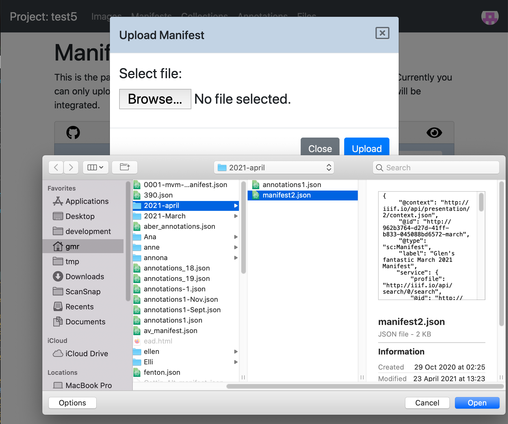
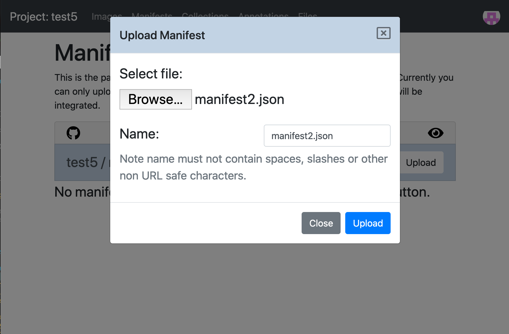
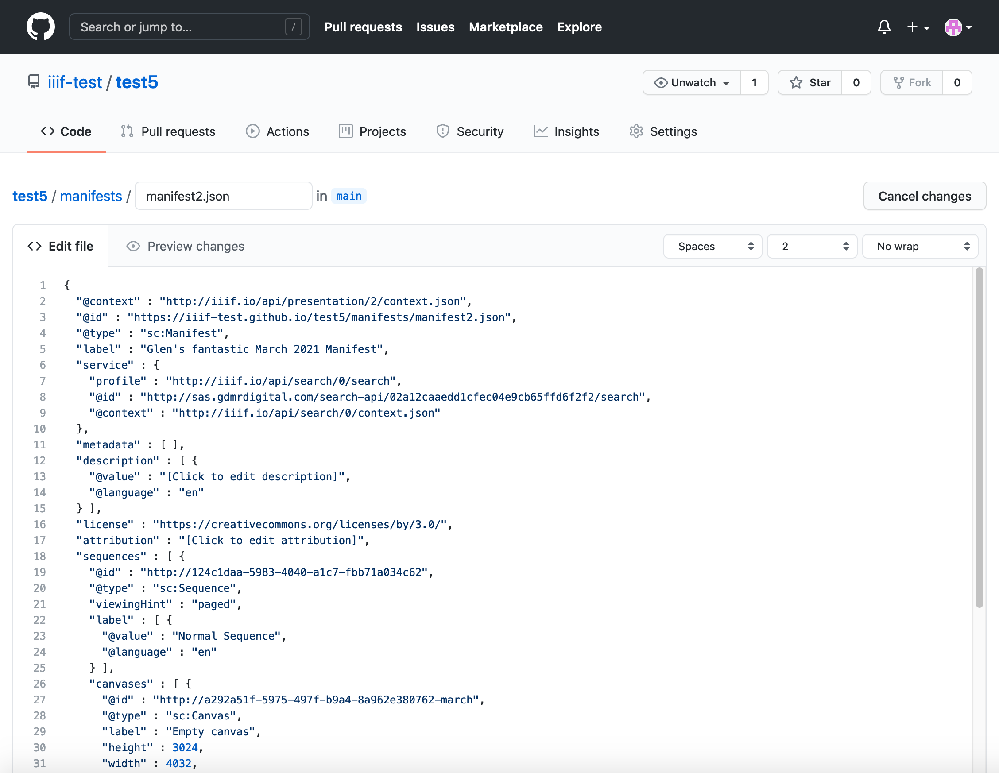
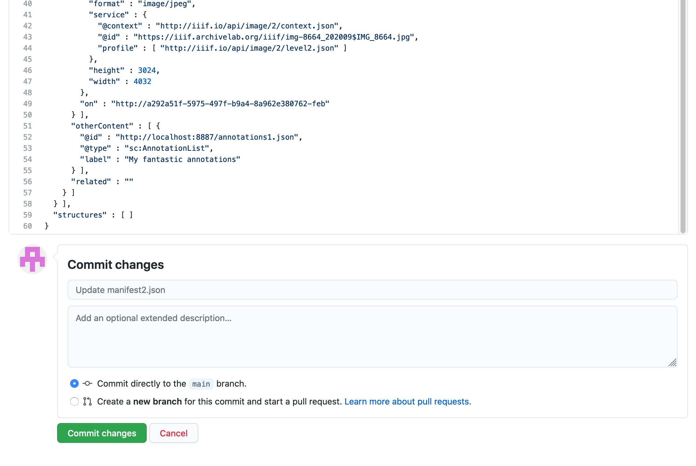

# Publishing your Manifest

In the previous sections we have asked you to use the Chrome web server to make your manifests available. This works well for trying out your manifest but it does limit some of the tools you can use. The main issue is to do with the Chrome web server making your manifests available as http. In the last few years most web sites have moved over to https which encrypts the traffic and increases privacy. One of the restrictions of https is that it limits access to http resources which can cause problems with some IIIF tools.

The solution to this is to use a service which will host your manifest using https and for the purposes of this course we are going to use the Workbench introduced in the [Static Images - Workbench](../../part2/image-servers/level0-workbench.md) section. This encompasses the following stages:

1. Logon to Workbench and navigate to the Manifests section
2. Upload your Manifest
3. View your Manifest in compatible IIIF tools.
4. Making changes to your manifest

Further details on these stages are below with screen shots:

# Stage 1. Logon to Workbench and navigate to the Manifests section

Navigate to the training workbench:

[https://workbench.gdmrdigital.com/](https://workbench.gdmrdigital.com/index.xhtml)

Select the project you are working on and then select the Manifests heading at the top of the page.

# Stage 2. Upload your Manifest

Now you can upload your manifest. Click the upload button and choose the manifest you want to upload.

You can change the name of the manifest before uploading. You may want to do this if you already have a manifest with the same name that you've uploaded previously. Ensure that the filename doesn't have any spaces or characters that aren't `.`,`-` or `_`.

Then click upload. The upload happens in two stages. The first is uploading the manifest to GitHub which happens quite quickly. The second stage is GitHub updating the website which can take a couple of minutes. While the website is updating you may see the following which will wait to show the Mirador and UV links until the Manifest is available on the website.

Once you see the IIIF image and other logos it is safe to start using your manifest in other tools.

# Stage 3. View your Manifest in compatible IIIF tools.

Now you have a public https manifest you can start using it! There are a number of buttons underneath your manifest which is a good place to get started.

The buttons from left to right are as follows:

 * IIIF Logo - if you click this, it will open your manifest in a new window and show you the JSON. If you right click on the image and select `Copy link`, this is the link to your manifest which you can use in other tools.
 * Edit icon - click this if you want to make small edits to your manifest. This feature is discussed further in stage 4.
 * Delete icon - This will delete the manifest from your project.
 * Github icon - This will take you to the GitHub location of your manifest.
 * Mirador icon - click this to see your manifest in the latest version of Mirador.
 * UV icon - click this to see your manifest in the public UV version.

As well as the tools above there are also a number of other tools that work with IIIF manifests. For these you will need to copy the Manifest URL in the IIIF logo. Some other tools to try are:

 * [A guide to IIIF viewers](https://iiif-io.medium.com/how-to-use-iiif-resources-and-image-viewers-bd378a68b013) - try your manifest in Mirador 2, Tify, IIIF Curation Viewer and Diva.js
 * [exhibit.so](https://exhibit.so/) a tool for creating Exhibits or presentations of your manifests. See the [Guest Videos](../../GuestPresentations.md) for more details.
 * [FromThePage](https://www.fromthepage.com/) a transcription tool. Also see the video in the [Guest Videos](../../GuestPresentations.md).
 * [Recogito](https://recogito.pelagios.org/) a hosted free transcription and teaching tool.

# Stage 4. Making changes to your manifest

If after trying out some of the tools above you want to make some changes to your manifest. There are two ways to do it. The first is to delete the manifest from your project and upload it again.

The second way is to click the Edit icon. This will take you into GitHub and will look something like this:

You can make changes to the manifest here but be careful as the GitHub interface doesn't provide any validation for the JSON so its easy to miss a `,` or brackets. Once you have made your changes scroll to the bottom of the page where you should see:

Click the commit button to save the changes to your manifest. Note although your changes will be saved straight away it will take a couple of minutes for them to be reflected in the website version of the manifest.
