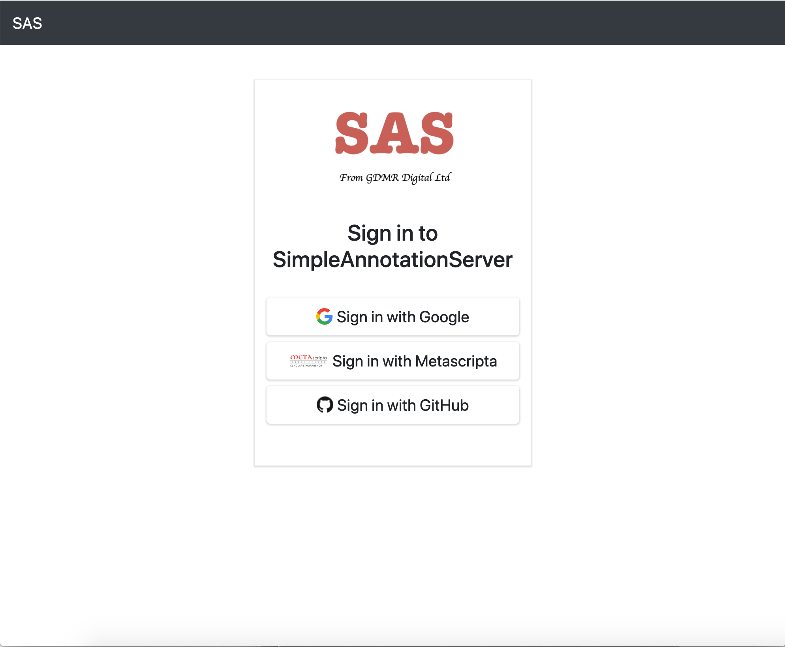
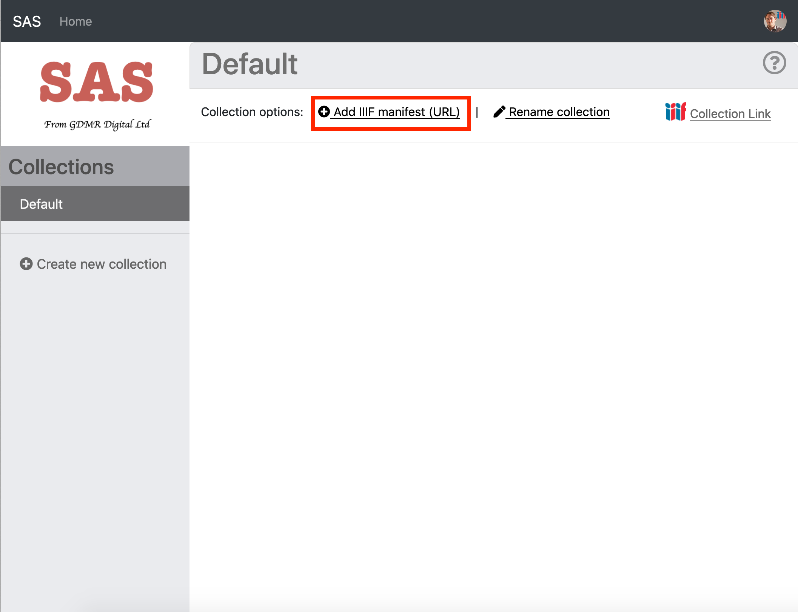
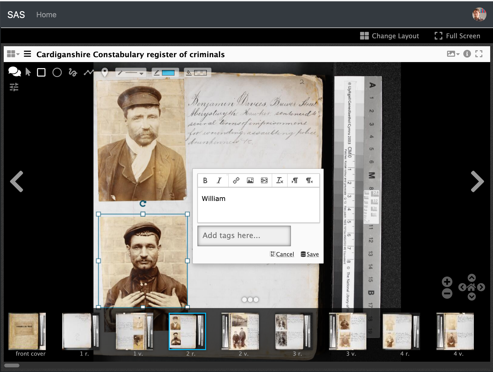
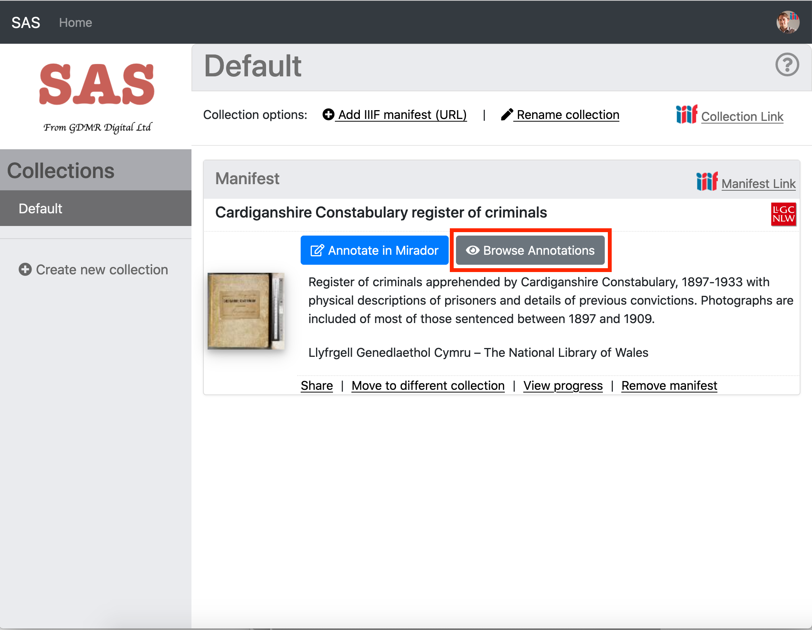
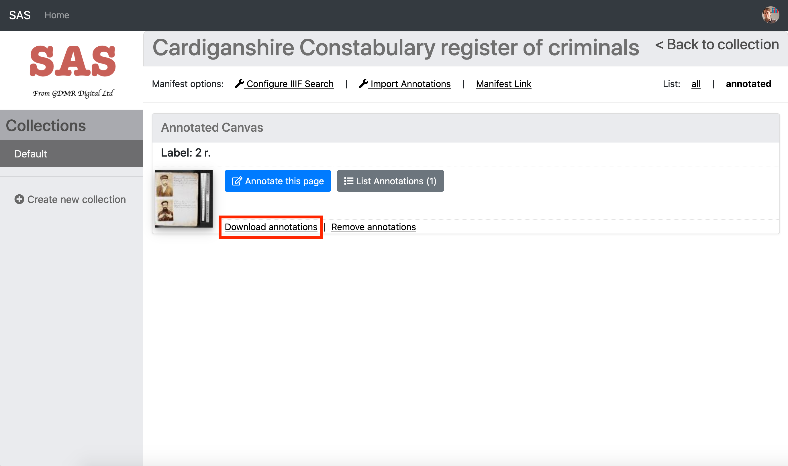
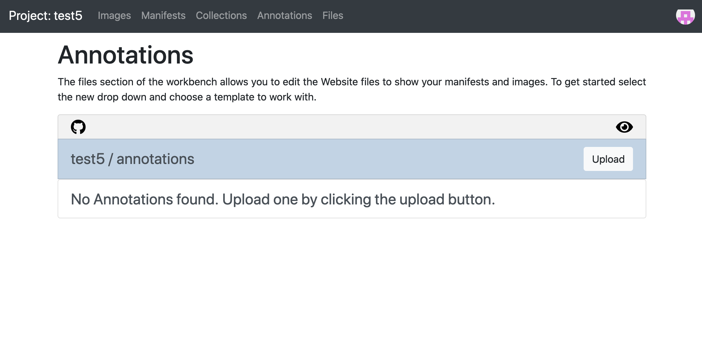
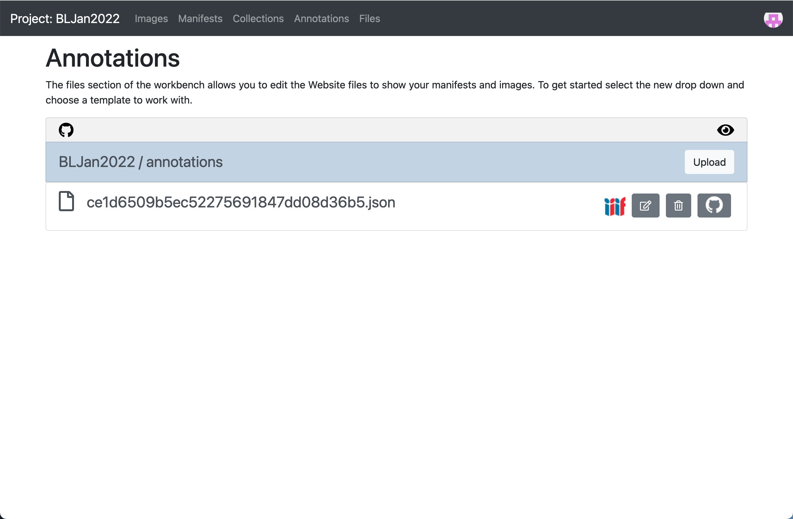
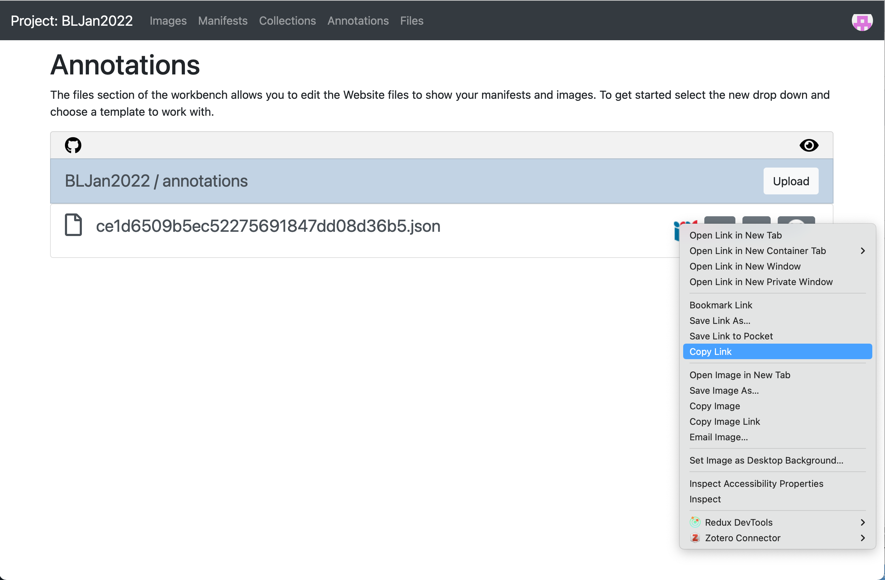
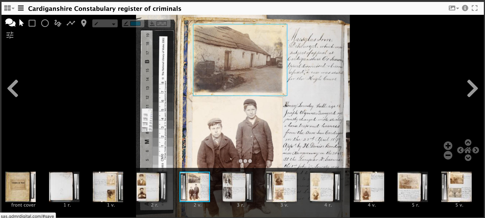

# Creating and downloading Annotations

In this tutorial we are going to annotate an image from your own manifest using a recently released version of the SimpleAnnotationStore. Once we have finished annotating we are going to link the annotations to your Manifest. This is a way of permanently attaching annotations to a manifest.

The major difference with this new version of the SimpleAnnotationServer is that you are asked to login and you will have a collection of Manifests that you have annotated. The previous version only had a single user so everyone could see and edit all of the annotations. In this version only you can see your annotations until you publish them. The high level process is as follows:

 * Step 1: Create your annotations
 * Step 2: Upload your annotations to Workbench
 * Step 3: Link your manifest to the annotations
 * Step 4: Test to see if your annotations are working

Note from this step forward the activities get more difficult and will involve editing your Manifest. These stages are optional and will give you a complete workflow for annotating and publishing your annotations. There are two options for getting a Manifest to Annotate.

### Option 1 use the Workbench

This option uses a combination of annotating the version of the manifest from your Workbench (see step [Publishing your Manifest](../part3/workbench/)) and creating a copy that you can edit and test using the Chrome Web Server. For this option you need to do the following two things:

1. Download your manifest for editing

 * Navigate to your manifest in your workbench
 * Right click on the IIIF logo and select `Save Link As`
 * Save it in the Chrome Web Server directory and call it `manifest3.json`
 * Ensure your Chrome Web server is running. This should be running on port `8887` and the manifest should be available at http://localhost:8887/manifest3.json
 * Open the downloaded manifest in [Atom](https://atom.io/) ready for editing.

2. Copy the Manifest URL

Now go back to your manifest in the Workbench and right click on the IIIF logo again but this time select `copy link`. This will copy the Manifest URL to your clipboard.

### Option 2 Use any public IIIF manifest

If you didn't manage to get a manifest in the previous session you can use any IIIF Manifest. My personal favourite is:

https://damsssl.llgc.org.uk/iiif/2.0/4389767/manifest.json

## Step 1: Create your annotations

### Login to SAS
 * Navigate to https://dev.gdmrdigital.com/ and click the Log in / Sign Up link.
 * This will take you to the following screen where you can choose to either login using your Google or Github accounts

  

Unlike the workbench SAS doesn't write to your Google drive or GitHub account. The GitHub/Google methods are purely used to provide authentication to SAS with all of the data being stored on the SAS server.

### Load your manifest into SAS:
Once you have logged in you will be presented with the following collection screen:

  

 * Now click the Add IIIF manifest (URL) link and enter the URL to your manifest as below.
   * If you are using the Workbench use the URL copied from the IIIF logo.
   * If you are using the Chrome web server the URL is: http://localhost:8887/manifest2.json

  

 * Then click Add. Depending on how many pages the manifest takes this might take a minute or two to index.
 * Once your manifest is loaded you should see it appear in your default Collection:

  

### Annotate manifest

 * Now we have the manifest loaded into your SAS account we can start annotating.
 * Click the blue "Annotate in Mirador" button.
 * This should open up your manifest in Mirador
 * Navigate to a page you want to annotate then click the speech bubbles at the top right to start annotating.

  

## Step 2: Upload your annotations to Workbench

### Download annotations from SAS

Now you have finished annotating you need to download the annotations before uploading it to the Workbench. To do this you will download 1 annotation list per page or canvas.

 * Navigate back to the collections page by either clicking the Home menu item or following this link: https://dev.gdmrdigital.com/collections.xhtml
 * Now click the grey "Browse Annotations" button

  

 * You should now see the canvases which have annotations.
 * Click the "Download Annotations" link.

  

If you download this annotation file to your workshop directory. The name of the file isn't important as long as it ends in .json.  

### Upload annotations to Workbench

In a new Browser tab navigate to your Workbench by going to https://workbench.gdmrdigital.com/login.xhtml and logging in. Select the project you are working on and click the Annotations section.



Now upload the annotations you downloaded from SAS:


Once you have uploaded your annotations you should see the screen below.



It takes about 10mins for the Workbench to publish the annotation list to your Website but we can still copy the URL to the annotations list to move on to the next stage. To do this right click on the IIIF logo and select "Copy Link" to copy the URL of your annotations. This is what we will add to your manifest.



## Step 3: Link your manifest to the annotations

To get the annotations to display you need to link them into the manifest. Open up your manifest in your Chrome Web Server directory in [Atom](https://atom.io/).

Then find the canvas your annotations point to then add the following:

```json
"otherContent": [
    {
        "@id": "https://iiif-test.github.io/BLJan2022/annotations/ce1d6509b5ec52275691847dd08d36b5.json",
        "@type": "sc:AnnotationList",
        "label": "My fantastic annotations"
    }
]
```

after the images array. Replace the URL after the `@id` with the URL you copied from Workbench. A full canvas example is below:

```json
{
    "@id": "http://dams.llgc.org.uk/iiif/2.0/4004562/canvas/4004563.json",
    "@type": "sc:Canvas",
    "label": "1r",
    "height": 5584,
    "width": 3744,
    "images": [
        {
            "@id": "http://dams.llgc.org.uk/iiif/2.0/4004562/annotation/4004563.json",
            "@type": "oa:Annotation",
            "motivation": "sc:painting",
            "resource": {
                "@id": "http://dams.llgc.org.uk/iiif/2.0/image/4004563/full/1024,/0/default.jpg",
                "@type": "dctypes:Image",
                "format": "image/jpeg",
                "service": {
                    "@context": "http://iiif.io/api/image/2/context.json",
                    "@id": "http://dams.llgc.org.uk/iiif/2.0/image/4004563",
                    "profile": "http://iiif.io/api/image/2/level1.json"
                },
                "height": 5584,
                "width": 3744
            },
            "on": "http://dams.llgc.org.uk/iiif/2.0/4004562/canvas/4004563.json"
        }
    ],
    "otherContent": [
        {
            "@id": "https://iiif-test.github.io/BLJan2022/annotations/ce1d6509b5ec52275691847dd08d36b5.json",
            "@type": "sc:AnnotationList",
            "label": "My fantastic annotations"
        }
    ]
},

```

Save the manifest. Watch out for JSON typing errors. Common JSON issues include:

 * Make sure that all the brackets match up
 * Lines that are not the last line in a list or array must have a `,` at the end of the line.

To make this easier you may want to use a JSON aware editor like [ATOM](https://atom.io/) which will tell you if you are missing brackets or commas. You can also copy and paste your JSON to:

https://jsonlint.com/

which will tell you if the JSON is valid and if not where the error is.

Now test your edited manifest in the browser to check it looks OK. If you are using `manifest3.json` then the link will be:

http://localhost:8887/manifest3.json

If you are using the workbench then the link will be similar but the name might be different to `mainfest2.json`. If you go to:

http://localhost:8887/

You should be able to see your manifest. If you click on your manifest you should see the JSON. If you copy the URL in the browser address bar you will have the Manifest URL for your edited manifest.

## Step 4: Test to see if your annotations are working

 * Go to http://iiif.gdmrdigital.com/mirador/index.html.
 * Load the manifest using Add new object from URL (using the manifest hosted in the Chrome Web Server)
 * Click on one of the images to view the manifest
 * Click on the speech bubble to show the annotations.

  

 * and if it all worked OK you should see your annotation.

  


Another method to see your annotations is with a tool using the [Annona Storyboard viewer](https://ncsu-libraries.github.io/annona/) by Niqui O'Neill from NC State University Libraries. This will demonstrate the interoperability of these annotations and also provide an option for the end of week projects. Annona is a powerful tool to create stories from annotations and supports a wide variety of use cases. The most important one for this lesson is to support annotations created by the SimpleAnnotationServer (SAS).

Annona is unusal in that it takes a link to the Annotation List rather than the Manifest but if you change the URL after iiif-content below to your own Annotation List URL from workbench you should be able to browse through your annotations.

[http://iiif.gdmrdigital.com/annona/index.html?iiif-content=https://iiif-test.github.io/BLJan2022/annotations/ce1d6509b5ec52275691847dd08d36b5.json](http://iiif.gdmrdigital.com/annona/index.html?iiif-content=https://iiif-test.github.io/BLJan2022/annotations/ce1d6509b5ec52275691847dd08d36b5.json)
