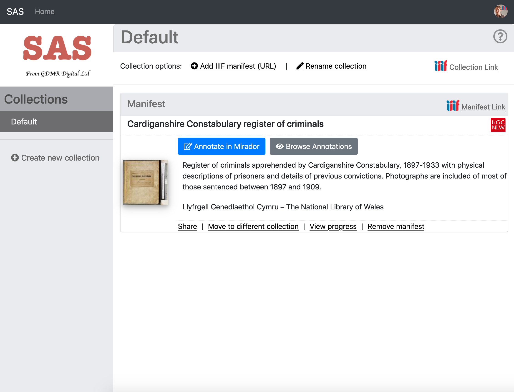
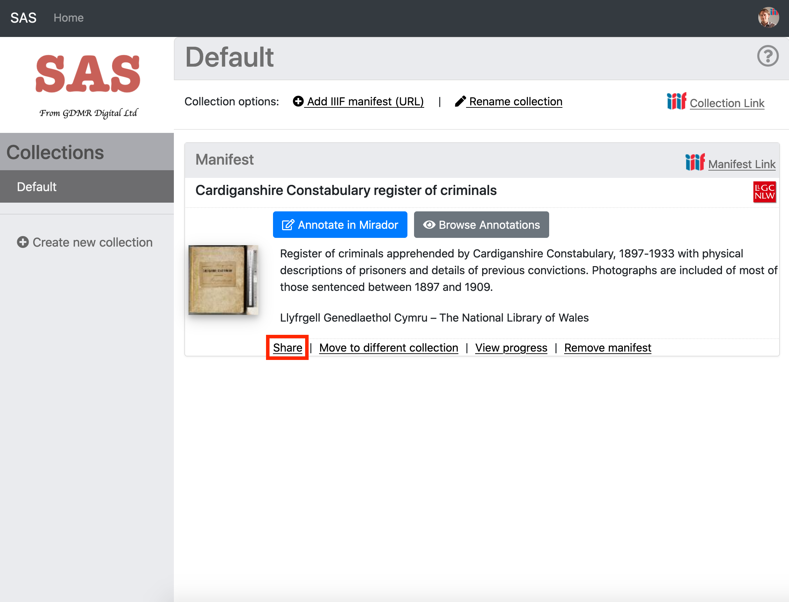
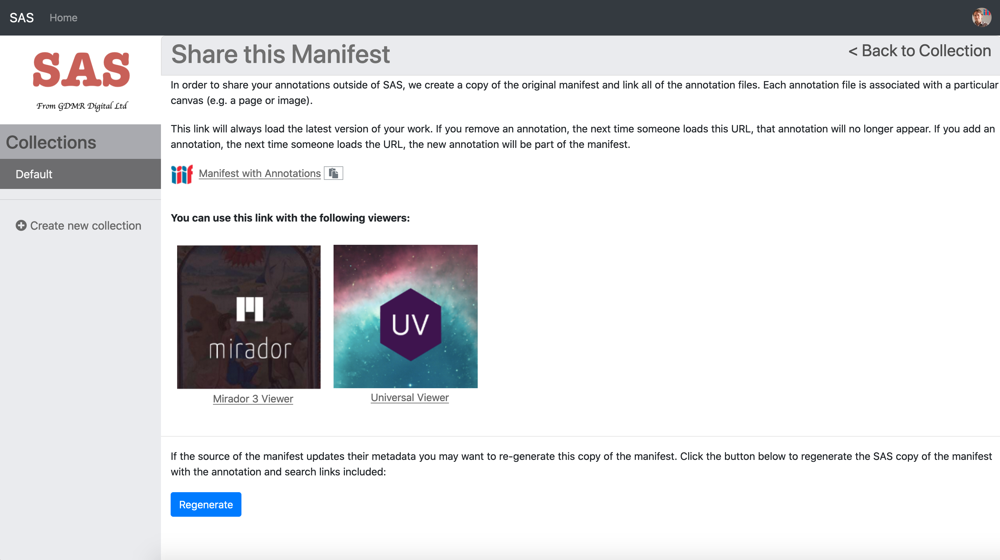
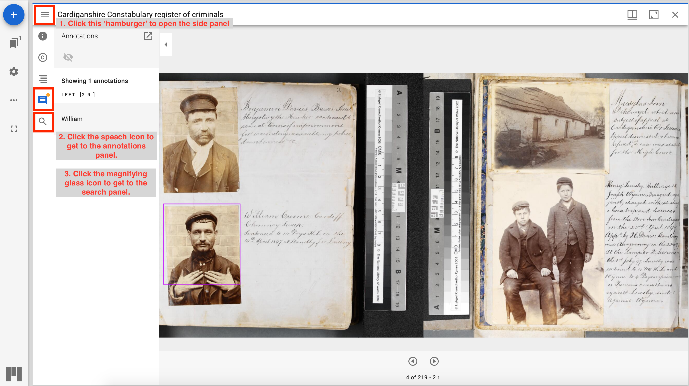
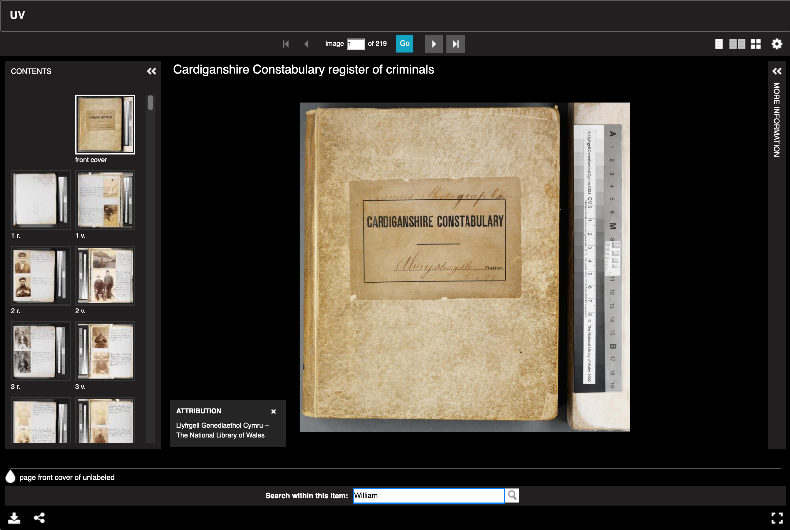

# Sharing your Annotations

Now you have created your annotations you want to share them with others. To do this make sure you are back on your Collections screen and have the collection with your Manifest selected.

Now click the share link:

Opening the Share screen will create a copy of the original Manifest and add links to the Annotations and to a IIIF Search service. The share screen gives you a link to the copied Manifest and also two large buttons to open the Manifest in Mirador and the Universal Viewer. 

If you click on the Mirador link you will be taken to a public copy of Mirador. Once you navigate to the page you have annotated you should be able to click the 'hamburger' symbol to open up the left hand panel. Once open you can click on either the Annotations panel or Search Panel. 

If you go back to the Share screen and click on the Universal Viewer link you will be taken to the following screen:

Note the Universal Viewer doesn't support annotations in the same way as Mirador. To view the annotations you have to search for them using the search bar at the bottom. 
