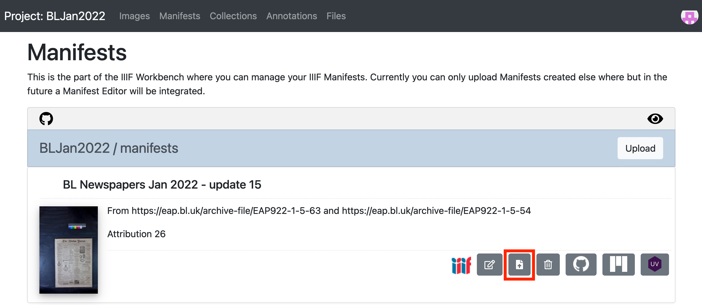

# Publishing your annotated Manifest

Now you have finished editing your manifest and tested it is working you can upload it to your Workbench so you can share it with others. The reason we have been developing with the Chrome Web Server version is that GitHub caches all of the Website files and so it takes a while for the changes you make to appear on the Website. 

To update the manifest in Workbench click the replace button highlighted below:

This will ask you to upload a new version of the Manifest and then will wait for the website to be updated. When you see the links to Mirador and the UV appear it should be OK to view the latest version of the manifest. You not see your changes due to the caching issue mentioned earlier so if this is the case open up a new private window or click Shift and refresh to get the latest copy. 

You should now be able to see your annotations and search service in the following places:

 * Mirador 3: https://projectmirador.org/
 * Universal Viewer: http://universalviewer.io/
 * Annona: http://iiif.gdmrdigital.com/annona/index.html?iiif-content=[annotations_url]

