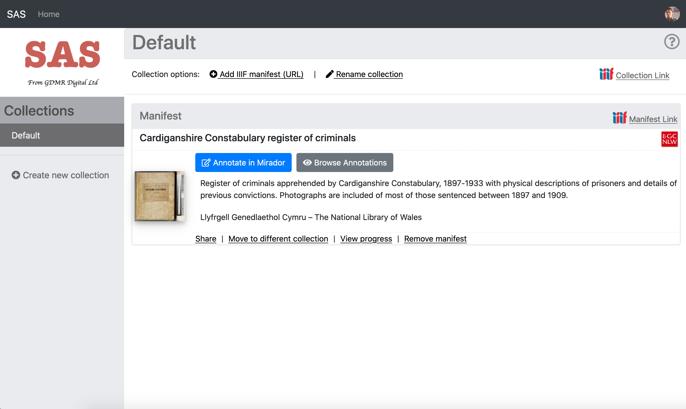
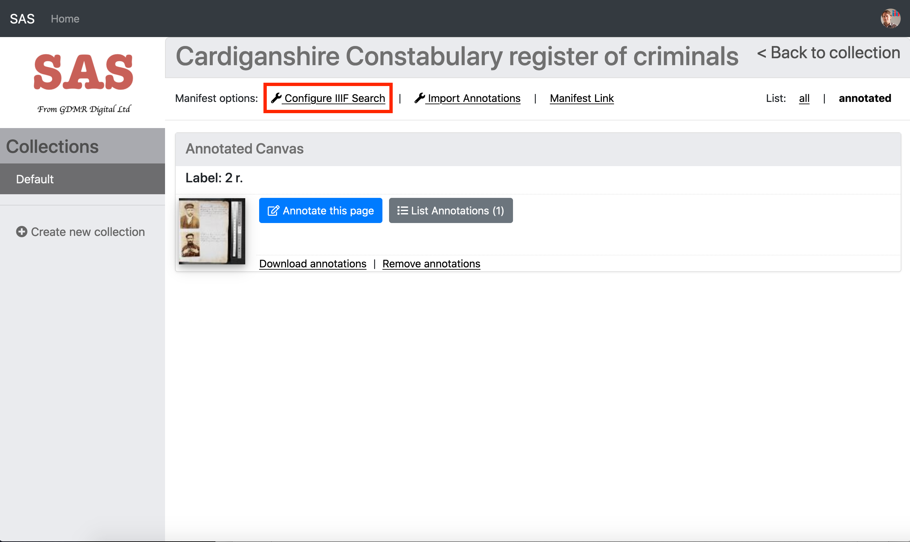
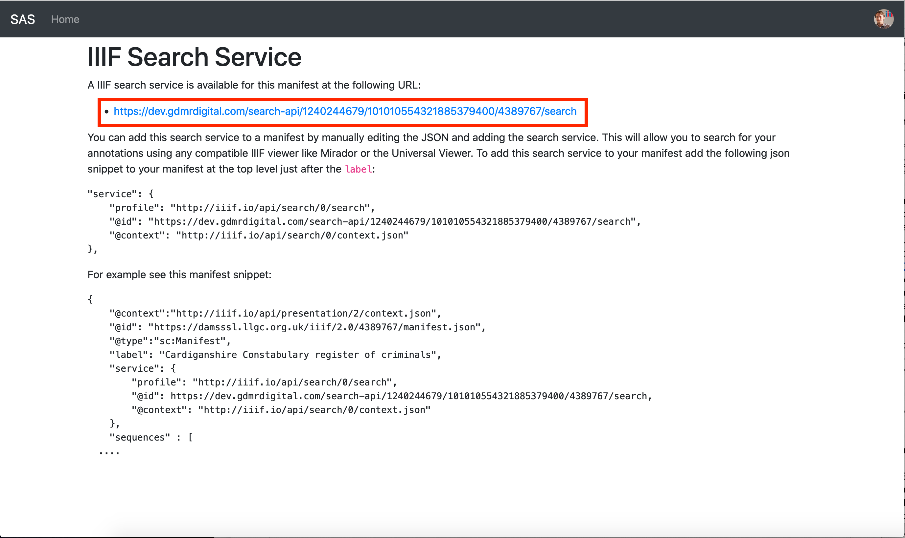

# IIIF Search API

TODO overview of API

## Creating a Search Service.

* Your service needs to be able to take in a query via a web request to a designated endpoint
* Search for Hits
* Return Results in the JSON format required by the IIIF api.

## Announcing a Search Service

* Once you have a search service running, you need to announce.
* Someone loading your manifest will not automatically know that a search service exist
* So, we have to declare this in the manifest like so:
  ```json
    "service": {
        "profile": "http://iiif.io/api/search/0/search",
        "@id": <the url of the search endpoint goes here>,
        "@context": "http://iiif.io/api/search/0/context.json"
    },
  ```
* Here's what my service looks like
  ```json
    "service": {
        "@context": "http://iiif.io/api/search/1/context.json",
        "@id": "https://exist.scta.info/exist/apps/scta-app/iiif2/lon/search",
        "profile": "http://iiif.io/api/search/1/search",
        "label": "Search within this manifest"
    },
  ```

# Example Search Service

Implementing a serv


<!-- ## Step 1: Find the IIIF Search URL

If you navigate to your collections page either by clicking on the Home link or by navigating to:

https://dev.gdmrdigital.com/collections.xhtml

On the collections page click "Browse Annotations":

  

and then you will be taken to the Manifest page. Now select the Configure IIIF Search link highlighted below. 

  

The IIIF search page gives details on how to add a link to the search service. Copy the URL circled in Red in the image below:

  
 
## Step 2: Link Manifest to Search Service

Now open up your Manifest in VS Code and it should look like this:

  

Now add the following JSON to the manifest after the `label`:

```
"service": {
    "profile": "http://iiif.io/api/search/0/search",
    "@id": "SEARCH_ID",
    "@context": "http://iiif.io/api/search/0/context.json"
},
```

Now replace the SEARCH_ID with the URL you copied earlier. In my example it would look like:

  

## Step 3: Test with a IIIF Viewer
Test your manifest with the Universal Viewer to see if has worked.

 * Open up http://universalviewer.io/
 * and paste your manifest http://127.0.0.1:5500/manifest2.json in the View a IIIF Manifest section
 * Does it show a search box?
 * Has it found an annotation? 
 * If you add an annotation in Mirador does it show up in the search results in the UV?
 -->
