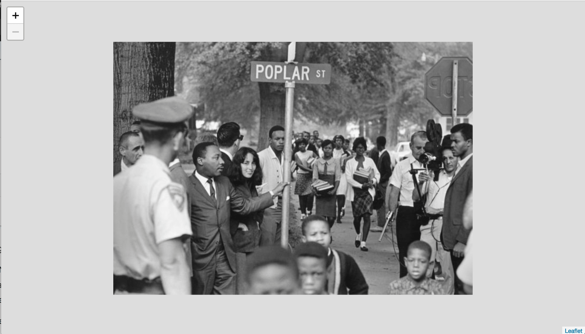
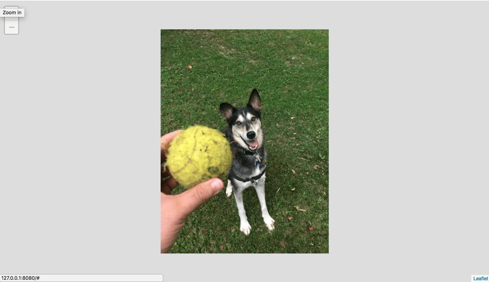
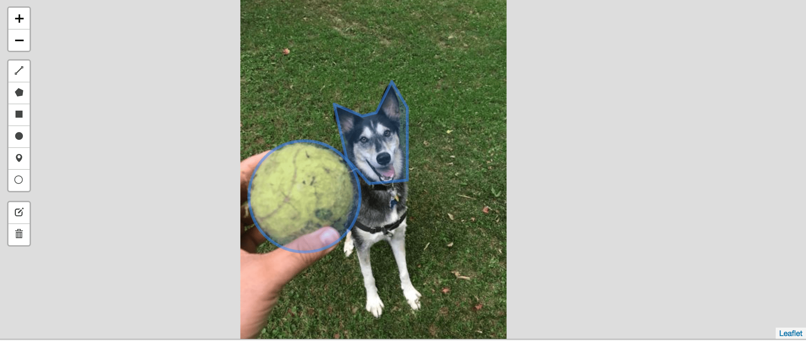

# Creating a Basic Image Viewer

We have already had success in setting up a IIIF Image Server, now lets put that to use.

## IIIF Image API Client Libraries

There are several widely used [IIIF Image API client libraries](https://github.com/IIIF/awesome-iiif#image-viewers), available for multiple languages including JavaScript and Swift. For this workshop (at least for today) we are going to focus on working with Leaflet-IIIF. Why Leaflet-IIIF, well the facilitator of the workshop is the author of the library. Later in the week we will cover some more technologies.

## Adopting an existing basic example

For this basic example we want to adopt some pre-existing code hosted as Gist and available at [https://bl.ocks.org/mejackreed/b0aba2ff6f5a54f197767313fbc5a26e](https://bl.ocks.org/mejackreed/b0aba2ff6f5a54f197767313fbc5a26e).

Go ahead and check that link out. Now let's download the code to get started.

1. Visit https://gist.github.com/mejackreed/b0aba2ff6f5a54f197767313fbc5a26e
1. Download the code example, "Download ZIP" is probably the easiest way.
1. Unzip downloaded ZIP file and then open the directory in a code editor.
1. Lets run the code as is. Change into the downloaded directory (using `cd`) in a terminal
```sh
$ cd b0aba2ff6f5a54f197767313fbc5a26e-7ece2b016005fb9454dad91d5fcabf5a3ddc934f
```
**Hint: Use tab to autocomplete directory or file names in the terminal**
1. Run a webserver in the directory. There are two options here, you can use the Nodejs package "http-server" if you installed Nodejs. `npm install --global http-server` and then run it using `http-server`. Or if you have Python installed you can run `python -m SimpleHTTPServer`.
1. We should now be able to visit the page in our browser: Visit [http://127.0.0.1:8000](http://127.0.0.1:8000) or [http://127.0.0.1:8080](http://127.0.0.1:8080). You should see the example we saw on the bl.ocks site.

1. Let's change the image to use one we setup in the last step. In your code editor modify the following line in `app.js`.

```diff
- L.tileLayer.iiif('https://stacks.stanford.edu/image/iiif/hg676jb4964%2F0380_796-44/info.json').addTo(map);
+ L.tileLayer.iiif('http://127.0.0.1:8182/iiif/2/eddie.jpg/info.json').addTo(map);
```
Now when we reload the webpage, we should see our image similar to the last example.


## Adding annotation

One advantage of using Leaflet-IIIF is the vast plugin ecosystem. We can quickly add the ability to add annotations to our image using a Leaflet plugin, [Leaflet-Draw](https://github.com/Leaflet/Leaflet.draw).

1. Add the Leaflet.Draw CSS and JavaScript dependencies to our `index.html` file.

```diff
<!DOCTYPE html>
  <head>
    <meta charset="utf-8">
    <meta name="viewport" content="width=device-width, initial-scale=1.0, maximum-scale=1.0, user-scalable=no" />
    <link rel="stylesheet" href="https://unpkg.com/leaflet@1.3.1/dist/leaflet.css"
     integrity="sha512-Rksm5RenBEKSKFjgI3a41vrjkw4EVPlJ3+OiI65vTjIdo9brlAacEuKOiQ5OFh7cOI1bkDwLqdLw3Zg0cRJAAQ=="
     crossorigin=""/>
+   <link rel="stylesheet" href="https://unpkg.com/leaflet-draw@1.0.2/dist/leaflet.draw.css" />
    <link rel="stylesheet" href="styles.css">
    <script src="https://unpkg.com/leaflet@1.3.1/dist/leaflet.js"
     integrity="sha512-/Nsx9X4HebavoBvEBuyp3I7od5tA0UzAxs+j83KgC8PU0kgB4XiK4Lfe4y4cgBtaRJQEIFCW+oC506aPT2L1zw=="
     crossorigin=""></script>
    <script src="https://ajax.googleapis.com/ajax/libs/jquery/3.2.1/jquery.min.js"></script>
    <script src="https://cdn.rawgit.com/mejackreed/Leaflet-IIIF/v2.0.1/leaflet-iiif.js"></script>
+   <script src="https://unpkg.com/leaflet-draw@1.0.2/dist/leaflet.draw.js"></script>
  </head>
  <body>
    <div id="map"></div>
    <script src="app.js"></script>
  </body>
</html>
```
1. Initialize the Leaflet.Draw plugin and a data structure to hold the annotations.

```diff
// Initialize the FeatureGroup to store editable layers
var drawnItems = new L.FeatureGroup();
map.addLayer(drawnItems);

// Initialize the draw control and pass it the FeatureGroup of editable layers
var drawControl = new L.Control.Draw({
  edit: {
    featureGroup: drawnItems
  }
});

map.addControl(drawControl);

map.on(L.Draw.Event.CREATED, function (e) {
  var type = e.layerType
  var layer = e.layer;

  // Do whatever else you need to. (save to db, add to map etc)

  drawnItems.addLayer(layer);
});
```
1. You should now be able to reload your webpage and add annotation shapes to your image.


This example is online at [https://bl.ocks.org/mejackreed/462e89092ce71ae7dd09e6074d60f2e0](https://bl.ocks.org/mejackreed/462e89092ce71ae7dd09e6074d60f2e0).
