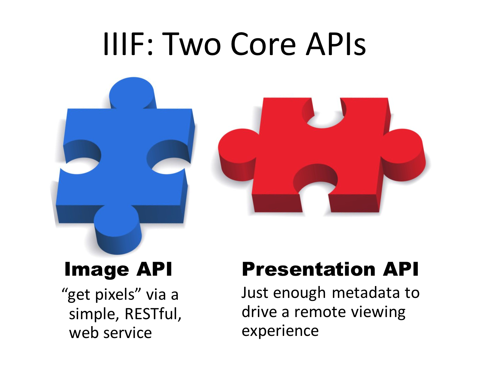
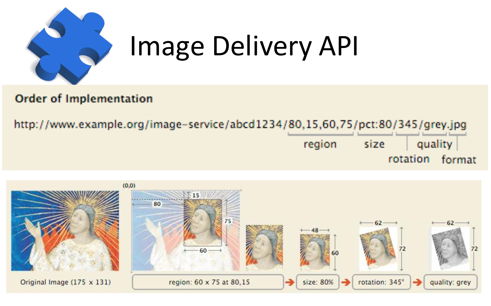
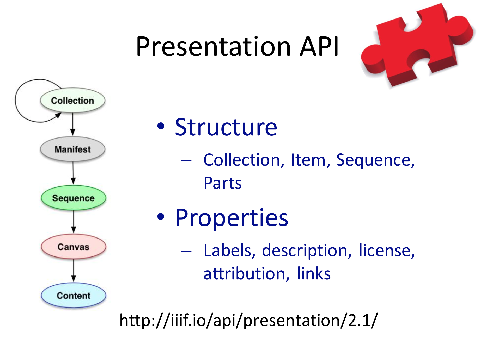
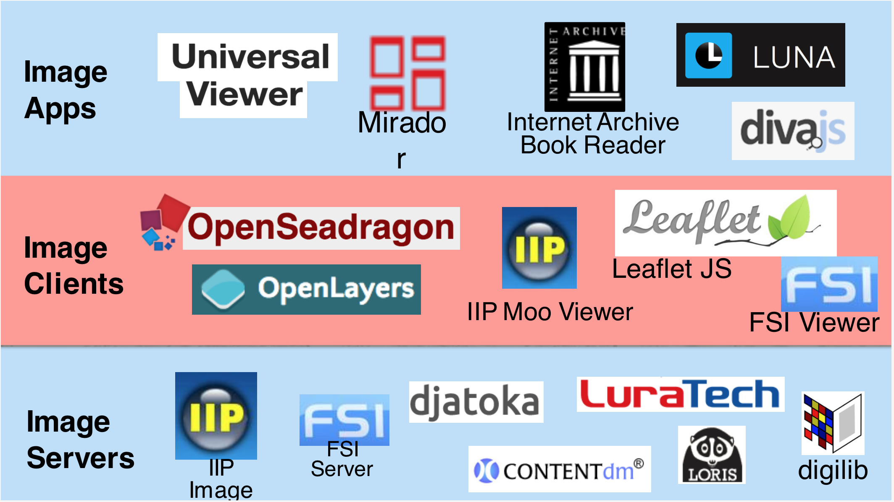
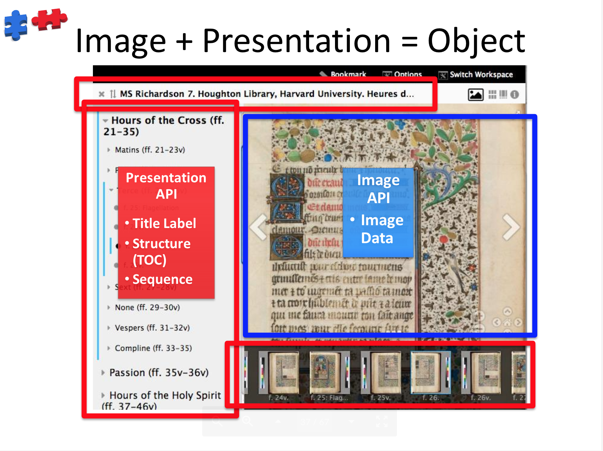

# IIIF Presentation API

The IIIF Image API provides a machine-readable mechanism to retrieve pixels. But when we want to know more about the context of the image, such as its rights, title, description, and related information, and when we are working with structured sets of several images, we need the presentation API.

> The Image API retrieves pixels.  
> The Presentation API presents the image(s) in context.  

> The Presentation API presents "just enough metadata to drive a remote viewing experience". 

Several "Presentation API Clients" have been written over the last few years at this top layer.
[Mirador]( http://projectmirador.org/demo/ )
[Universal Viewer]( https://universalviewer.io/examples/#?c=&m=&s=&cv=&manifest=http%3A%2F%2Fwellcomelibrary.org%2Fiiif%2Fb18035723%2Fmanifest&xywh=-1383%2C-197%2C5333%2C3936 )
[IIIF Curation Viewer]( http://codh.rois.ac.jp/software/iiif-curation-viewer/demo/?manifest=http://iiif.bodleian.ox.ac.uk/iiif/manifest/e32a277e-91e2-4a6d-8ba6-cc4bad230410.json )

## Enhanced Interoperability
### Drag and Drop
### Annotations
## Advanced Representation Features
### Reunification of Broken Books
### Reunification of Fragmented Pages
### Multispectral Image Layers
