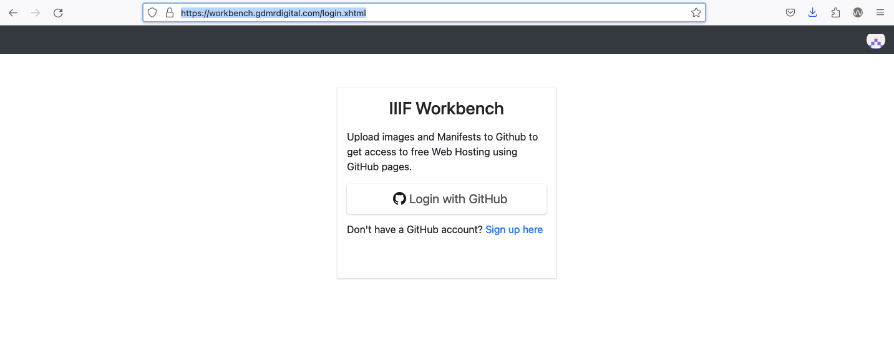
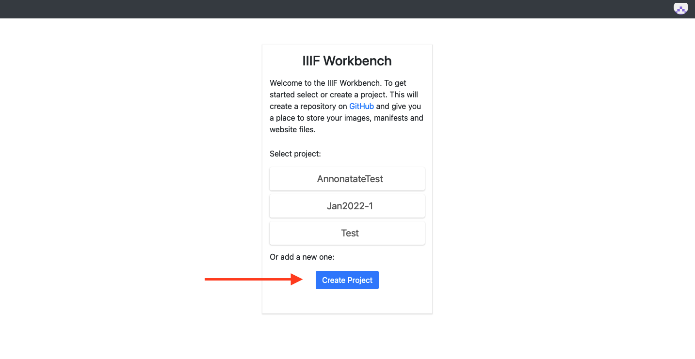
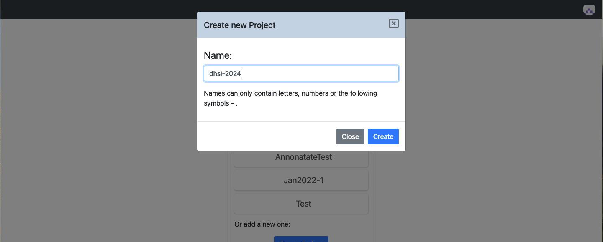
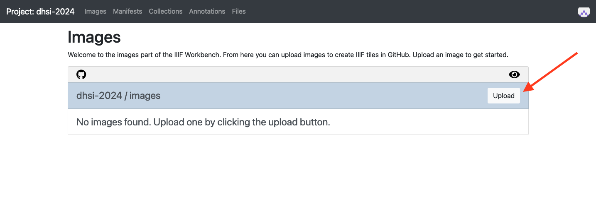
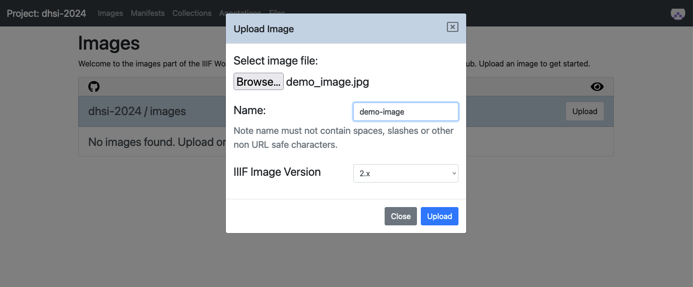
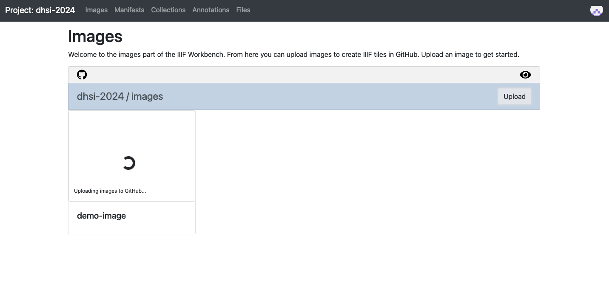
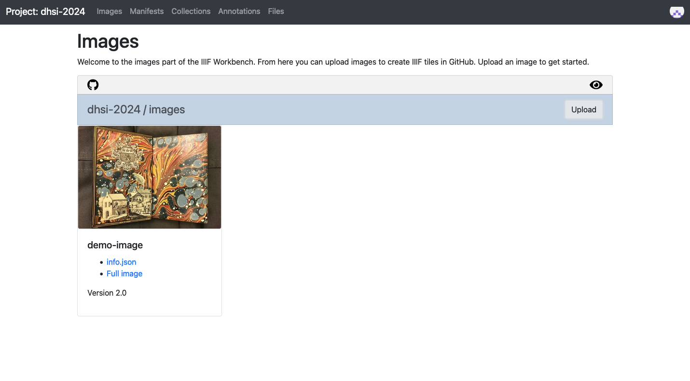

# IIIF training workbench
The IIIF training workbench that is often used in IIIF training workshops like this. It allows for creating IIIF views via a browser. We are going to be using it to create some IIIF images. 

1. Open https://workbench.gdmrdigital.com/login.xhtml
2. Click on the Login with GitHub button

3. Click "Create project" button

4. Name your project and click create

5. Click on the upload button in the upper right hand corner.

6. Click on browse and choose image from your computer.
7. Provide a name for the image and choose IIIF version

8. Wait for the image to process

9. Look at the links that are provided when the process is finished running.

# Thoughts?
- What are some of the limitations of this approach?
- What are some of the positives of this approach?
- Any other thoughts?