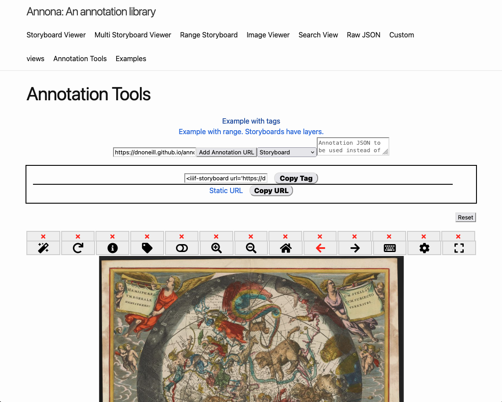
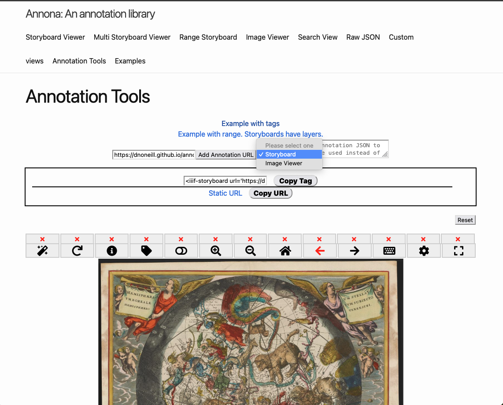
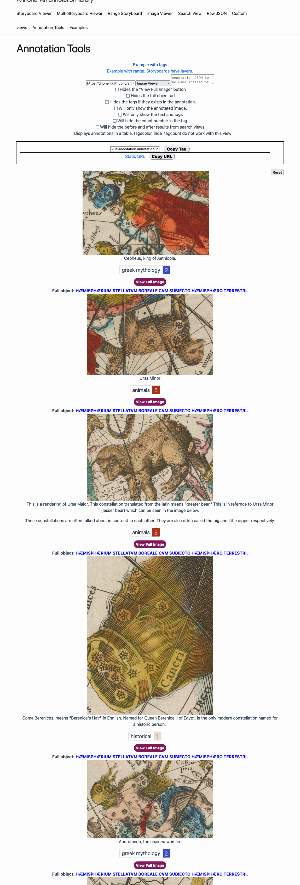
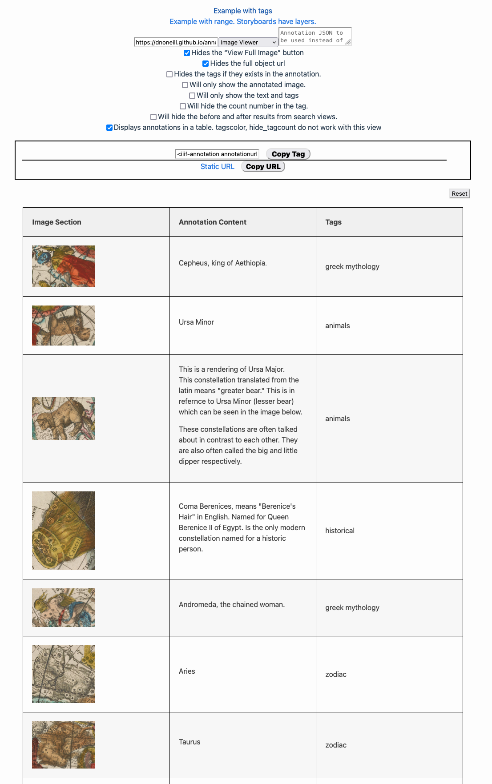

# Annona for annotations
Annona was originally built as a viewer specifically for annotations. As such, annotations that aren't tied to manifests can be viewed in Annona. Not the manifest/image does need to referenced in the annotation or it will not work.

# View annotations
Annona is built to determine the type of item material being passed in. The storyboard viewer will work with Manifests, collections, or annotations. The image viewer will only work with annotations.

1. Go to [https://ncsu-libraries.github.io/annona/tools/#/tag-builder](https://ncsu-libraries.github.io/annona/tools/#/tag-builder)
2. Click on the `Example with tags` link.
3. You can see it is in a storyboard viewer similar to what we saw earlier with a manifest. This is embeddable in any site.

4. Select the image viewer from the dropdown next to the `Add annotation url` button.

5. As you can see the annotations which are in JSON are displayed in an embeddable, reusable view.

6. If you wanted to change the view, you can check some of the checkboxes. In the image below, the first, second and last checkboxes are checked, which gives a table with the image section, content, and tags.

# Comparing annotations to annotations or images
Annona also provides a multistoryboard view. An example of this can be seen on the [mulistoryboard view page.](https://ncsu-libraries.github.io/annona/multistoryboard/#defaults)

