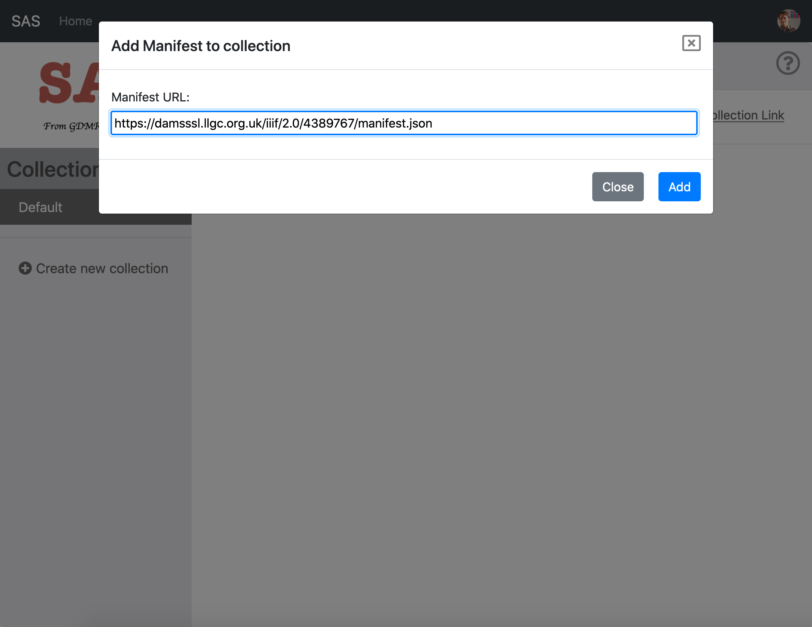
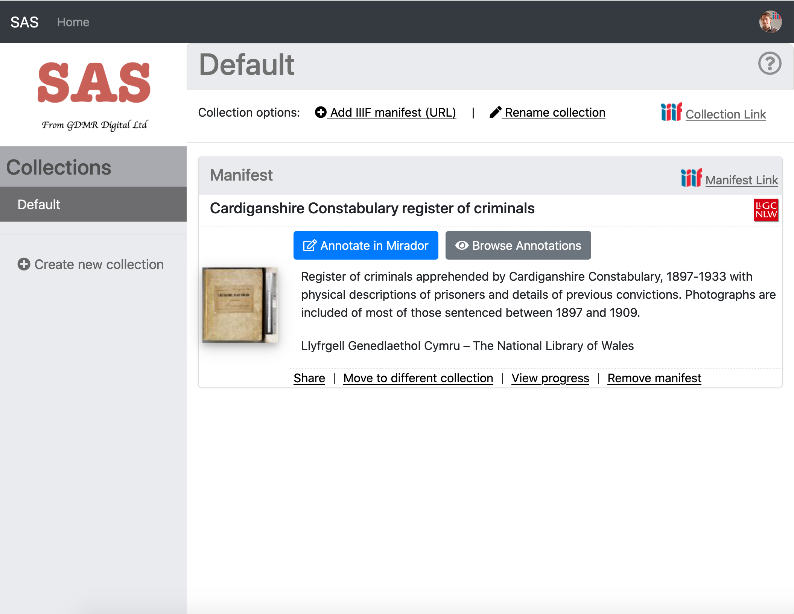
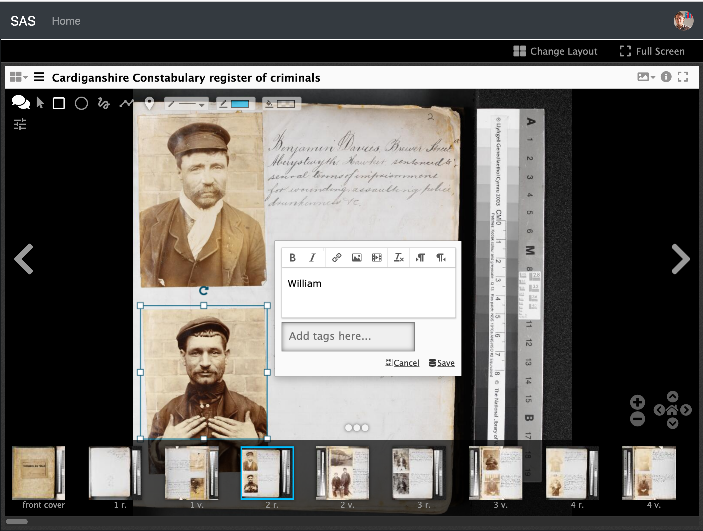
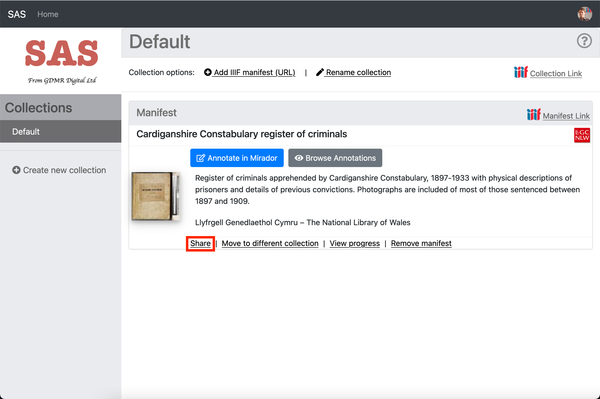
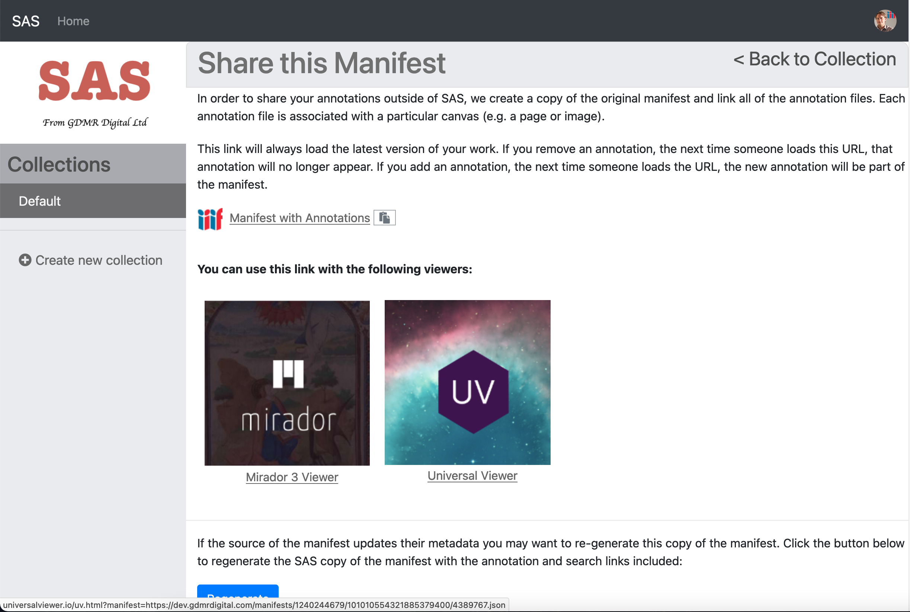

# Creating and downloading Annotations

In this tutorial we are going to annotate an image from your own manifest using a recently released version of the SimpleAnnotationServer. Once we have finished annotating we are going to view the annotations in a viewer which isn't connected to the annotation server.

The major difference with this new version of the SimpleAnnotationServer is that you are asked to login and you will have a collection of Manifests that you have annotated. The previous version only had a single user so everyone could see and edit all of the annotations. In this version only you can see your annotations until you publish them. The high level process is as follows:

 * Step 1: Load your manifest into the Annotation server
 * Step 2: Create your annotations
 * Step 3: Share your annotations

There are two options for getting a Manifest to Annotate.

### Option 1 use the Workbench

This option uses the Manifest you uploaded to the workbench in the [Publishing your Manifest](../day-three/workbench/) guide. To use this manifest you need to copy the manifest URL by going to Workbench, Manifests tab and right clicking on the IIIF logo and select `Copy link`. This will copy the Manifest URL to your clipboard. 

### Option 2 Use any public IIIF manifest

If you didn't manage to get a manifest in the previous session you can use any IIIF Manifest. My personal favorite is:

https://damsssl.llgc.org.uk/iiif/2.0/4389767/manifest.json

## Step 1: Load your manifest into the Annotation server

### Login to SAS
 * Navigate to https://dev.gdmrdigital.com/ and click the Log in / Sign Up link. 
 * This will take you to the following screen where you can choose to either login using your Google or Github accounts

  

Unlike the workbench SAS doesn't write to your Google drive or GitHub account. The GitHub/Google methods are purely used to provide authentication to SAS with all of the data being stored on the SAS server. 

### Load your manifest into SAS:
Once you have logged in you will be presented with the following collection screen: 

  

 * Now click the Add IIIF manifest (URL) link and enter the URL to your manifest as below.
   * If you are using the Workbench use the URL copied from the IIIF logo.

  

 * Then click Add. Depending on how many pages the manifest takes this might take a minute or two to index.
 * Once your manifest is loaded you should see it appear in your default Collection:

  

## Step 2: Create your annotations

 * Now we have the manifest loaded into your SAS account we can start annotating.
 * Click the blue "Annotate in Mirador" button.
 * This should open up your manifest in Mirador
 * Navigate to a page you want to annotate then click the speech bubbles at the top right to start annotating. 

  

## Step 3: Share your annotations

Once you have finished annotating return to the collections screen by clicking the `Home` link. We are now going to generate a copy of your Manifest with links to your annotations. The SimpleAnnotationServer provides this functionality by clicking on the Share button.

Once you click on the Share link the SimpleAnnotationServer will retrieve a copy of your manifest from the Workbench, add links to the annotation lists per canvas and add a link to the Search service. It will then story a copy of this new manifest in SAS for you to use. Once it has generated this new manifest you should see the screen below:

Click on the UV link or Mirador link to see your annotations in these viewers which aren't connected to an annotation server. The annotations that these viewers are reading come from the manifest. 

## Review

Using these instructions you have a manifest which points to annotation lists and a search service that is hosted by the Simple Annotation Server (SAS). If you add more annotations using SAS they will instantly appear in the new manifest that SAS created. The newly created manifest can be shared with others and will be available as long as the SAS server is running. 

In the next section we will look at extracting the Annotations we created using SAS so they can be linked to from your original Workbench manifest. This will create a read only version of the annotations and they will be available through the workbench. 

