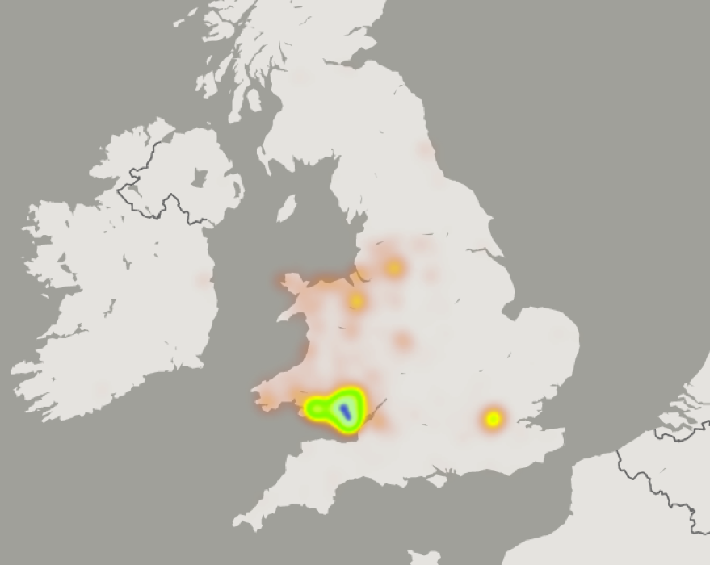
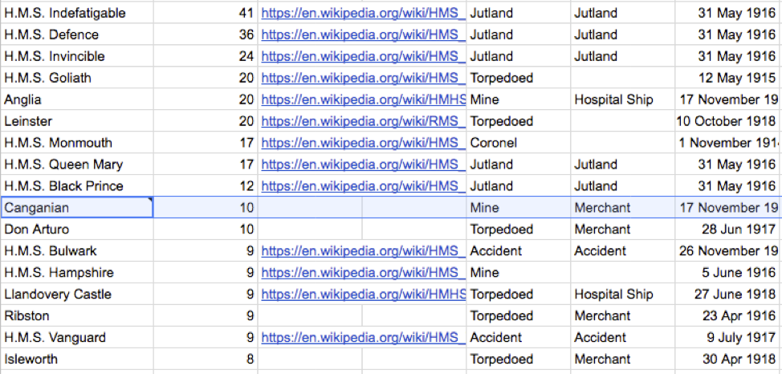
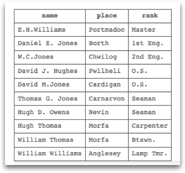
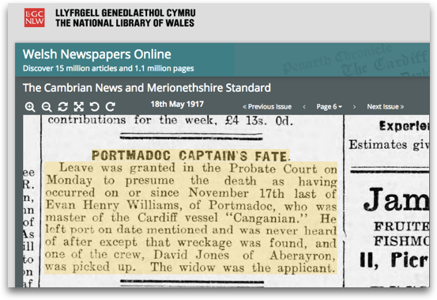
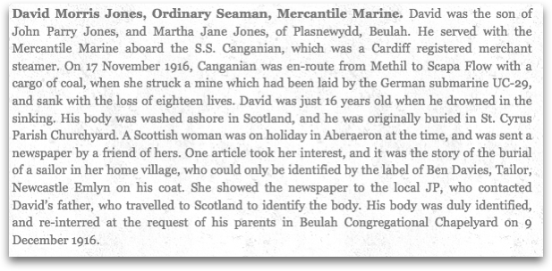

# Results

Feel for the volunteers who did all 1,000 pages!

Exercises:
 * Navigate to somebody else's section, do you see the annotations?
 * Take the Manifest and view it in http://projectmirador.org/. The manifest is https://iiif.gdmrdigital.com/nlw/bor.json
   * Do you see the annotations? 
 * Take the Manifest to the Universal Viewer: https://universalviewer.io/
   * What do you see?


## Looking at the annotation:

```
{
  "@id" : "http://35.177.224.176:8888/annotation/1559731764132",
  "@type" : "oa:Annotation",
  "dcterms:created" : "2019-06-05T10:49:24",
  "resource" : [ {
    "@id" : "_:b2",
    "@type" : "dctypes:Text",
    "http://dev.llgc.org.uk/sas/full_text" : "<span property=\"ns:rank\" class=\"rank\">Ty.Sub.Lt. <span property=\"ns:name\" class=\"name\">Eric Hugh Allan <span property=\"ns:unit\" class=\"unit\">R.N.R <span property=\"ns:ship\" class=\"ship\">Bombala",
    "format" : "text/html",
    "chars" : "<p><span property=\"ns:rank\" class=\"rank\">Ty.Sub.Lt.</span> <span property=\"ns:name\" class=\"name\">Eric Hugh Allan</span> <span property=\"ns:unit\" class=\"unit\">R.N.R</span> <span property=\"ns:ship\" class=\"ship\">Bombala</span></p>"
  } ],
  "on" : {
    "@id" : "_:b0",
    "@type" : "oa:SpecificResource",
    "within" : "https://iiif.gdmrdigital.com/nlw/bor.json",
    "selector" : {
      "@id" : "_:b1",
      "@type" : "oa:FragmentSelector",
      "value" : "xywh=488,1543,2735,327"
    },
    "full" : "https://damsssl.llgc.org.uk/iiif/2.0/4642022/canvas/4642029.json"
  },
  "motivation" : [ "oa:commenting" ],
  "@context" : "http://iiif.io/api/presentation/2/context.json"
}

```

Looking more closely at the Annotation body:

```
    <p>
        <span property=\"ns:rank\" class=\"rank\">Ty.Sub.Lt.</span>
        <span property=\"ns:name\" class=\"name\">Eric Hugh Allan</span>
        <span property=\"ns:unit\" class=\"unit\">R.N.R</span>
        <span property=\"ns:ship\" class=\"ship\">Bombala</span>
    </p>
```

This uses RDF/A which is linked data hidden inside HTML. The HTML is what Mirador displays in the annotation but it can also be loaded to a Linked Data database and queried. For example this is looking at all the places listed in the book and putting them on a heat map:

  

and this is looking at the numbers lost per ship:

  

and doing a bit more research I found:

  

and a Newspaper article and blog post:

  
  

A full export of the data is available at: https://github.com/NLW-paulm/BoR-annotations 

## Search

So how did that work?

Lets have a look at the Manifest: https://iiif.gdmrdigital.com/nlw/bor.json

## Summary
Win, Win

 * Engaged volunteers
 * Publicity for the collection
 * Funding
 * Item now searchable for the public
 * Data available for integration
