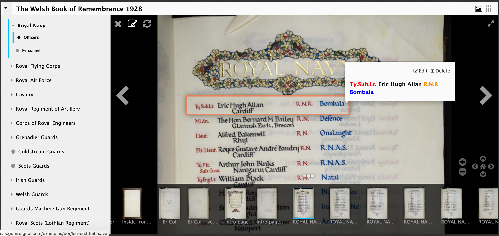

# Annotation Stores

Like image servers there are a number to choose from:

https://github.com/IIIF/awesome-iiif#annotations

Popular ones include:
 * annotot - Simple IIIF annotations mounted in a Ruby on Rails applications by Jack Reed
 * Elucidate - Java and Postgres annotation server by Digirati
 * SimpleAnnotationServer - Java annotation server backed by an Apache Jena triple store, Sesame, or Solr. - developed while working at the NLW

 For this exercise we are going to be using the [SimpleAnnotationServer](https://github.com/glenrobson/SimpleAnnotationServer) and we are going to work on a copy of the National Library of Wales Book of Remembrance. You may remember this book from the Presentation API talk yesterday. The live version of the books is available at:

http://hdl.handle.net/10107/4642022 

but we are going to use the following version which has a annotation server connected to Mirador:

http://sas.gdmrdigital.com/examples/bor/lcc-en.html

Mirador doesn't cope well with multiple people annotating the same page so I will distribute the following sections to each of you:

 * Cavalry
 * Corps of Lancers
 * Grenadier Guards
 * The Queen's (Royal West Surrey Regiment)
 * The King's Own (Royal Lancaster Regiment)
 * Northumberland Fusiliers
 * Norfolk Regiment
 * The Prince of Wales's Own (West Yorkshire Regiment)
 * Canadian Expeditionary Force Service in France (right at the bottom of the book)
 * New Zealand Expeditionary Force (also at the bottom)

I am going to ask you to transcribe one page for the section that you are assigned. As part of this project we wanted to capture not just a transcription but also the fields to allow research so we customised Mirador to capture the different fields. 

To annotate a name:

## Step 1:
 * To navigate make sure the  pen and paper at the top left is disabled
 * Get the line in full view
 * Click the pen and paper to start annotating
 * Draw a box as well as you can around the name 

  

 * Now type what you see (don't worry about the buttons yet). So in this example I would type `Ty.Sub.Lt. Eric Hugh Allan R.N.R Bombala`

 * Once you've typed everything double click on a word or highlight two words if required. 

 * Now click the button that matches the type of the text. In this example I would click name and see the text go black:

 * Now do the rest:

 * Then click save:

 * Now complete the page

