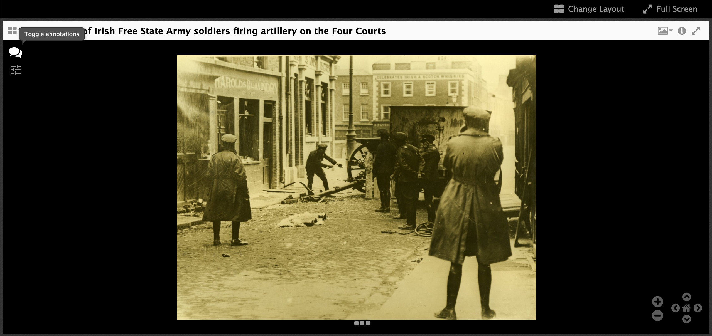
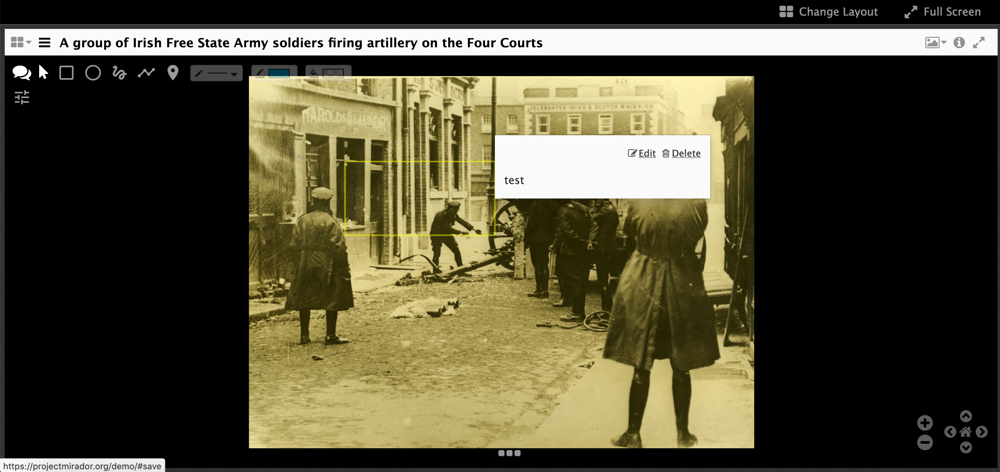

# Annotation Exercises

In this example we are going to have a look at Annotating in Mirador 2.

During the session I will go through the steps and feel free to follow along although if you get lost you can follow the instructions below.

Another option to this browser based solution is to use [iiif-annotation-studio](https://github.com/atomotic/iiif-annotation-studio) which is a Desktop application.

## Step 1 - Open Mirador

 * Go to [https://testingannonatate.github.io/annotate/](https://testingannonatate.github.io/annotate/)

### A quick intro into using Mirador: 

The image below shows a circle around the cross at the top left of the image. Use this to close one of the windows. Then click the 4 rectangles to drop down a menu where you can select **Replace Object**. Click this to view other manifests.

    

Select a Manifest by clicking on one of the rows or add your own manifest in the 'Add new object from URL'.

    

## Step 2 - Start annotating: 
Click the speech bubble on the top left

  

Lots of options:

  

From left to right the buttons are:
 * Speech bubble - hide annotation buttons
 * Pointer - to select existing annotations and change the size or edit the content
 * Rectangle - Draw a rectangle annotation
 * Oval - Draw a Oval annotation
 * Freeform - Go free style with the shape of the annotation
 * Ploygon - Create a shape with straight sides
 * Pin - Drop a pin as the target of the annotation
 * Thickness - change the thickness of the shape's line
 * Line colour - change the colour of the shape's line
 * Fill - fill the shape with a colour. 

Once you have drawn a shape on the image you get a box where you can add content for the annotation.

  

Again you have more buttons to choose from and these are to format the content of the annotation:
 * Make the text bold
 * Make the text italics
 * Insert a link
 * Insert an image
 * Insert a video or audio file
 * Clear formatting
 * and change orientation of the text (left/right or right/left)

To format the text with bold or italics, type of your text then highlight it and click the bold or italics button. 

Once you have added some text click save. You can also add a tag if you like. 
 
You will then see a box appear and if you put your mouse over the box you will see the text you entered:

  

Take 5 minutes to play around creating annotations so you get a feel for how it works. Also think on the following questions:

 * What type of project would this be useful for?
 * What might it not work so well with?

## Where are these annotations stored?
1. Scroll down to the `Add annotations` section
2. Click on the `View cached annotations JSON` button

3. Click on the `Download [canvaslabel].json` button


## Viewing this in Mirador 3
1. Go to [https://mirador-annotations.netlify.app/](https://mirador-annotations.netlify.app/)
2. Creat an annotation

3. Right click on the browser. Choose inspect

4. Make sure you are in the console tab

5. Type `localStorage` into the browser. You should see your JSON contents.

6. You can download by adding the following code to the console. These annotations are storage in your browser's localStorage should disappear when you close the page.

```
function downloadFile(contents, filename) {
  var blob = new Blob([contents], { type: 'application/json' });

  // Create a link element
  var a = document.createElement('a');
  a.href = URL.createObjectURL(blob);
  a.download = `${filename}.json`;

  // Programmatically click the link to trigger the download
  document.body.appendChild(a);
  a.click();

  // Clean up
  document.body.removeChild(a);
  URL.revokeObjectURL(a.href);
}

Object.keys(localStorage).forEach(function(key){
   downloadFile(localStorage.getItem(key), key.split('/').slice(-1)[0]);
});
```

## How do we make these annotations more permanent?

With an Annotation Store.
