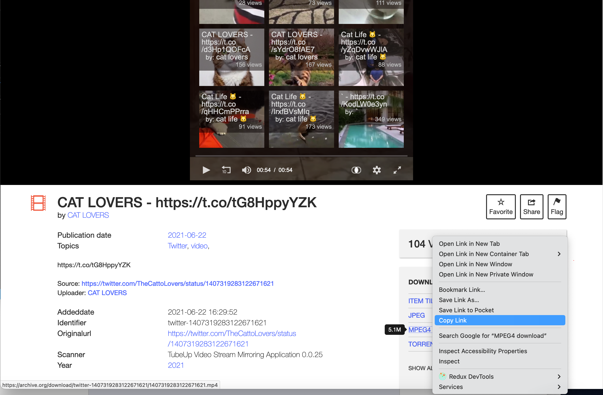
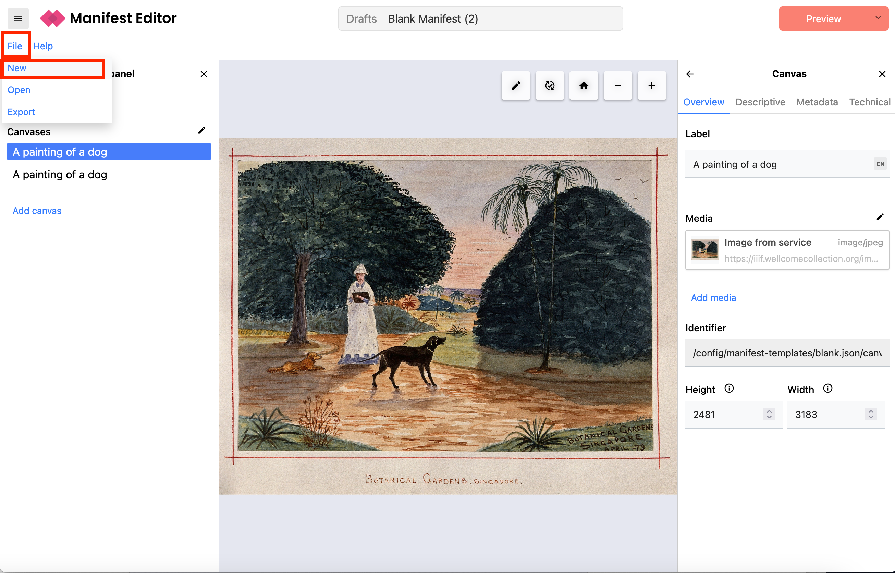
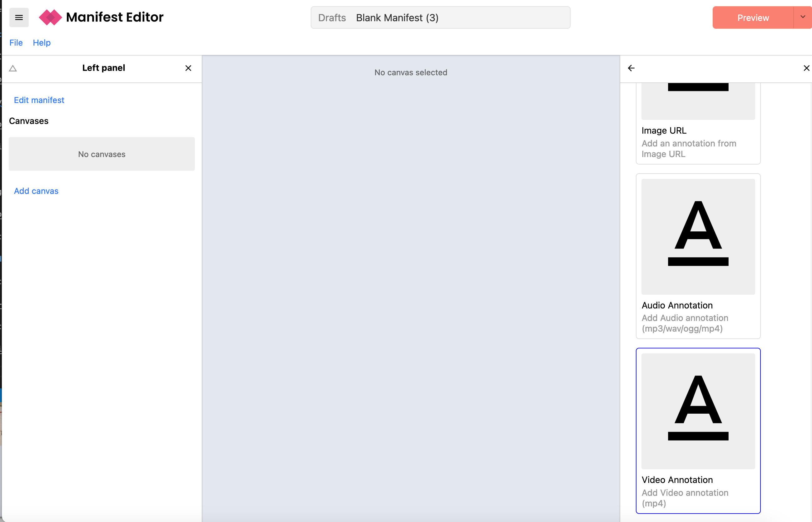
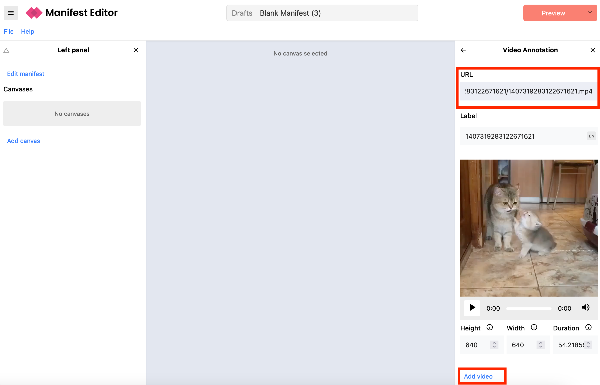
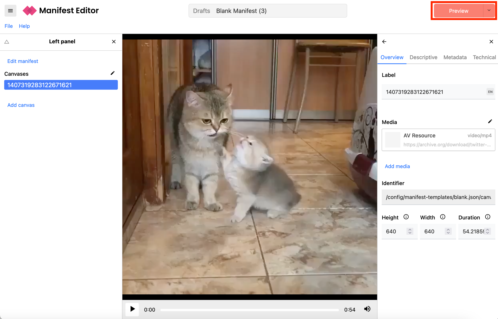
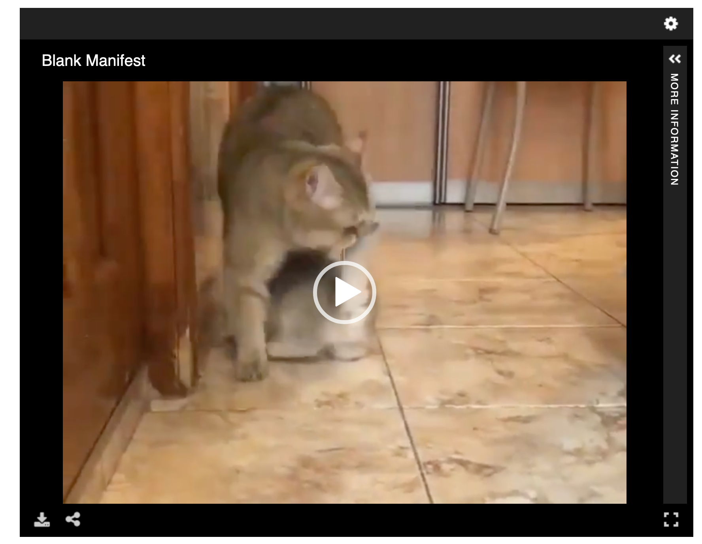

# Create a Video Manifest

One of the extra features of the Digirati Manifest Editor is the support of Audio or Video resources. This guide will take you through adding a Video from the Internet Archive. For IIIF videos need to be accessible as a URL to the file and the Internet Archive provides the option to download Videos and this is the link we can use.

## Find a video to embed in your Manifest

Navigate to the Internet Archive and find a video from the Movie section:

https://archive.org/details/movies

If you stick to vidoes which are listed as MPEG4 these are more likely to be supported in the current IIIF viewers. I am going to use the following example:

https://archive.org/details/twitter-1407319283122671621

and to get the link to the video I am going to right click on the MPEG4 download option and select copy link:

For this item I get the following URL:

https://archive.org/download/twitter-1407319283122671621/1407319283122671621.mp4

Now we will create the Manifest for this video.

## Creating a Video Manifest

If you navigate to the Digirati Manifest Editor:

https://manifest-editor.digirati.services/

and either select new Manifest or if you are already editing a manifest select  **File** -> **New** -> **Blank Manifest**:

Now select add canvas and then the Video Annotation.

Paste in the link to your video and scroll to the bottom of the right panel and click Add Video.

Now we can view the Manifest in the Universal Viewer by clicking the Preview button:

Once you click the preview button you should see the following in the Univesral Viewer:

***Note***: this video didn't work for me in Mirador due to the file format not being supported. 