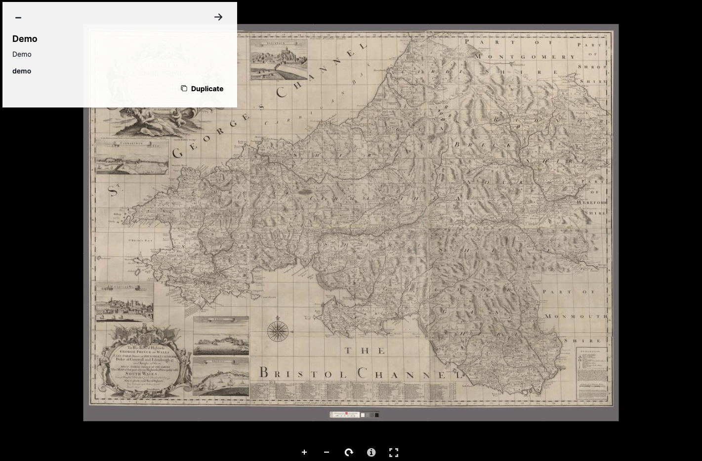
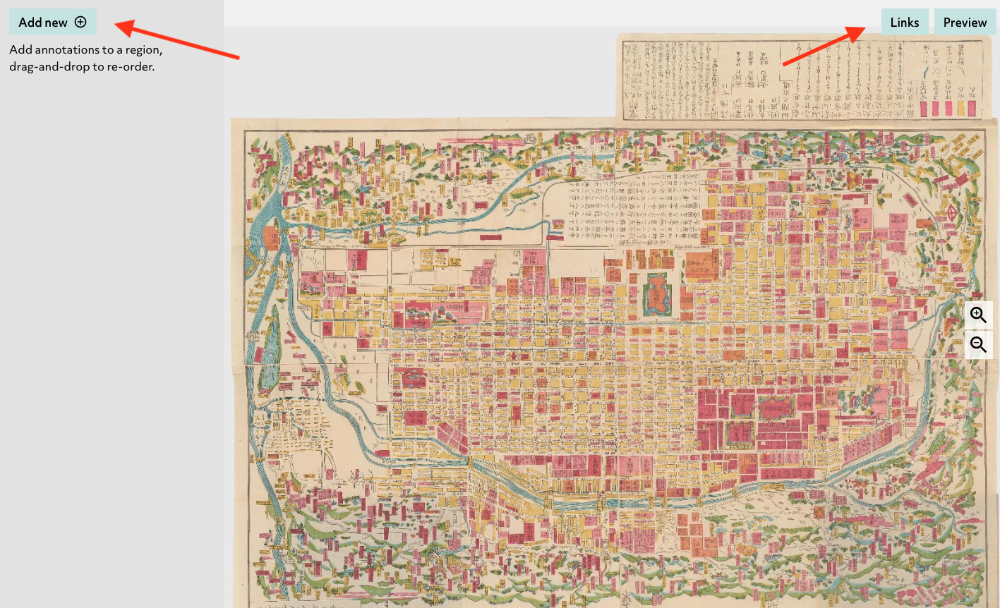

# Exhibit.so
1. Go to [https://www.exhibit.so/exhibits/create](https://www.exhibit.so/exhibits/create)
2. Choose your view and fill out the form. Click `create exhibit`

3. Click `Add Item`

4. Add a manifest url.

5. In the viewer on the right zoom to the feature you want to highlight.
5. Click on the plus button to create an annotation

6. Create your comments. To share the view, click on the share button.

7. Keep track of your URLs

8. Below is the storytelling viewer that exhibit creates.

# Storiiies
1. Go to [https://storiiies-editor.cogapp.com/](https://storiiies-editor.cogapp.com/)
2. Fill out form

3. In the viewer on the right zoom to the feature you want to highlight.
4. Click `Add new` to create an annotation.
5. After you are done creating annotations click the share button.

8. Below is the storytelling viewer that storiiies creates.

# Adno
1. Go to [https://w.adno.app/#/](https://w.adno.app/#/)
2. Add manifest and click `CREATE MY OWN PROJECT` 

3. Choose a picture from those listed (you can only use one image) and click `USE THIS PICTURE FOR MY PROJECT`

4. Add title, description (optional). click `CREATE MY NEW PROJECT` 

5. Click on of the shapes in the toolbar and create a shape.

6. A pop up will appear for you to put your annotations in. Fill out and click save.

7. Click the download icon to download your annotations. Unfortunately the download doesn't conform to spec so you will have to do a little transformation if you want to use it in a different viewer.

8. View if you disable edit mode.

