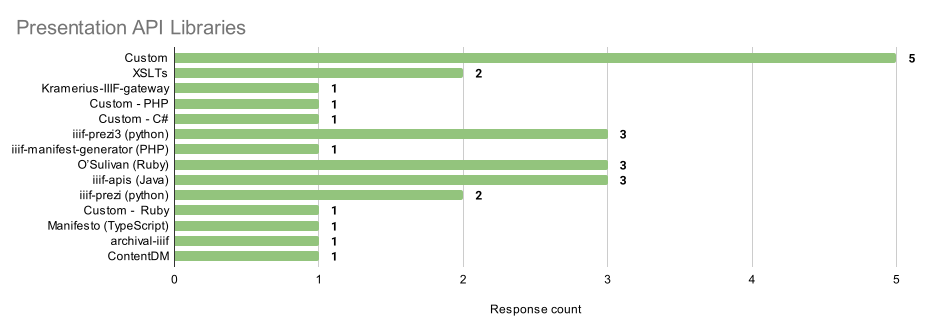

# How do people create Manifests?

<iframe src="https://player.vimeo.com/video/716824994?h=29d36a5e00" width="640" height="360" frameborder="0" allow="autoplay; fullscreen; picture-in-picture" allowfullscreen></iframe>

In this workshop we are going to take you through creating a Manifest using a Manifest Editor. This works well for a small number of manifests and to give you an idea of what a Manifest contains. If you are going to create thousands or millions of manifests then you would need to look at automating this process. In the 2023 community survey we asked what people are using to generate manifests and the results can be seen below:

As you can see there isn't one solution and most people build their own tools using some shared libraries like iiif-prezi3. 

Generally the data required to create a manifest generator are as follows:

 * Accessible IIIF Images
 * Structural data on how the images relate to each other. For example the order of the pages in a manuscript
 * Descriptive metadata for example:
   * Title - Name of the item this is called a `label` in IIIF
   * Description (optional)
   * Rights or licensing (optional)
   * Metadata useful for discovery (optional) - this will be explained later

Generally the format of the incoming metadata means that often these manifest generation tools are custom to each institution although there are the following libraries that can assist in the process:

 * [biiif](https://github.com/edsilv/biiif/) Organise your files according to a simple naming convention to generate IIIF v3 manifests.
 * [demetsiiify](https://github.com/jbaiter/demetsiiify) - Web service for creating IIIF manifests from METS/MODS documents.

## Presentation API Libraries
 * [IIIF Manifest Generator](https://github.com/yale-web-technologies/IIIF-Manifest-Generator) - PHP library for generating IIIF manifests.
 * [iiif-apis](https://github.com/dbmdz/iiif-apis) - Java IIIF API libraries.
 * [iiif-prezi3](https://github.com/iiif-prezi/iiif-prezi3) - Python library providing a reference implementation for IIIF v3.
 * [iiif-prezi](https://github.com/IIIF/iiif-prezi) - Python library providing a reference implementation.
 * [O'Sullivan](https://github.com/IIIF/osullivan) - Ruby API for creating IIIF manifests.
 * [Swiiift](https://github.com/mejackreed/Swiiift) - IIIF presentation API library for Swift.
 * [tabula-rasa](https://www.npmjs.com/package/tabula-rasa) - npm module for creating and manipulating IIIF manifests.
 * [ViewDir](https://iiif-commons.github.io/) - Documentation on IIIF-related libraries and components.

Once the Manifests are generated they can be stored on any Web Server and don't need a specific server like the Image API.

## Important Considerations

When publishing manifests there are a couple of considerations you need to take in account.

### http/https issue

With the Web more generally moving to https if you publish your manifests as http it means they will no longer work in many of the online viewers and tools. Previously this was encouraged but now with the number of https sites it is almost impossible to use a http manifest.

### CORS issues

Another requirement for IIIF is to enable CORS headers. CORS headers tell the browser that its OK to open this JSON on a website which doesn't match the location of your Manifest. For example it says projectMirador.org can open a manifest from the Library of Congress. Without CORS headers being set then you will only be able to open your manifest on your website. For more details see:

https://enable-cors.org/

### JSON issues

Finally if you are hand editing JSON documents it is very easy to miss required commas and brackets so the following tool is useful to validate your JSON:

 * [JSONLint](https://jsonlint.com/)

If your Manifest is valid JSON but its not working in a viewer there is a IIIF Validator which will let you know if the JSON has fields that are not part of the IIIF specifications:

 * [IIIF Presentation Validator](https://iiif.io/api/presentation/validator/service/)
