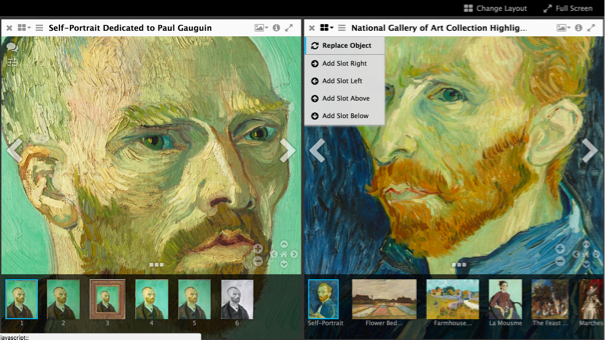

## Viewing your manifest with a IIIF-compatible image viewer

NOTE: It can be tricky to use a viewer on an external website (e.g., https://projectmirador.org/demo/) to view images that are hosted on an image server on your local computer -- whether or not it works can depend on your computer's network connection, software versions, etc. We provide a range of options here, which is also helpful for learning some of the many different ways to view manifests.

### Viewing in a local Mirador instance

1. Download the most recent release of Mirador 2 from here: [https://github.com/ProjectMirador/mirador/releases](https://github.com/ProjectMirador/mirador/releases/tag/v2.7.0)
1. Unzip the package.
1. In Chrome, open the file in the downloaded package called example.html
  * File->Open File->example.html
1. Click on the plus sign in the middle to “Add item”.
1. Look in the upper left, in the box labeled “addNewObject:”. 
1. Enter the http or https (not filesystem) URL of your manifest, e.g., http://127.0.0.1:8080/manifest.json.
1. Click “load”. Your manifest should be added to the list of those available.
1. Click on the new link to your manifest to view your images.

### Viewing online in UniversalViewer

1. Copy the URL of the web-hosted version of your manifest, then navigate to [http://universalviewer.io/uv.html?manifest=](http://universalviewer.io/uv.html?manifest=) and paste in the URL after the `=` in the url.

  Hopefully you'll see your images in the [UniversalViewer](http://universalviewer.io/).

### Viewing online in Mirador

We can also try to view the manifest in the online demo of [Mirador](projectmirador.org)

1. Navigate to [http://projectmirador.org/demo/](http://projectmirador.org/demo/).
1. Click the icon to the right of the `x` in one of the windows and click "Replace Object."

    

1. Paste in your manifest URL to the text box "Add new object from URL:"
1. Click "Load" - You should see your manifest loaded there. Click on one of your images.

You should now see one of your images in a viewer window.

