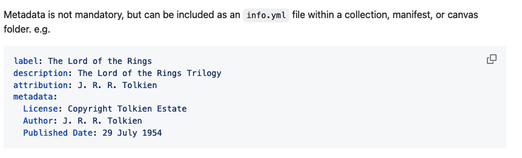
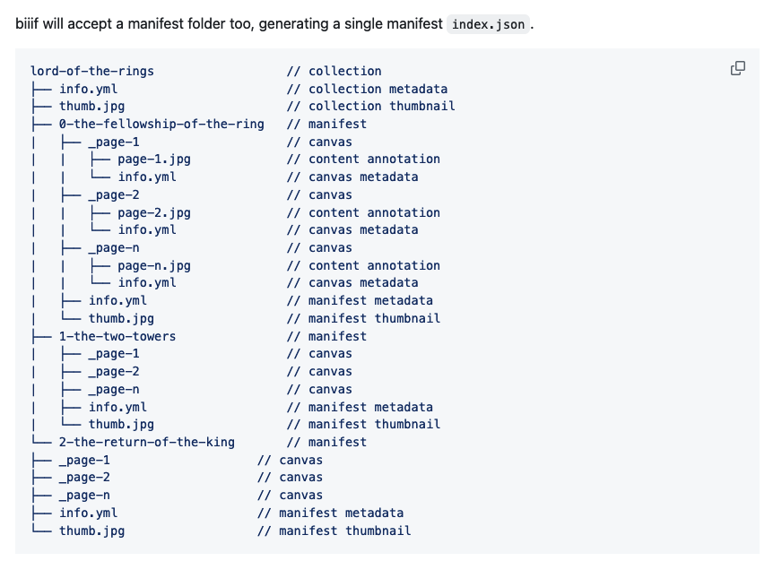

# Autogenerating manifests

Do we think all of these institutions with manifests autogenerate them? No they are generated multiple different ways. Often they are tied the a metadata or DAMS system that retrieves the metadata and image info from the systems.

## Minimal computing ways to autogenerate manifests
1. [wax](https://github.com/minicomp/wax) - a minimal computing project for producing digital exhibitions focused on longevity, low costs, and flexibility. Provides a way to create manifests via csv.
2. [biiif](https://github.com/IIIF-Commons/biiif) - Organise your files according to a simple naming convention to generate IIIF v3 manifests. 
3. [biiif-cli](https://github.com/IIIF-Commons/biiif-cli) - biiif terminal tool
3. [iiif-producer](https://github.com/ubleipzig/iiif-producer) - A CLI tool that generates IIIF Presentation 2.1 Manifests from METS/MODS (produced by Kitodo).
4. [Leiden's Islandora IIIF Manifest Generator](https://github.com/LeidenUniversityLibrary/islandora_iiif_manifests) - A module to generate IIIF Manifest for Islandora.
5. [Presentation API libraries](https://github.com/IIIF/awesome-iiif?tab=readme-ov-file#presentation-api-libraries) - Libraries that will help create manifests in a script.

## biiif-cli
1. Go to your dhsi-iiif-2024 folder.
2. In the images folder create an `info.yml` file.
3. Fill out some metadata to match the format below.
.
4. Upload to your dhsi-iiif-2024 fork
5. `git add images/info.yml`
6. `git commit -m "create info.yml file"`
7. `git push origin main`
8. Look in the images folder. What do you see?

You can create move complex forms with this tool.
.

## Reflections
1. Based on what we know what if anything is wrong with this method?
2. Is there anything we can do to fix it?
3. What method (does not need to include something on this page) would you want for generating manifests?