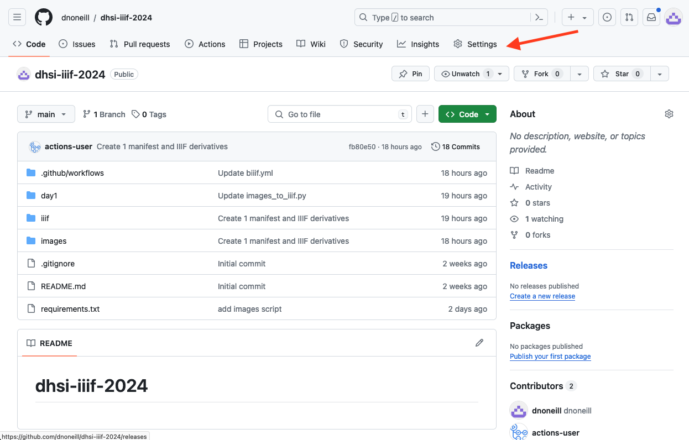
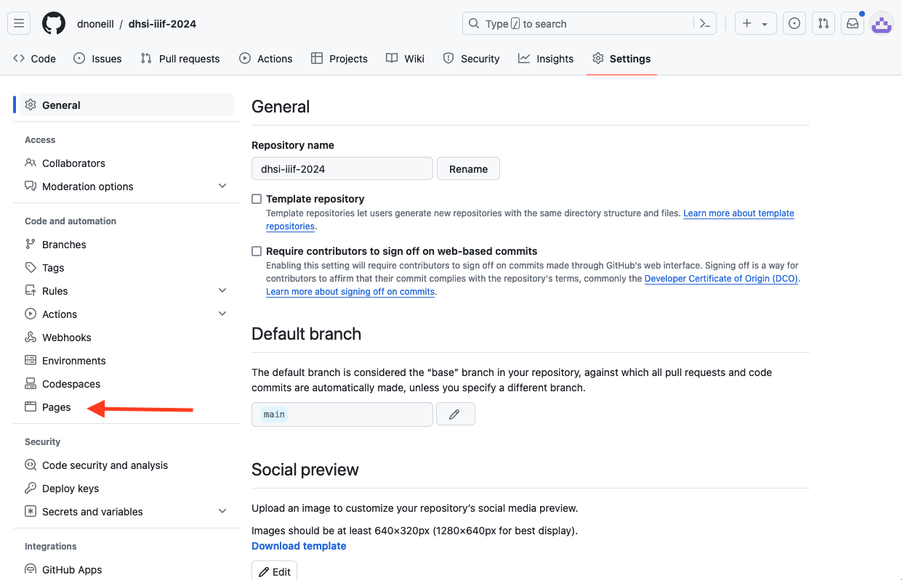
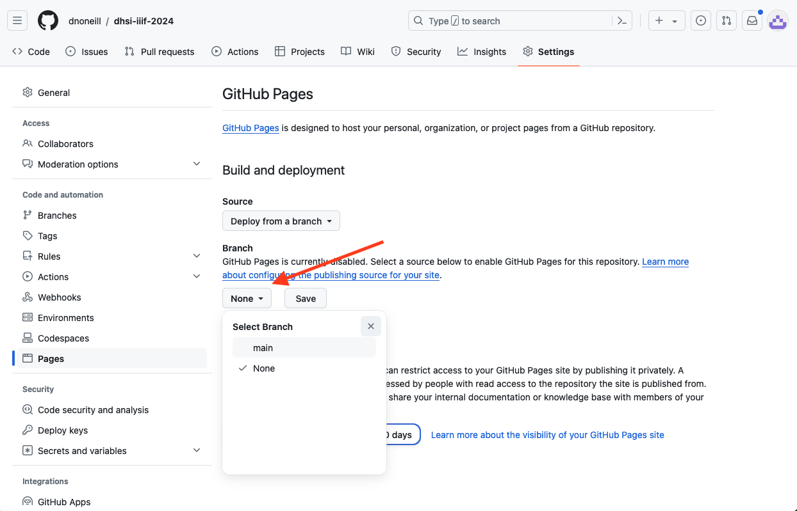
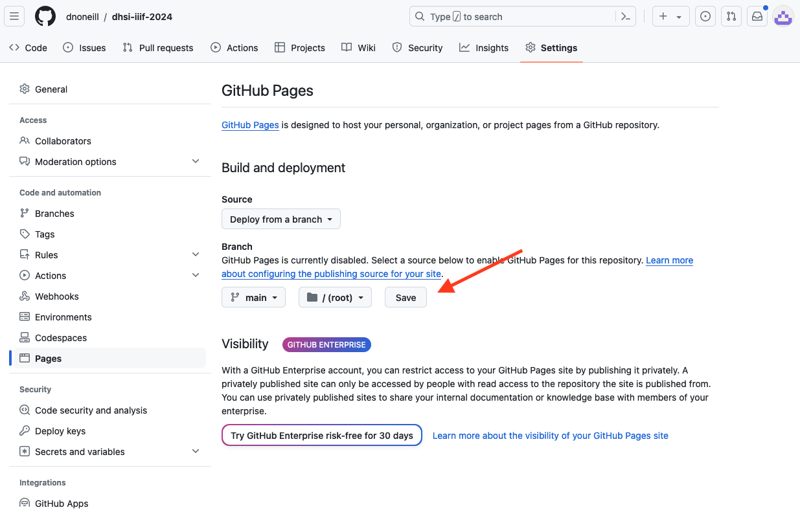

# Publishing via GitHub pages
Maybe you want to publish multiple files without having to go through the workbench UI. This section will illustrate how to do this for any project you might have.

1. Go to your dhsi-iiif-2024 folder
2. Add your manifests in any structure you would like.
3. Send these files to github.
4. `git add .`
5. `git commit -m "add manifest files"`
6. `git push origin main`
7. In the browser go to your fork
8. Click on the settings tab

9. Click on the pages panel from the sidebar

10. Underneath the branch section click on the dropdown and choose main.

11. Click the save button

12. It will take about a minute for your site to build. After it has built, the content will be visible at `[github_username].github.io/[repository_name]`. If you follow the folder path your manifest you should be able to view it in the browser. `[github_username].github.io/[repository_name]/path/to/file/filename.json`