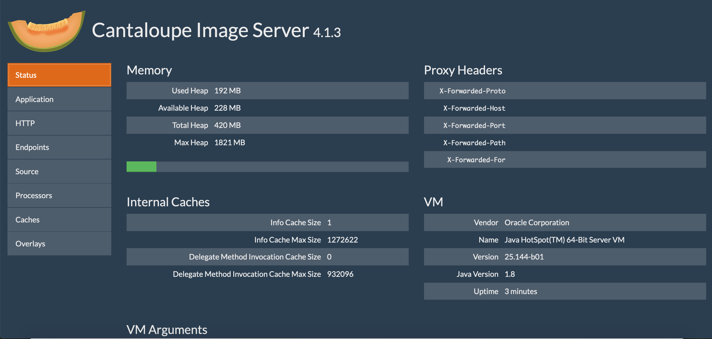
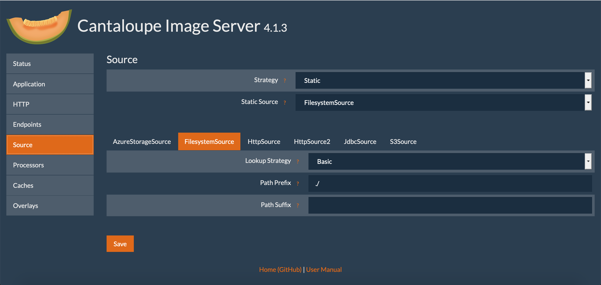

# Setting up Cantaloupe IIIF Image Server

Cantaloupe is one of the open source image servers which is free to use but takes some command line setup to install. Once installed you will see how an Image Server works but note if you install it on your laptop then only you will be able to access it. The example viewers at the end of this session will work for you on your machine but if you sent it to someone else they wouldn't be able to access your machine. 

Following this tutorial will be most useful for those that are interested in setting up a IIIF Service in their own institution. It will  be less relevant to those that are mostly interested in using IIIF Images in research. For those people it is better to use the hosted option or the static images option. 

## Prerequisites

### Java

In this workshop we will install and run a IIIF Image server and for this you will need Java 11 installed.

 - [Downloading Java 17](https://www.oracle.com/java/technologies/downloads/#java17)

To verify you have the correct package installed, you can run the following command from a terminal or command prompt:

```sh
$ java -version
# java version "1.17.0.10"
```

You should see version `1.17x`. 

### Using a text editor

We will be using a text editor to edit some of the configuration files for Cantaloupe. If you don't know which text editor to choose, a good, free, open source option is [VS Code](https://code.visualstudio.com/).

## Navigating on the command line / terminal

In this workshop, we will be running commands from a terminal / command prompt. There is no need to be an expert, but before you start you may find the following introductions useful:

 - [Paths, Folders, Directories (pwd)](https://learnpythonthehardway.org/book/appendix-a-cli/ex2.html)
 - [If You Get Lost](https://learnpythonthehardway.org/book/appendix-a-cli/ex3.html)
 - [Make A Directory (mkdir)](https://learnpythonthehardway.org/book/appendix-a-cli/ex4.html)
 - [Change Directory (cd)](https://learnpythonthehardway.org/book/appendix-a-cli/ex5.html)

## Download Cantaloupe

This is a short guide to installing Cantaloupe, for more information on each step, checkout the [Cantaloupe getting started guide](https://cantaloupe-project.github.io/manual/5.0/getting-started.html).

Start by downloading [Cantaloupe v5.0.6](https://github.com/cantaloupe-project/cantaloupe/releases/download/v5.0.6/cantaloupe-5.0.6.zip)

Open and extract the zip file to your directory of choosing. We suggest `~/iiif-workshop`.

Open up a terminal or command prompt and change directory to that extracted directory:

```sh
cd ~/iiif-workshop/Cantaloupe-5.0.6
```

## Configure Cantaloupe

Now lets create a copy of the configuration file:

```sh
cp cantaloupe.properties.sample cantaloupe.properties
```

Now open up the new `cantaloupe.properties` in your text edit so we can enable the admin panel.

Scroll to line 118, and change `false` to `true`. Also add a password.

```diff
# Enables the Control Panel, at /admin.
- admin.enabled = false
+ admin.enabled = true
- admin.secret =
+ admin.secret = yolo
```

Save the file.

Now lets try and start the server. Run this command from your Cantaloupe directory

```sh
java -Dcantaloupe.config=./cantaloupe.properties -Xmx2g -jar cantaloupe-5.0.6.jar
```

Now navigate to [http://127.0.0.1:8182/iiif/2](http://127.0.0.1:8182/iiif/2) in your browser.

You should see this:


Congrats you successfully installed Cantaloupe!

### Troubleshooting

If you don't see the screen above there are a few common problems that people have come across:

 * Lack of memory. You may see something like the following when you run the Cantaloupe java command:

```
Error occurred during initialization of VM
Could not reserve enough space for 2097152000000KB object heap
```

to fix this change the `-Xmx` parameter to something smaller e.g:

```
java -Dcantaloupe.config=./cantaloupe.properties -Xmx1g -jar cantaloupe-5.0.6.jar

```
 * Spaces in Windows. If you are using Windows ensure that there are no spaces in the directories above the Cantaloupe directory. 

## Admin panel

Also make sure you can get into the admin panel by navigating to [http://127.0.0.1:8182/admin](http://127.0.0.1:8182/admin).

Use the username `admin` and the password you set previously.



# Configuring Cantaloupe to use your images.

Congrats now you have your image server up and running! We need to feed it some images to keep it happy!

## Download some images

Go ahead and download a `*.jpg` image from the Internet into your Cantaloupe directory `Cantaloupe-5.0.6`. Here is one [eddie.jpg](https://github.com/sul-cidr/histonets/raw/master/spec/fixtures/images/eddie.jpg) that you can use.

## Configure Cantaloupe to use the correct path

Now we need to configure Cantaloupe to use that image directory.

Navigate to the admin page [http://127.0.0.1:8182/admin](http://127.0.0.1:8182/admin).

Click on "Source", then click "FilesystemSource" tab at the bottom of the page.

Next fill in Path Prefix to be `./`



and click `Save`.

## Check it out in the browser

Now you should be able to navigate to an image's info.json response successfully.

Checkout [http://127.0.0.1:8182/iiif/2/eddie.jpg/info.json](http://127.0.0.1:8182/iiif/2/eddie.jpg/info.json)

And if everything goes right, you should see an `info.json` response.


Let's finally check it using the Leaflet-IIIF image api viewer.

Try this url: [http://mejackreed.github.io/Leaflet-IIIF/examples/?url=http://127.0.0.1:8182/iiif/2/eddie.jpg/info.json](http://mejackreed.github.io/Leaflet-IIIF/examples/?url=http://127.0.0.1:8182/iiif/2/eddie.jpg/info.json)

Notice how we added our local IIIF server's info.json response url as a parameter. This is used by IIIF Image API clients to understand how they can request images/tiles.


Cross our fingers, but you should see a picture of Eddie in a zoomable viewer.

You can also try this image with:
 * OpenSeaDragon: http://iiif.gdmrdigital.com/openseadragon/index.html?image=<url_to_info.json>
   * http://iiif.gdmrdigital.com/openseadragon/index.html?image=http://127.0.0.1:8182/iiif/2/eddie.jpg/info.json
 * UCD Image clipper: https://jbhoward-dublin.github.io/IIIF-imageManipulation/index.html?imageID=<url_to_image_id>
   * e.g. https://jbhoward-dublin.github.io/IIIF-imageManipulation/index.html?imageID=http://127.0.0.1:8182/iiif/2/eddie.jpg
