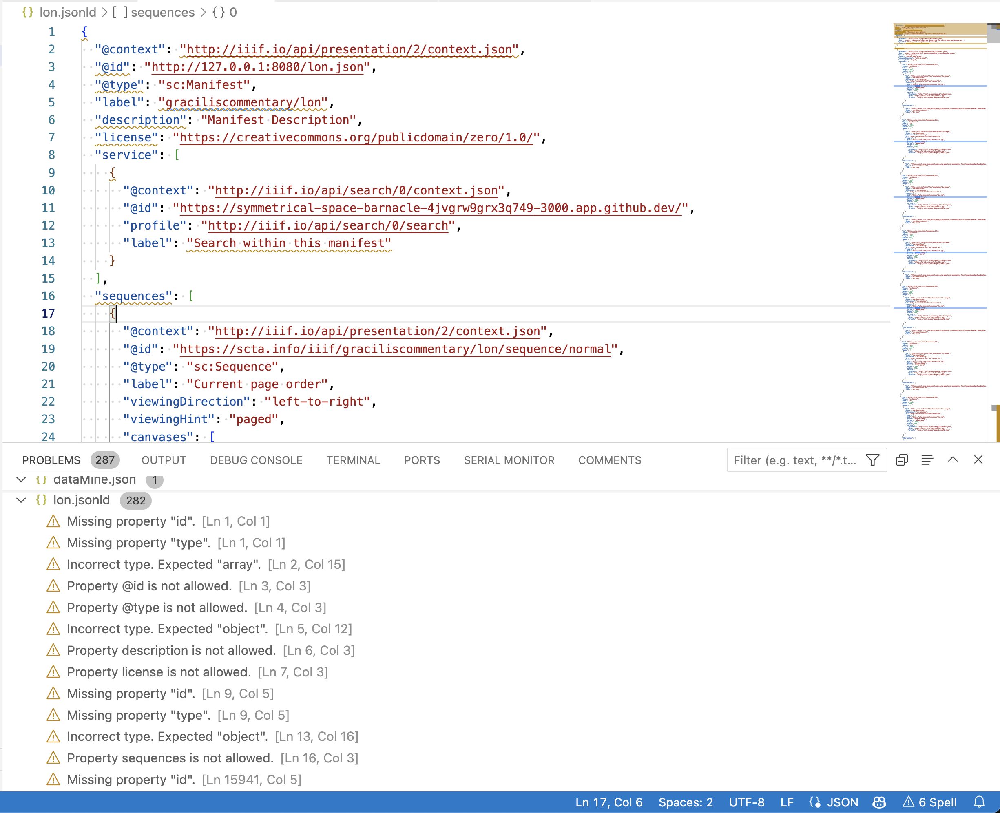

# JSON Crash Course

JSON (Javascript Object Notation) is very popular data format for storing data. 

It is the privilege data for storing and communicating IIIF Data.

So in order to feel comfortable with the IIIF Presentation API, we need to be comfortable with the basics of the JSON format.

There are lots of online resources about JSON. A quick google search will give you more content than you could ever want. 

So here were just going to highlight a few fundamental concepts that will help us "interpret" a JSON document. Once that's in place we'll turn to the IIIF Presentation API, and we'll continue to get comfortable with the format the more we use it.


## Semantics

In short there are six different data types that can be communicated with a JSON document.

When we talk about a "data-type" we're not talking about the data itself, but what kind of data it is. 

For example the number 6 is kind of "number" and its data type is referred to as an **number**. In contrast, the word "dog" is a piece of data but it is distinct from a number. It is referred to as a **string**.

While "numbers" and "strings" might the more obvious data data types, there are four more. Here's a list. 

* number
* string
* boolean (true or false)
* null (meaning no value)
* list
* object

Those are the "semantics". The JSON format is distinguished by its "syntax" the manner in which it records or structures these data types so they can be interpreted first by machines but also be humans.

## Syntax 

### Objects

Let's start with Objects

Objects are probably the most fundamental or important datatype (as indicated by the name "JSON **object** notation")

An object is communicated view the "curly braces" and contains "keys". Each key can take a value which can be one of the 6 data types including objects. So, an object could have many objects nest within it. Let's look at a simple example.

```json
{
   "name": "DHSI Conference",
   "size": 500
}
```

So here we have a small object that has two keys (often called object properties), "name" and "size". Each key has a value of a different data type: "name" takes a "string" while "size": takes a number.

Note that these type requirements can enforced by something called a schema. While JSON itself doesn't say that a "name" property always has to take a string, a schema or an API (like the IIIF API) will often make declarations about which datatypes an key/property can take. Such a declaration helps the application consuming this data know what to expect when parsing the data.

So we will often see the IIIF APIs spacing which kinds of values a given property CAN and CANNOT, SHOULD or SHOULD NOT , MAY or MAY NOT take.

### Strings and Numbers
 
Notice in the above example that "strings" are always surrounded by quotation marks while numbers are not. 

So there is a big difference between "1" and 1.

To appreciate this difference consider the difference an consuming application would see when adding strings verses numbers. 

```js
   "1" + "1" = "11"
```

while

```js
   1 + 1 = 2
```


### Lists

In addition to objects, there are lists (sometimes called "arrays"). 

Lists are indicated with "square brackets". Lists are "ordered lists" of data, and such lists can be list of all 6 data types, even mixed data types if there is no higher level (schema) restriction. Items within the list are separated by commas

Here's an example of a **list** within our earlier **object**

```json
{
   "name": "DHSI Conference",
   "size": 500,
   "participants": [
      "Bobby",
      "Sally",
      "Susie
   ]
}
```

Here's an alternative version where the **items** within the **list** are **objects**:

```json
{
   "name": "DHSI Conference",
   "size": 500,
   "participants": [
      {
         "name": "Bobby",
         "age": 24
      },
      {
         "name": "Sally",
         "age": 32
      },
      {
         "name": "Susie",
         "age": 39
      },
   ]
}
```
NOTE: A **list** of **objects** is an extremely common pattern. And it will be a frequent data structure that you will see within the IIIF Presentation API.

## Schema Restrictions

Between the foundations of JSON, further restrictions and control can be implemented through Schemas. And this is precisely what the IIIF Presentation API will do. 

The editors of the IIIF Presentation API have basically defined one large JSON object. And then they have defined the names of various "keys/properties" that this object can take and then the various data types that each one of these properties can take as values.

## Tools

There are a lot of tools to make sure you're making valid json documents. 

There are online validators such as [https://jsonlint.com/](https://jsonlint.com/) which will help you make sure you've got quotation marks in the right

Vscode will also have built in json validation, so if you're editing any file that ends in `.json` or `.jsonld` vscode will alert you to any syntax problems or errors.

It can also help you format your Json.

Try creating a document called `test.json` and opening it in vscode.

Copy in the earlier example, but in a messy unformated way.

```json
{
"name": "DHSI Conference",
"size": 500,
"participants": [
{
          "name": "Bobby",
"age": 24
     },
 {
"name": "Sally",
"age": 32
                 },
{
"name": "Susie",
                           "age": 39
},
                   ]
}
```

After you've pasted this in, select ⇧⌥F (shift+option+F) and vscode should nicely format this for you.

---

But note that the above two validation methods are only going to check that your syntax is correct, it's not going to check or validate any other schema restrictions.

To check both syntax and schema validation, there are other tools like the [IIIf Presentation Validator](https://presentation-validator.iiif.io/)

Finally, with a little prep, we can actually make your vscode environment IIIF schema aware (at least for version 3.0).

To do this, open your settings panel with `shift+command+P` and type/select `>Preferences: Open User Settings (JSON)`. This will open lo and behold, a `json` document which we, now that we know how to navigate a `json` document are going to edit.

We're going to add a new `property/key` to the main settings document called `json.schemas` and we're going to tell vscode to apply the IIIF 3.0 Schema to all files that end in `v3.jsonld`. 

Now anytime you name one of your files within the ending `v3.jsonld` the IIIF Presentation 3.0 Schema will be applied.

Here's the block we want to add.

```json
"json.schemas": [
        {
            "fileMatch": [
                "**/**v3.jsonld"
            ],
            "url": "https://raw.githubusercontent.com/IIIF/presentation-validator/main/schema/iiif_3_0.json"
        },
]
```

Here's an example of what this looks like in my vscode. Here I have a json document designed for the IIIF Presentation API 2.0, and vscode is telling me all the places that are now "out of spec" and need to be updated.



