# Using the Internet Archive

The Internet Archive allows you to upload images and then provides a IIIF Image API service and Manifests. The Internet Archive service uses Cantaloupe as their image server and images can be accessed as either Version 2 or Version 3 of the IIIF Image and Presentation APIs. 

__Note__: some people have had some issues getting their images to show when uploading to the Internet Archive. To avoid these issues:

 * Ensure the collection is 'Community Image' collection. The `Community Texts` collection seems to break the image viewing currently

## High level steps for getting access to IIIF manifests

1. Register for a user account at [archive.org](https://archive.org)
2. Upload your image or images
  * __Ensure you select the 'Community Image' collection__ 
3. On the details page get the identifier for the image. For example if the details page link is:
  
  https://archive.org/details/img-8664_202009
 
  the identifier would be `img-8664_202009`
4. Access the Internet Archive IIIF helper page with this identifier:

  https://iiif.archive.org/iiif/helper/img-8664_202009/

On this page you should see a link to the Manifest and also links to open up the Manifest in Mirador, Universal Viewer and Clover

## Step by step guide

A step by step guide with screen shots for the above steps is below:

1. Register for a user account at [archive.org](https://archive.org) 

 Click signup or login if you already have an account:

 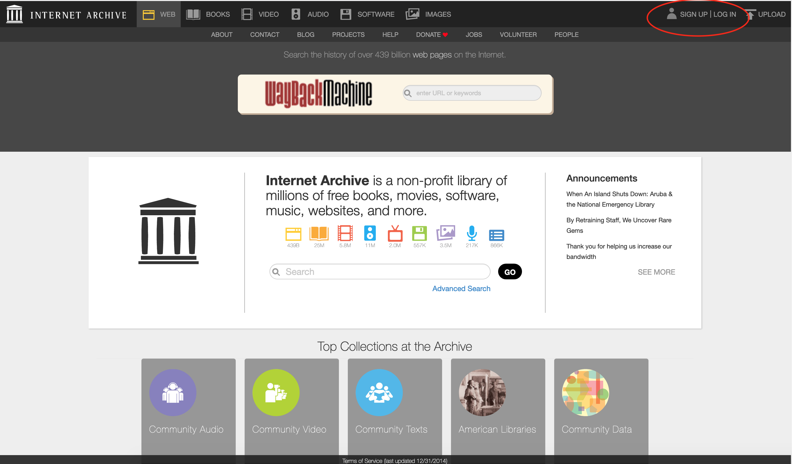

 Then create your user:

 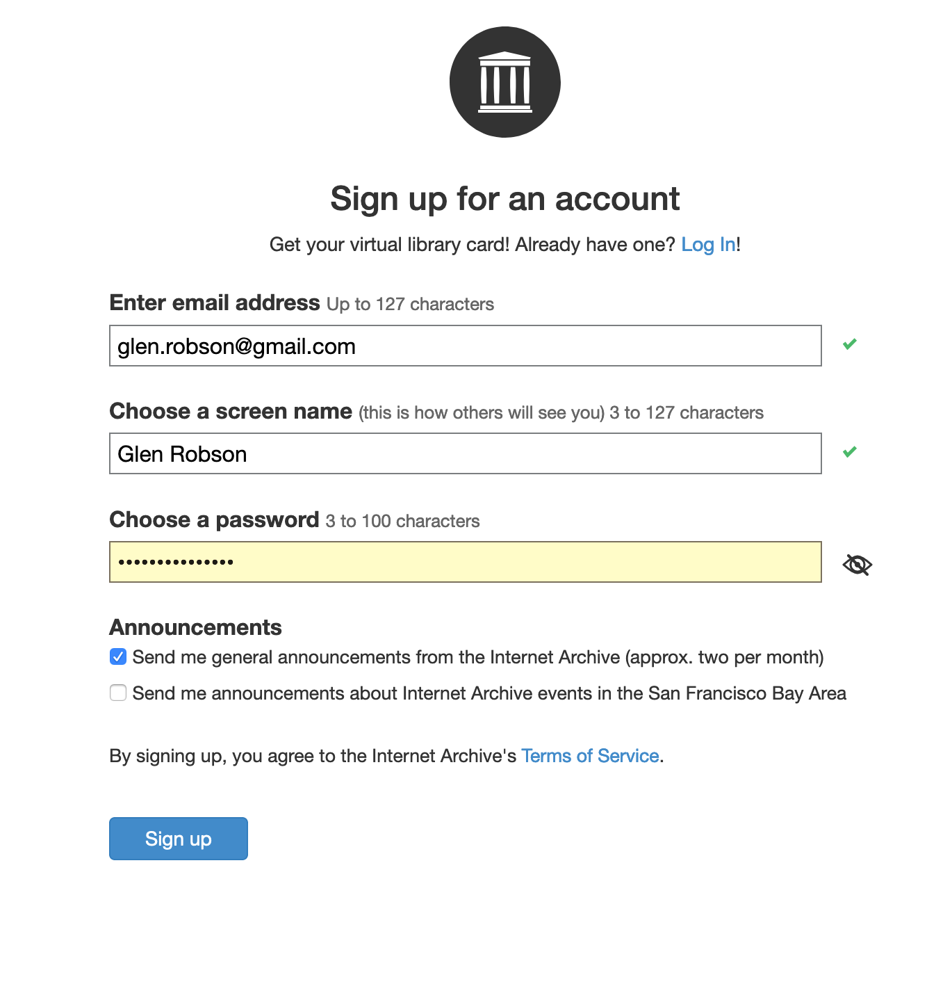

 They will then ask you to verify your email address:

 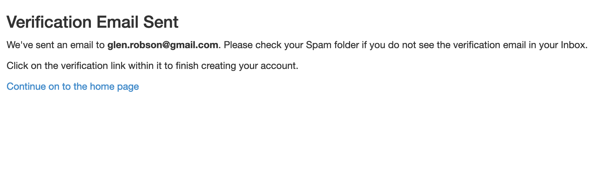

 You will then see an email like the following:

 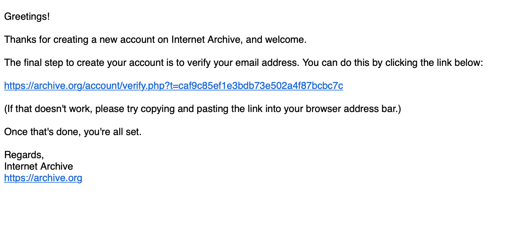

 Click on the link on the email and you will get the following screen:

 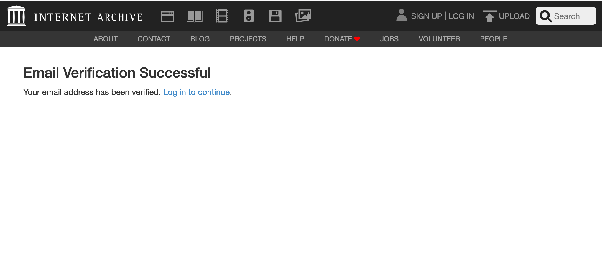

2. Upload your image

 Select upload on the Archive Welcome screen:

 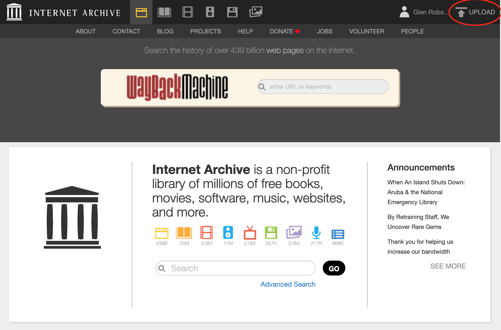

 You will then see the following screen. Select the green Upload Files button:

 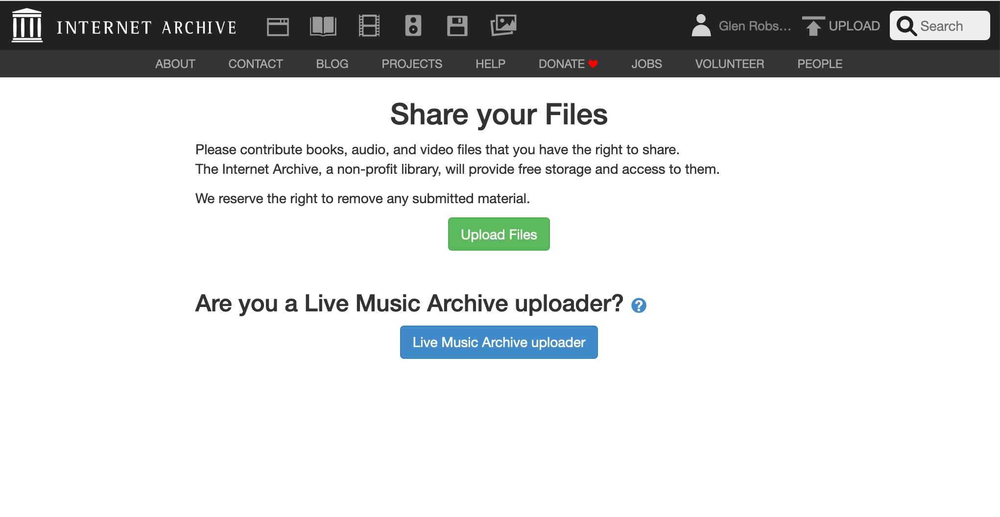

 Then click on the 'choose files to upload' button and select the images to upload:

 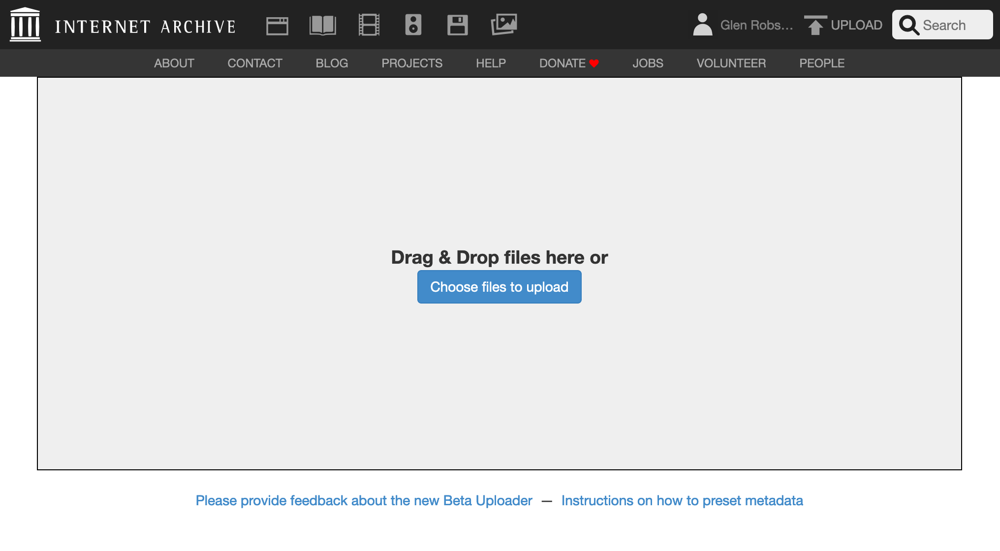

 Add metadata. The Title, URL, Description tags are mandatory. I left it in the Community Image collection. Usefully you can also say if its a test item which can be deleted after 30 days. 
 
 __Update__: ensure collection is `Community Image Collection` otherwise the image won't work as IIIF. 

 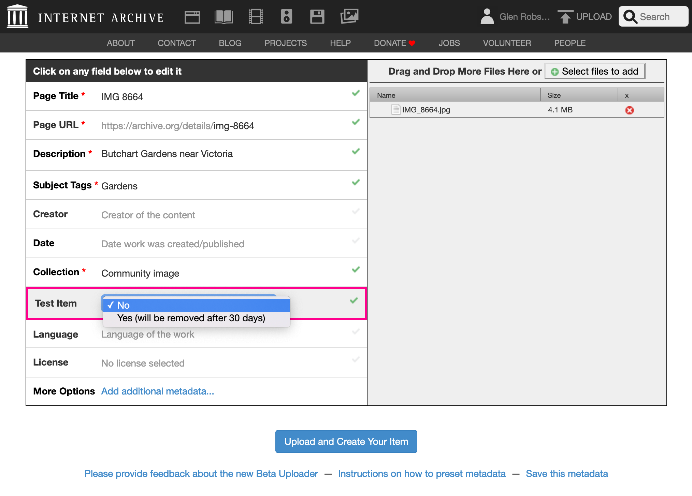

 Then click 'Upload and Create Your Item'. This took at least 5 minutes and after the bar has completed you have to wait longer presumably so it can setup the derivative images.

 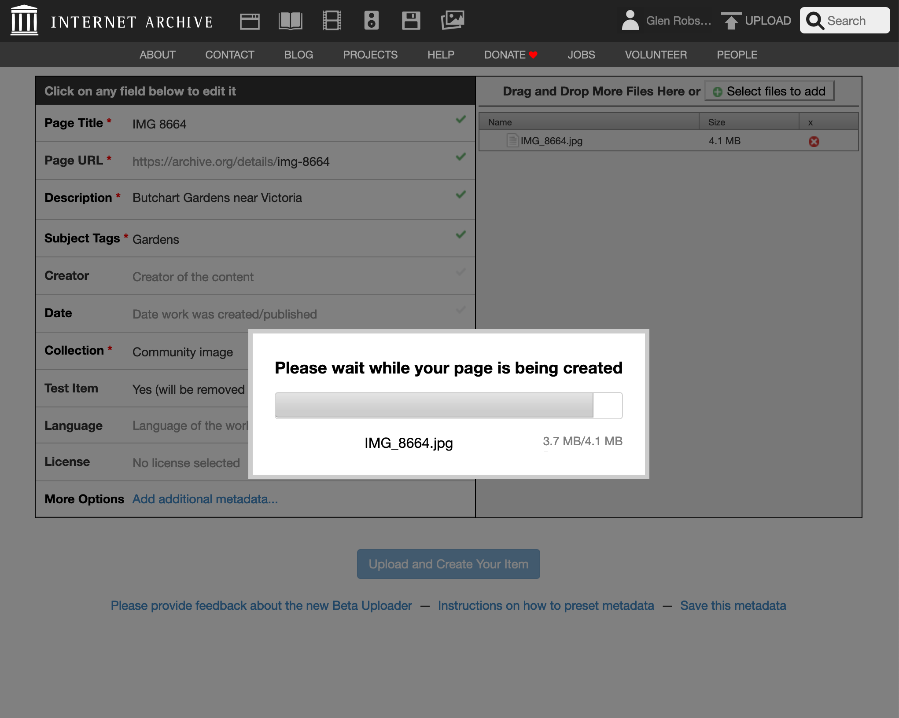

 If all has gone well you should see the item page:

 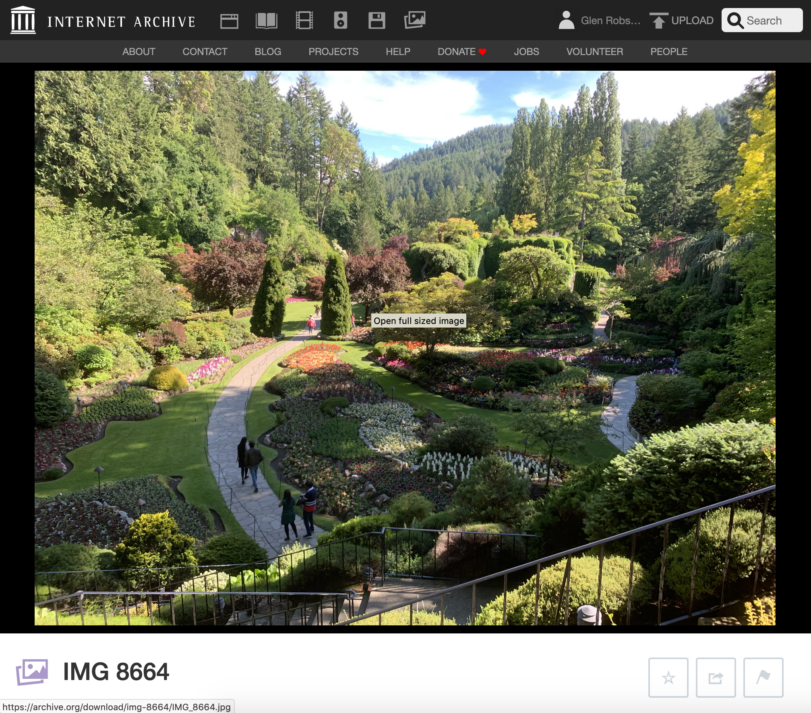

3. On the details page get the identifier for the image. For example if the details page link is:
  
  https://archive.org/details/img-8664_202009
 
  the identifier would be `img-8664_202009`

  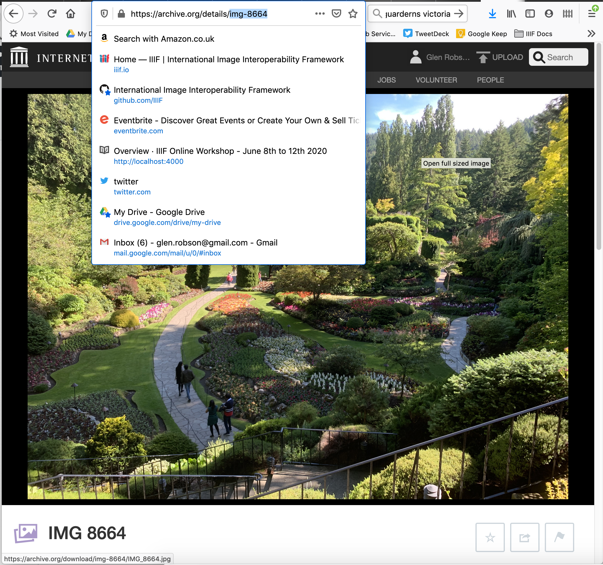

4. Access the Internet Archive IIIF helper page with this identifier:

  https://iiif.archive.org/iiif/helper/img-8664_202009/

  On this page you should see a link to the Manifest and also links to open up the Manifest in Mirador, Universal Viewer and Clover

  If this is a single image you will also see links to various image croppers. 

  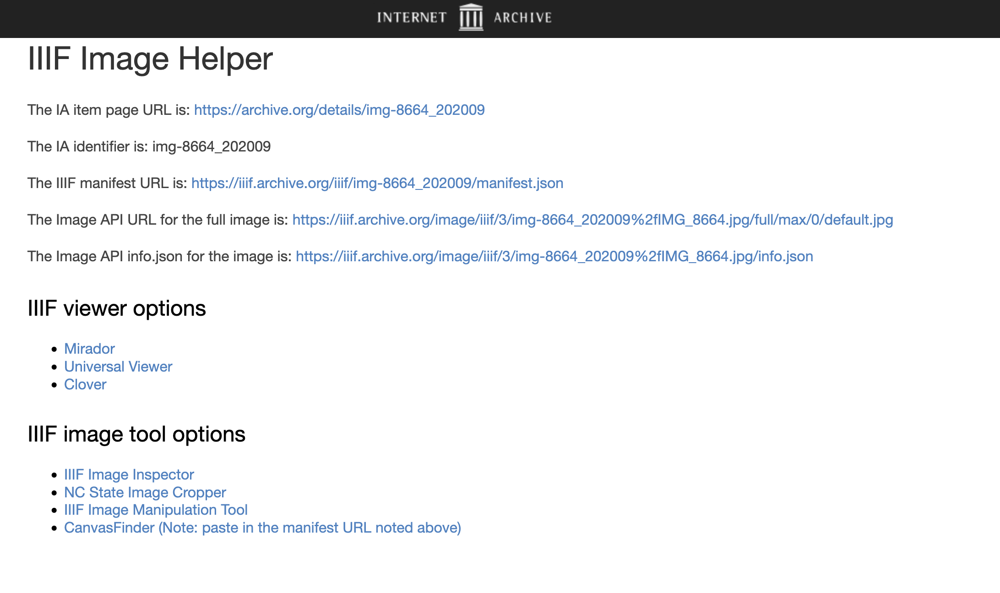