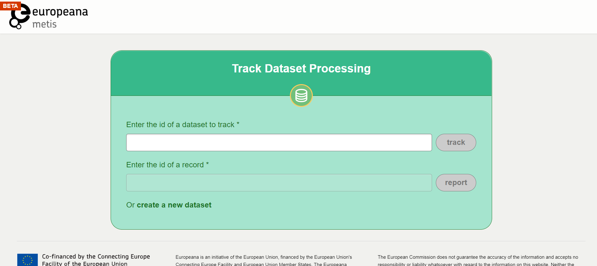

# Europeana Metis Sandbox

After creating your iiif-edm-files, what is next?

## A quick Sandbox how-to
For many extra features, advanced instructions can be found in the [Metis Sandbox User Guide](https://europeana.atlassian.net/wiki/spaces/EF/pages/2104295432/Metis+Sandbox+User+Guide)
If you would like to look into all the Sandbox has to offer, follow the [Sandbox training](https://europeana.atlassian.net/wiki/spaces/EF/pages/2227765249/METIS+Sandbox+Training) whenever is convenient for you.

### Goals of the Sandbox

The Metis Sandbox is a test environment for your data. It consists of a set of tools with which you can:

1. simulate ingesting and running the Metis workflow on your data,

2. see what your records would look like on the actual [Europeana.eu](https://www.europeana.eu/nl) portal,

3. get insight into the quality of your records.

### Focus of today: running & what would it look like

* Prepare zip-file using your own edm-iiif files (see above)
* Navigate to the [Sandbox](https://metis-sandbox.europeana.eu/) 
* Create new dataset: name your dataset and fill out the short form
* Press the ‘submit’ button
* Wait 15 minutes to ‘view published records’

## Try for yourself!
* Instructions: follow the steps indicated above
* Fiona & Lianne are available for bugfixes and questions
* 20 minutes, but in the meantime:...

## One example that we prepared for you earlier
Here is an example of Glen's tractor:
* In the [Sandbox](https://metis-sandbox.europeana.eu/dataset/213)
* In the [Sandbox preview](https://metis-sandbox-publish-api-prod-portal.eanadev.org/nl/item/213/_TEMPLATE_IIIF_Tractor)

