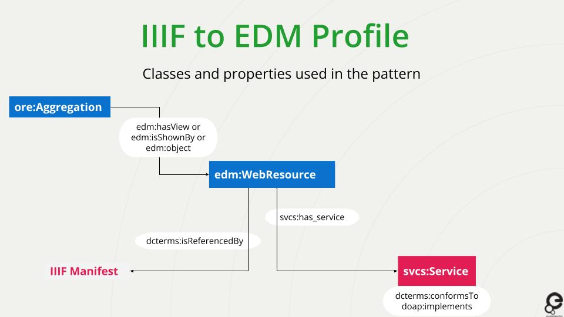

# HOW HAS EUROPEANA ADOPTED IIIF?
### By Fiona Mowat

* An [EDM extension](https://europeana.atlassian.net/wiki/spaces/EF/pages/2189262924/EDM+IIIF+EDM+classes+and+properties) was created to allow partners to supply links to IIIF resources and manifests from their own services 
* Europeana has reviewed its technology stack to be aligned with IIIF standards
* Reused available IIIF solutions for display and playout

## EDM 

basics on EDM

### 3 Core classes

concept of rdf classes

* `edm:ProvidedCHO` Class representing the provided cultural heritage object
* `edm:WebResource` Class for the web resource that is the digital representation
* `ore:Aggregation` Class that groups together the cultural heritage object with its digital version
---
* Each class starts with the “rdf:about” statement containing the identifier of the resource
* The class itself can be referred to within another class using the “rdf:resource” statement containing the same identifier

## IIIF to EDM Profile
### Classes and key properties to use within the classes 

 Class | Key properties
 ----------- | ----------- 
`ore:Aggregation` | edm:isShownBy or edm:hasView or edm:object 
`edm:WebResource` | svcs:has_service dcterms:isReferencedBy
`svcs:Service` | dcterms:conformsTo doap:implements



## Manifests can be generated on-the-fly

When a manifest is not available, we generate one automatically from EDM
We support both IIIF Presentation API v2 and v3

- [Example from the Newspaper Collection](https://www.europeana.eu/en/item/9200355/BibliographicResource_3000096341989)
- [Manifest v2](https://iiif.europeana.eu/presentation/9200355/BibliographicResource_3000096341989/manifest)
- [Manifest v3](https://iiif.europeana.eu/presentation/9200355/BibliographicResource_3000096341989/manifest?format=3)

## PROVIDING IIIF RESOURCES TO EUROPEANA: How to? - 4 Steps

1. Provide the IIIF Resource as EDM WebResource

`<ore:Aggregation rdf:about="[ … ]">`
[ … ]
`<edm:isShownBy rdf:resource="https://gallica.bnf.fr/iiif/ark:/12148/btv1b55001425m/f1/full/full/0/native.jpg”/>`
[ … ]
`</ore:Aggregation>`

`<edm:WebResource rdf:about="https://gallica.bnf.fr/iiif/ark:/12148/btv1b55001425m/f1/full/full/0/native.jpg"/>`
…

NB: {region}/{size}/{rotation}/{quality}


2. Flag the WebResource as IIIF-compliant

`<edm:WebResource rdf:about="https://gallica.bnf.fr/iiif/ark:/12148/btv1b55001425m/f1/full/full/0/native.jpg">
<dcterms:isReferencedBy rdf:resource="https://gallica.bnf.fr/iiif/ark:/12148/btv1b55001425m/manifest.json"/>
<svcs:has_service rdf:resource=”https://gallica.bnf.fr/iiif/ark:/12148/btv1b55001425m/f1”/>
</edm:WebResource>`

`<svcs:Service rdf:about="https://gallica.bnf.fr/iiif/ark:/12148/btv1b55001425m/f1">`
....

* Make sure that you have enabled CORS, Cross Origin Resource Sharing to enable Europeana to display the images (CORS->security feature for browsers)

3. Indicate a level of IIIF implementation

`<svcs:Service rdf:about=”https://gallica.bnf.fr/iiif/ark:/12148/btv1b55001425m/f1”/>
 <dcterms:conformsTo rdf:resource=”http://iiif.io/api/image”/>
 <doap:implements rdf:resource=”"http://iiif.io/api/image/2/level2.json">
</svcs:Service>`

4. Provide access to a IIIF manifest

`<edm:WebResource rdf:about="https://gallica.bnf.fr/iiif/ark:/12148/btv1b55001425m/f1/full/full/0/native.jpg">
<dcterms:isReferencedBy rdf:resource="https://gallica.bnf.fr/iiif/ark:/12148/btv1b55001425m/manifest.json"/>
<svcs:has_service rdf:resource=”https://gallica.bnf.fr/iiif/ark:/12148/btv1b55001425m/f1”/>
</edm:WebResource>`

## IIIF to EDM Profile on Pro

* Pattern, classes and properties used, complete examples 
* Some issues with the guidelines - they need updated. You will find them on the [knowledge base](https://europeana.atlassian.net/wiki/spaces/EF/pages/2189262924/EDM+IIIF+EDM+classes+and+properties)

## Prepare your own edm-iiif files

To create an edm-file using iiif, please copy-paste the [edm-iiif template file](https://docs.google.com/document/d/1hAiXhP2MdnJZPbmBG8hcaKLwAHnuCADi-m0hAVYubp0/edit) into your favourite xml editor and fill it out.
```
* Yellow: link to the image(s) in the repository that you created in part 1 of this workshop
* Green: insert your metadata (or leave the default.)
* Orange: insert your rights statements (!Make sure your rights statements are valid, if you are unsure, leave the default.)
```
* Save as .xml
* Zip
* Upload in Sandbox
