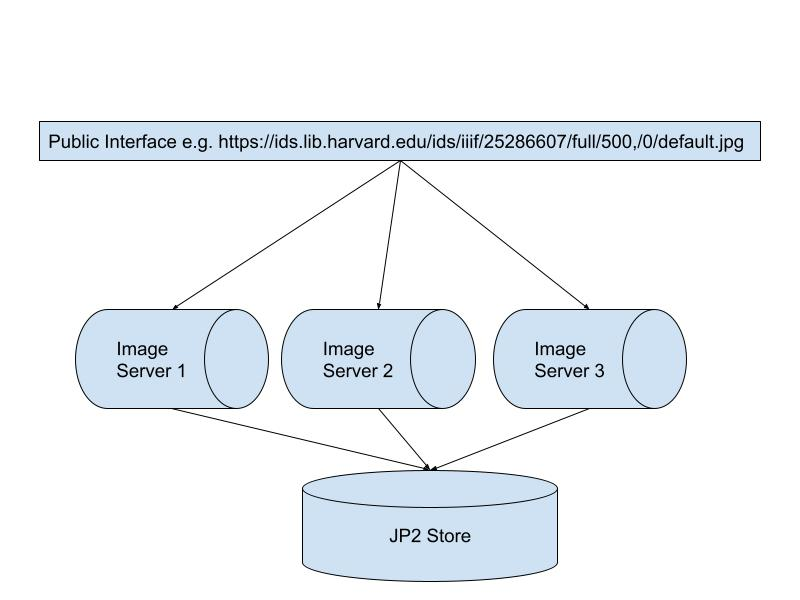
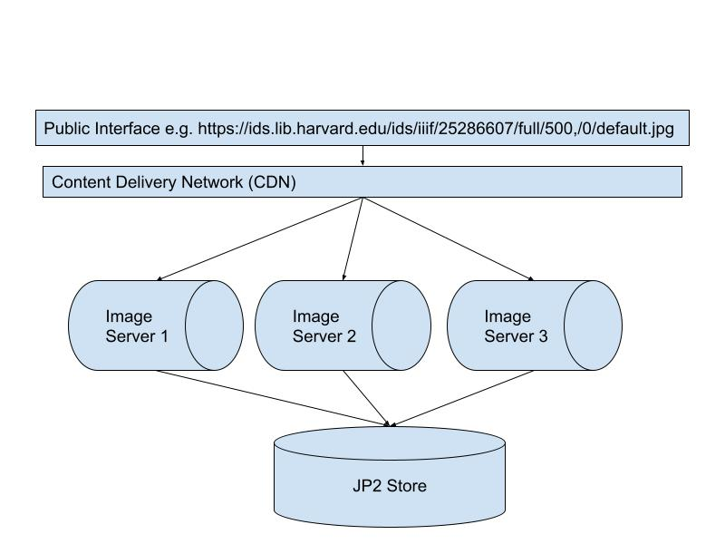

# Image Server Scalability
 
Horizontal scaling:

Content Delivery Network

Further reading:
 * [Getty Common Image Service](https://drive.google.com/file/d/1pB2eqlSlC4Ua5ZrEEEdJTbofl0wdDApg/view?usp%3Dsharing) - a useful comparison of Image API Servers
 * [IIIF by the Numbers](https://journal.code4lib.org/articles/15217) - the UCLA image API setup and experiments 
 * [Using Loris for IIIF at Wellcome](https://stacks.wellcomecollection.org/using-loris-for-iiif-at-wellcome-6ed1fefaf801)

