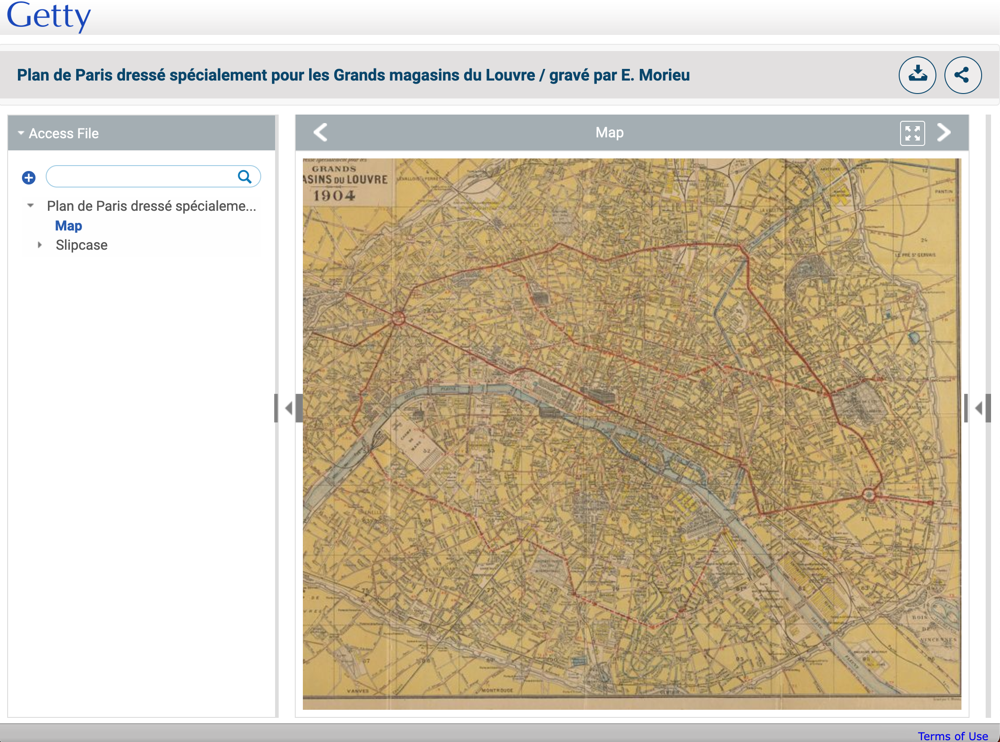
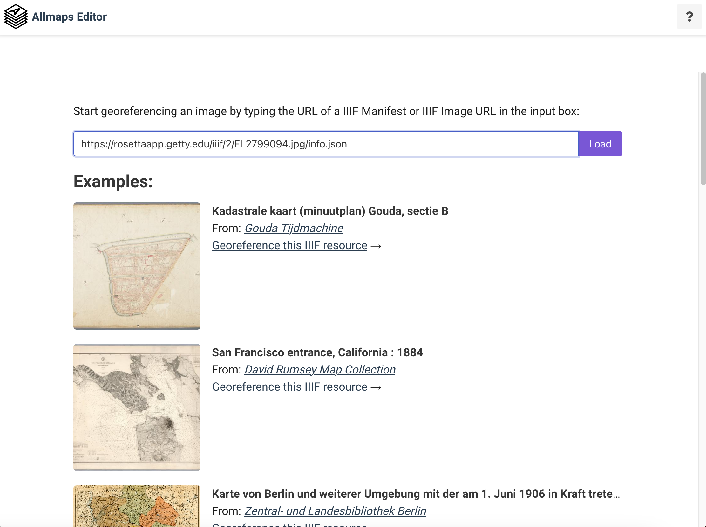

# Geo-locating a map

While looking through the GRI collection I noticed a number of Maps which is a good excuse to demonstrate one of the new tools available for IIIF maps.  For this example I am going to use this map of Paris:

https://rosettaapp.getty.edu/delivery/DeliveryManagerServlet?dps_pid=IE2799092&dps_file=FL2799094&md_pane=hide

Using the detektIIIF tool discussed previously we can use this map in the following Geo-referencing tool:

https://editor.allmaps.org/

