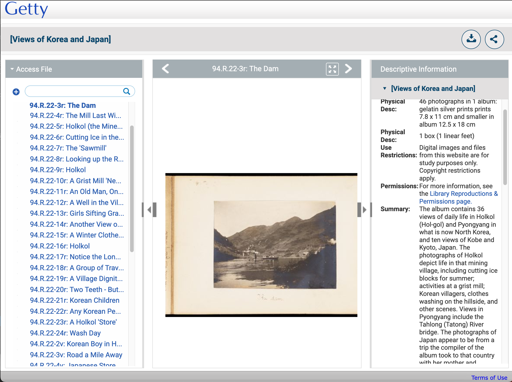

# Looking at other GRI collections

We will now have a look at the collections that are available from Rosseta and can be accessed from the following URL:

 * [Getty Search Gateway](https://search.getty.edu/gateway/search?q=maps&cat=source&sources=%22GRI%20Digital%20Collections%22&highlights=%22Open%20Content%20Images%22&rows=50&srt=&dir=s&dsp=0&img=0&pg=1)

When you get to an item page you can View the IIIF image in on of the basic IIIF viewers called [Openseadragon](https://openseadragon.github.io/). For example:

https://rosettaapp.getty.edu/delivery/DeliveryManagerServlet?dps_pid=IE9931113

Although this is a photo album with many pages it doesn't seem to have an associated manifest. It maybe possible to enable this and there are some instructions [here](https://knowledge.exlibrisgroup.com/Rosetta/Training/What%27s_New_Videos/Rosetta_5-3/IIIF_Image_Viewing).