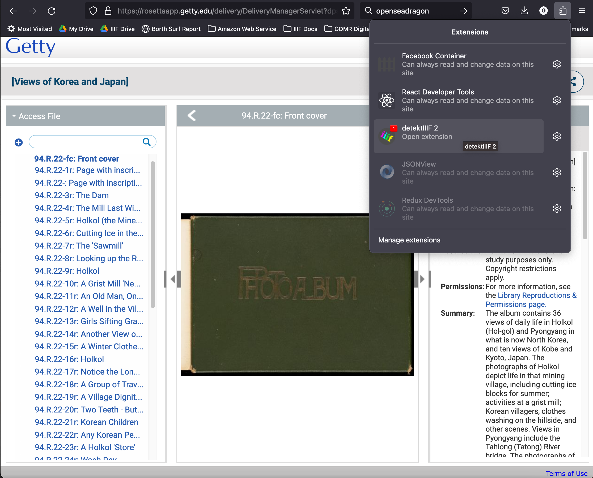
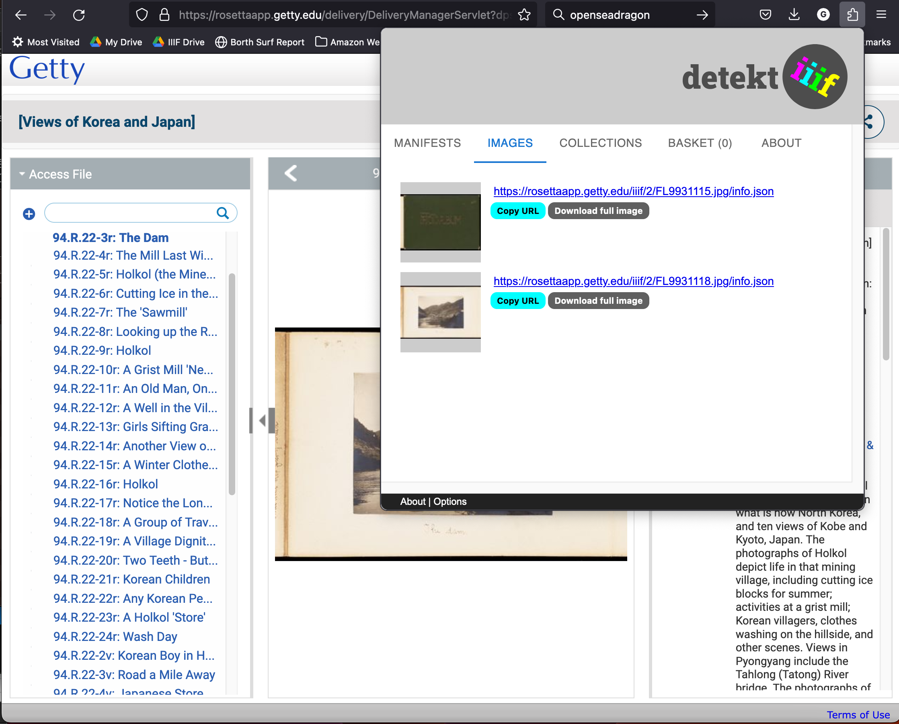

# Looking at other GRI collections

We will now have a look at the collections that are available from Rosseta and can be accessed from the following URL:

 * [Getty Search Gateway](https://search.getty.edu/gateway/search?q=maps&cat=source&sources=%22GRI%20Digital%20Collections%22&highlights=%22Open%20Content%20Images%22&rows=50&srt=&dir=s&dsp=0&img=0&pg=1)

When you get to an item page you can View the IIIF image in on of the basic IIIF viewers called [Openseadragon](https://openseadragon.github.io/). For example:

https://rosettaapp.getty.edu/delivery/DeliveryManagerServlet?dps_pid=IE9931113

Although this is a photo album with many pages it doesn't seem to have an associated manifest. It maybe possible to enable this and there are some instructions [here](https://knowledge.exlibrisgroup.com/Rosetta/Training/What%27s_New_Videos/Rosetta_5-3/IIIF_Image_Viewing).

Without access to the IIIF manifest it makes it very difficult for end users to re-use this content. One solution is to use a community developed tool called [DetektIIIF](https://seige.digital/en/detektiiif/). This was developed by a IIIF community member; Leander Seige to make it easier to find manifests. It can be installed in either Firefox or chrome. If you install the plugin then refresh the page you should be able to access it in the extensions part of the browser:

In this example it shows a red 1 to show that it has found an IIIF item. If you then navigate to a different image and select the detekt extension again and click to open the extension you will now see:

You will notice that no Manifests were found but it has found some IIIF images. If you click the Copy URL button you should be ready for the next stage of cropping the image. The URL will look something like:

https://rosettaapp.getty.edu/iiif/2/FL9931118.jpg/info.json

For Manifests like [The Florentine Codex](https://dfc-django-backend.getty.digirati.io/iiif/iiif/manifest/f75b53f9-7295-41f3-9299-6bbe04685c8b/) or the 12 Sunset photographs you can use the following tool to get the Image ID:

https://glenrobson.github.io/CanvasFinder/

