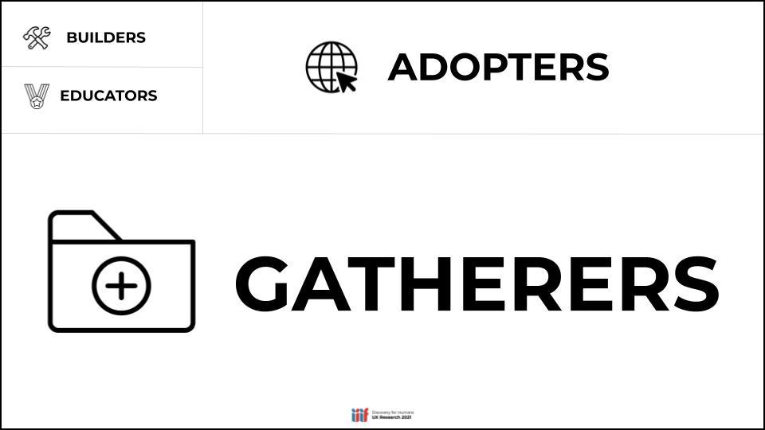

# Introductions

## Getty involvement with IIIF
IIIF is a set of standards that provide access to high quality images and audio-visual content in a method that allows users to choose different viewers and tools to interact with cultural heritage content. It has been widely adopted by world leading organisations including the J. Paul Getty Trust. It provides a basis for users to gather digital content and enables research by comparing and annotating content. The IIIF standards are developed by an international open community and are supported by a consortium of institutions including the Getty. 

The Getty has been involved with the development of IIIF since the very beginning and was instrumental in the addition of audio-visual support to IIIF. It was also one of the early members of the [IIIF Consortium](https://iiif.io/community/consortium/). Members of staff at the Getty have been active participants in the community providing advice on implementation and also funding tools that benefit both the Getty and the wider IIIF community. A highlight of some of IIIF related work the Getty has presented on are below:

 * [2016 Edward Ruscha photographs of Los Angeles streets](https://12sunsets.getty.edu)
 * [2017 press release for 30,000 artworks](https://www.getty.edu/news/30000-getty-museum-images-published-iiif/)
 * [Quire](https://quire.getty.edu/) - a widely used publication system
 * [Animal Crossing Art Generator](https://experiments.getty.edu/ac-art-generator) 
 * [iiif-for-dolls](https://iiif-for-dolls.davidnewbury.com/) - a thought provoking app on relating physical size to digital images. 
 * [Digital Florentine Codex](https://florentinecodex.getty.edu/) - mentioned at the 2019 DHSI training

# How users make use of IIIF 

One of the IIIF Community groups has done some research on how people use IIIF items and created the following groups of users: 

From the [D4H Community Group Research Findings presentation](https://docs.google.com/presentation/d/1JhhjJdGIAZjYm0j9iNig7-YT2LJqFgVgThsoS59jAV0/edit#slide=id.gdbd80f572f_0_95)

The groups are defined as:

### Gatherers
 * **EXPERTISE IN IIIF:** Does not use IIIF. May be aware or unaware that it exists.
 * **MOTIVATION:** The materials relevant to their research; technology agnostic.
 * **TOOLBOX:** Use tools like Zotero, Google Drive, Dropbox and MS Office to manage digital items.
 * **PEERS:** Involved in their own research communities.

Use cases include:
 * Making use of your [catalogue](https://search.getty.edu/gateway/landing) to find digital stuff
 * Browsing a project website like:
  * [Digital Florentine Codex](https://florentinecodex.getty.edu/)   
  * [Edward Ruscha photographs of Los Angeles streets](https://www.getty.edu/research/collections/collection/100071)
 * Storing references in Zotero or Spreadsheets
 * Downloading images
 
### Adopters
 * **EXPERTISE IN IIIF:** Utilize IIIF-compliant materials for research projects.
 * **MOTIVATION:** Available technology and materials relevant to their research.
 * **TOOLBOX:** Use tools like [FromThePage](https://fromthepage.com/), [Wordpress](https://www.vam.ac.uk/blog/digital/iiif-wordpress-and-shakespeare-too), [Omeka](https://omeka.org/s/), and other out-of-the-box solutions for research projects.
 * **PEERS:** Involved in their own research communities more than IIIF community.
 
Use cases include:
 * Looking for IIIF material. 
 * Using multiple collections with tools like [Mirador](https://projectmirador.org/)
 * Will use tools like [Exhibit](https://exhibit.so/) to put together exhibitions/presentations. 
 * This is where this course will target.

### Educators
 * **EXPERTISE IN IIIF:** Understand how to use IIIF tools for viewing, annotation, and transcription.
 * **MOTIVATION:** Teach people about the possibilities of IIIF.
 * **TOOLBOX:** Use tools like viewers in teaching.
 * **PEERS:** May be involved with IIIF community.

Use cases include:
 * Similar tools to above
 * Will use annotation tools we will cover on Thursday
 * Will use tools like [Recogito](https://recogito.pelagios.org/) which is a hosted annotation tool for teaching
 * Use AV tools like [Timeliner](https://cultural-heritage.digirati.com/our-work/timeliner/) or the [Europeana Media Player](https://video-editor.eu/).
 * Can setup crowdsourcing projects
 * We held a community call on Teaching and Learning with IIIF. Notes [here](https://docs.google.com/document/d/1viF1tgssZSTTiMTPy1sY3iTxgAKfByt1eM9MrCQEfF4/edit) and video [here](https://www.youtube.com/watch?v=ILrmRxPcK-o).

### Builders
 * **EXPERTISE IN IIIF:** Possess a deep, technical knowledge.
 * **MOTIVATION:** Make digital content from their institution available.
 * **TOOLBOX:** Use tools like Github, code editors, open source tools.
 * **PEERS:** Members of the IIIF community.

Use cases:
 * Create Manifests and IIIF Images either programmatically or through tools like Manifest Editors
 * They know about the IIIF tools available and where to look for them ([awesome-iiif](https://github.com/IIIF/awesome-iiif))

