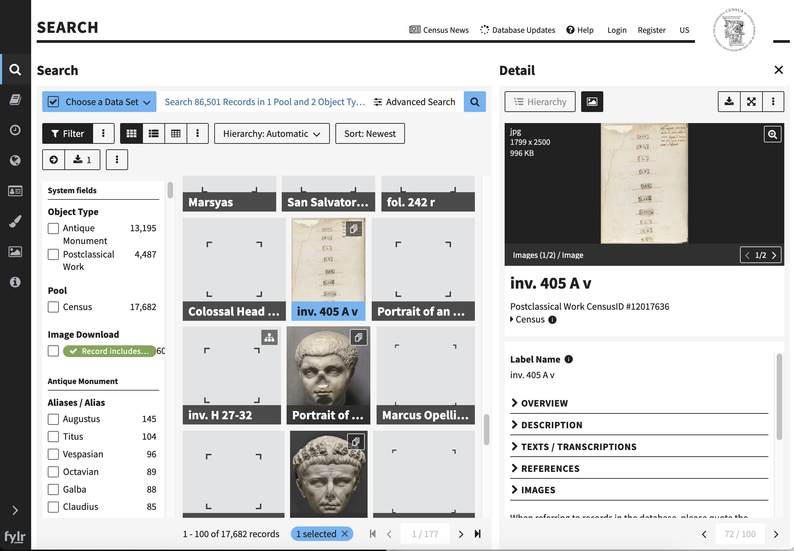

# Finding Census Manifests

The Census database currently uses EasyDB and it appears that it provides access to IIIF Manifests even though this isn't publicized in the site. What we are going to do is:

 * Find an item in the database
 * Work out the Manifest URL
 * Open this Manifest in a IIIF Viewer called Mirador

This could replicate a researchers workflow assuming there was an easier way to get access to the Manifest URL and would allow them to perform the following:

 * Gather together material from multiple collections and view it side by side in Mirador
 * Import the Manifests into an Annotation system
 * Gather a collection of material to work AI or Machine Learning workflows. 

## Step 1: Find an item in the database

Navigate to the Census database:

[https://database.census.de/](https://database.census.de/)

Select an item which has a Image associated with it like the follow:

[Example Record](https://database.census.de/#/detail/12017636)

## Step 2: Work out the Manifest URL

The Manifest URL for easyDB looks like the following:

https://database.census.de/api/v1/objects/uuid/<b>cc04f6bd-9e97-4c3f-92eb-f64bf2663cd1</b>/format/iiif/v3/manifest.json

Where the part in bold (cc04f6bd-9e97-4c3f-92eb-f64bf2663cd1) is the unique identifier for the item. We can find this identifier by scrolling to the bottom of the information window for the item. See the highlighted part in the image below:

[uuid example](img/uuid.png)

In this example the uuid is '4b3714d5-6112-47b3-ba6e-97f816e3fa41' so the Manifest is available at:

https://database.census.de/api/v1/objects/uuid/4b3714d5-6112-47b3-ba6e-97f816e3fa41/format/iiif/v3/manifest.json

Note some items seem to throw an error so if you get into trouble you can use the manifest above for the next step.

## Step 3: Open this Manifest in a IIIF Viewer Called Mirador

Now we have a Manifest we can open it up in Mirador 

Navigate to [https://projectmirador.org/](https://projectmirador.org/) and click the __Try a Live Demo__ button. Once Mirador opens close the two demo objects by clicking the two crosses highlighted in the screen shot below:

Then click the Start here button on the top left.

Then click the add resource button at the bottom right:

Finally you can paste your URL to your manifest and click Add and Mirador should open your Manifest.

