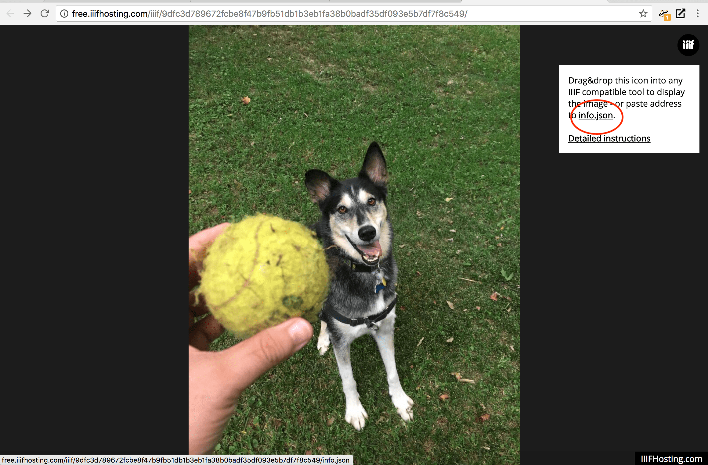

# IIIF Hosting - software as a service

The quickest way to get up and going is to upload images to an image hosting service. One quick one to get started with is [IIIF Hosting](https://www.iiifhosting.com/).


### Step 1. Click "Sign in/up"


### Step 2. Click "Import"


### Step 3. Drag or upload an image from your computer.

### Step 4. Success, now you should be able to see a zoomable version of your image.



Now you have a hosted version of your image, using a IIIF Image API server. If you click the "[info.json](http://free.iiifhosting.com/iiif/9dfc3d789672fcbe8f47b9fb51db1b3eb1fa38b0badf35df093e5b7df7f8c549/info.json)" link in the upper right-hand corner, you will see the Image Information response.

```javascript
// http://free.iiifhosting.com/iiif/9dfc3d789672fcbe8f47b9fb51db1b3eb1fa38b0badf35df093e5b7df7f8c549/info.json
{
  "@context" : "http://iiif.io/api/image/2/context.json",
  "@id" : "http://free.iiifhosting.com/iiif/9dfc3d789672fcbe8f47b9fb51db1b3eb1fa38b0badf35df093e5b7df7f8c549",
  "protocol" : "http://iiif.io/api/image",
  "width" : 3024,
  "height" : 4032,
  "sizes" : [
     { "width" : 189, "height" : 252 },
     { "width" : 378, "height" : 504 }
  ],
  "tiles" : [
     { "width" : 256, "height" : 256, "scaleFactors" : [ 1, 2, 4, 8, 16 ] }
  ],
  "profile" : [
     "http://iiif.io/api/image/2/level1.json",
     { "formats" : [ "jpg" ],
       "qualities" : [ "native","color","gray" ],
       "supports" : ["regionByPct","regionSquare","sizeByForcedWh","sizeByWh","sizeAboveFull","rotationBy90s","mirroring"] }
  ]
}
```

Try this image with:
 * Leaflet: http://mejackreed.github.io/Leaflet-IIIF/examples/?url=<url_to_info.json>
   * e.g. http://mejackreed.github.io/Leaflet-IIIF/examples/?url=http://free.iiifhosting.com/iiif/9dfc3d789672fcbe8f47b9fb51db1b3eb1fa38b0badf35df093e5b7df7f8c549/info.json
 * OpenSeaDragon: http://iiif.gdmrdigital.com/openseadragon/index.html?image=<url_to_info.json>
   * http://iiif.gdmrdigital.com/openseadragon/index.html?image=http://free.iiifhosting.com/iiif/9dfc3d789672fcbe8f47b9fb51db1b3eb1fa38b0badf35df093e5b7df7f8c549/info.json
 * UCD Image clipper: https://jbhoward-dublin.github.io/IIIF-imageManipulation/index.html?imageID=<url_to_image_id>
   * e.g. https://jbhoward-dublin.github.io/IIIF-imageManipulation/index.html?imageID=http://free.iiifhosting.com/iiif/9dfc3d789672fcbe8f47b9fb51db1b3eb1fa38b0badf35df093e5b7df7f8c549
