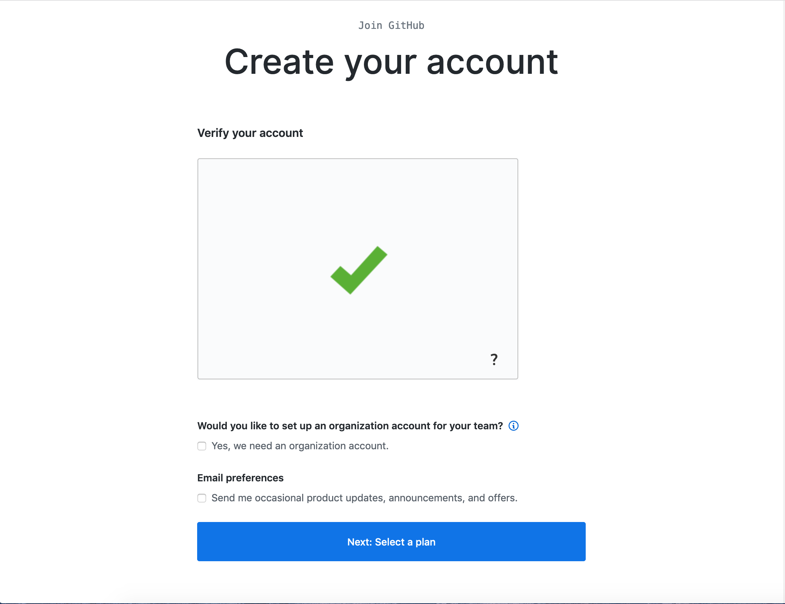
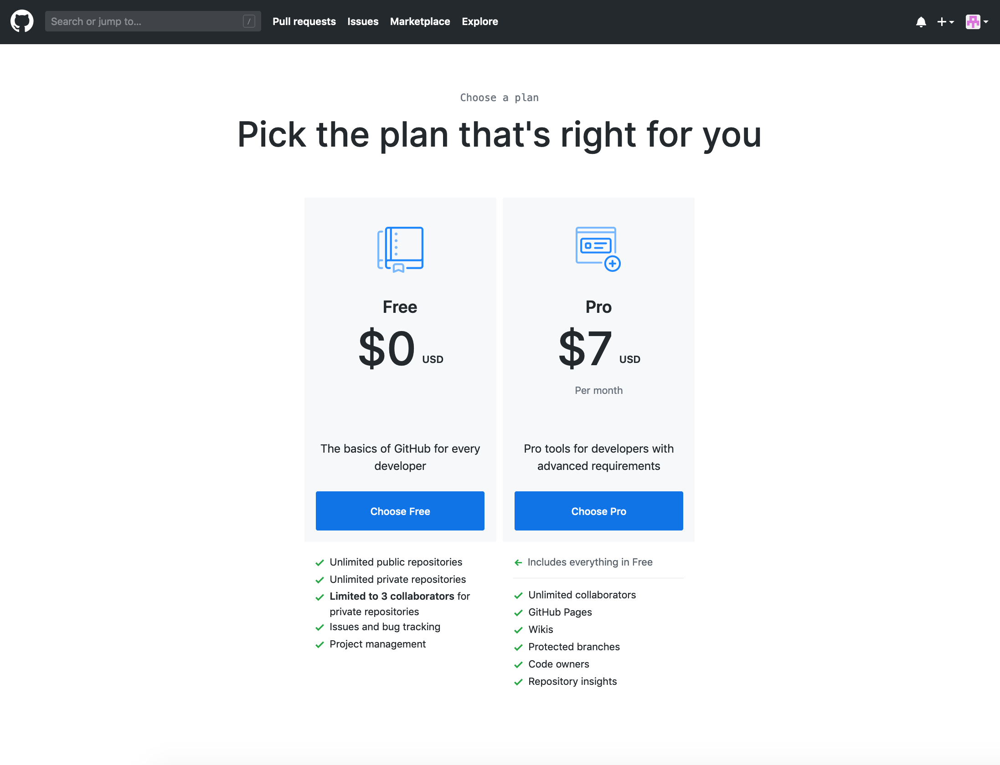
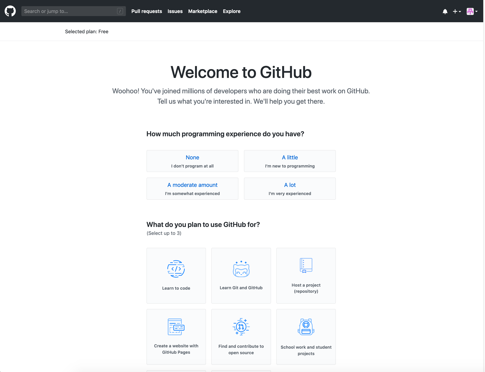
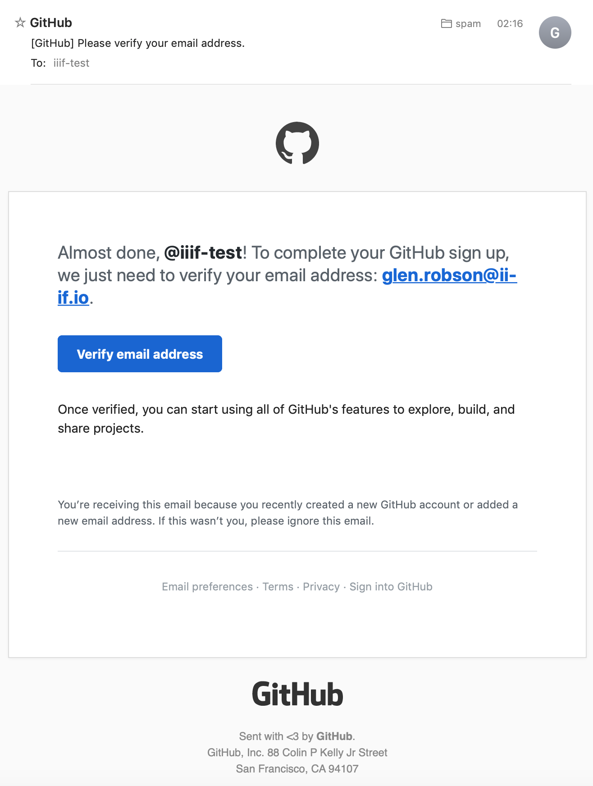
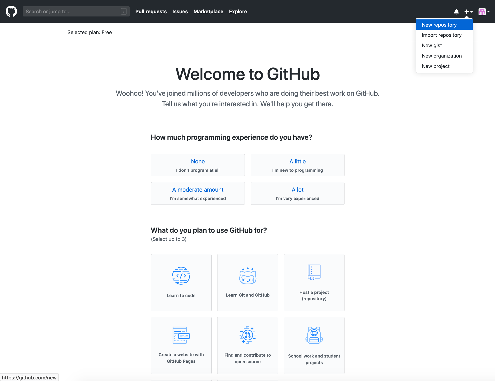
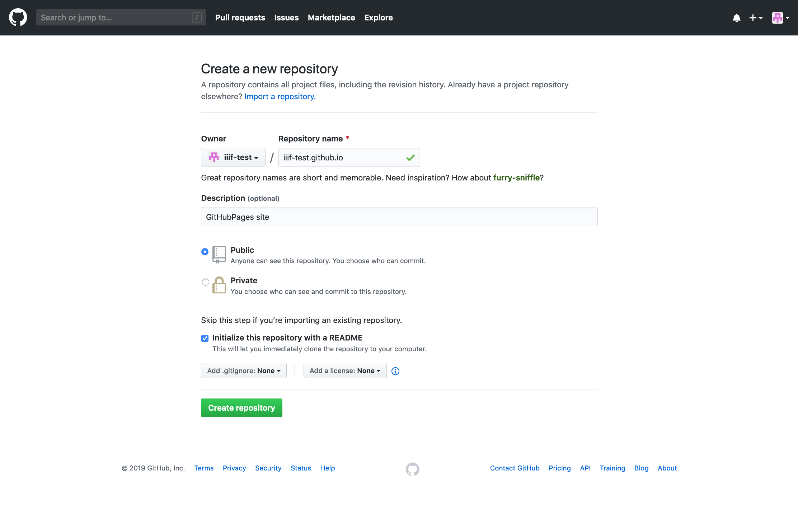
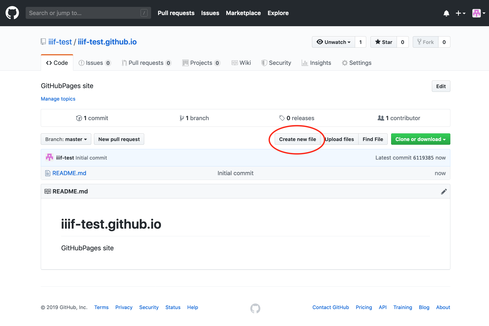
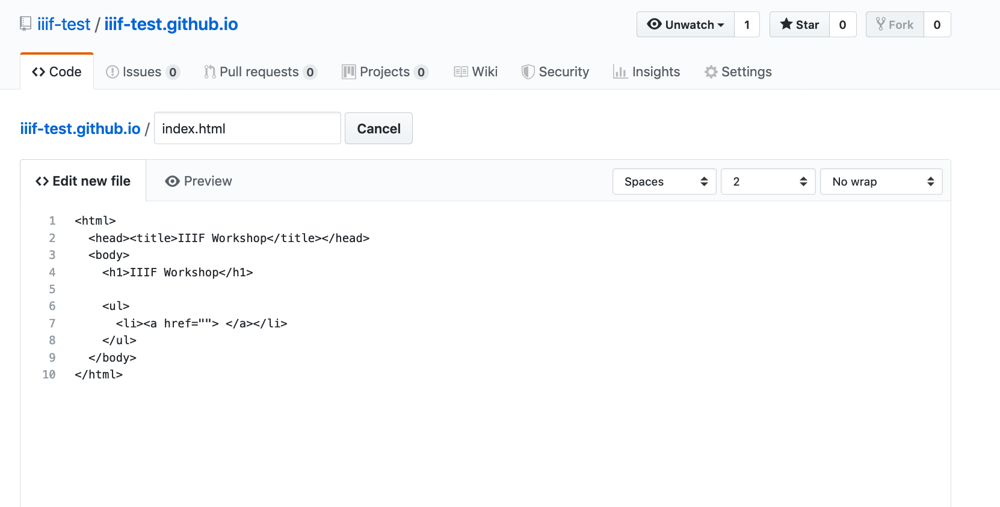
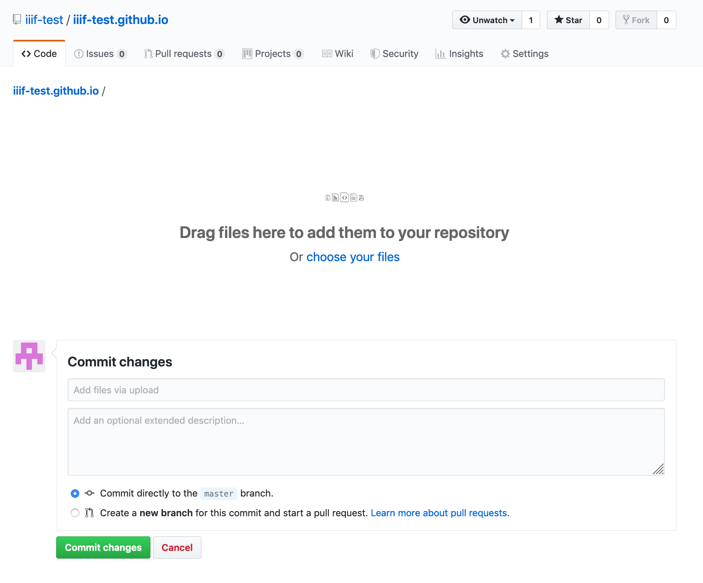

# Level 0 hosting with GitHub Pages

Now that you have a IIIF Level 0 image it would be great to publish this online so others can see your image. In the previous chapter using the Chrome Web server only users on your Machine can view the image. By publishing it on the web you can share it with others. We are going to use something called GitHub Pages which allows you to have free webspace hosting. 

GitHub is software and web application created to manage projects with multiple developers and manages the source code to ensure people's changes don't get overwritten. One feature of Github is GitHub Pages which allows you to create a Web page about your project. We are going to use this functionality to host our IIIF Images. This is a relatively convoluted process but once setup it will give you a free way to publish IIIF Images and later on IIIF Manifests.

## Step 1: Sign up to GitHub
Created an account by going to [Github](https://github.com/) and clicking signup.

 * Create Username, password, email

    

 * Complete verify puzzle

    

 * Choose free option

    


 * Success!!

    

## Step 2: Email verification

You may see the following screen once you have logged in. 

 

Check your email to see if you have a message like the following from GitHub:

 

Click the `Verify email address` button. This should take you back to GitHub.

## Step 3: Create your GitHub pages repository

 * Click the + on the top right and click `New Repository`



 * For the repository name call it:

 _username_.github.io

where _username_ is your GitHub user.

 * Then click `Create repository`



 * You should see the following screen. 



 * Now click `Create new file`:



 * Name the file `index.html` and copy and paste the following content:

```
<html>
  <head><title>IIIF Workshop</title></head>
  <body>
    <h1>IIIF Workshop</h1>
    
    <ul>
      <li><a href=""> </a></li>
    </ul>
  </body>
</html>
```

 * Scroll to the bottom of the page and click `Commit new file`.
 * In a browser you should now be able to navigate to

[https://username.github.io](https://iiif-test.github.io)

and see a page with a title of `IIIF Workshop`. 

If you have reached this far you have created a GitHub pages website and are ready to start uploading your IIIF Images

## Step 4: Upload level 0 image

 * Switch back to your pages repo (https://github.com/username/username.github.io
 * Click `Upload files`



 * Drag your IIIF directory into the GitHub page


 * Then click `Commit changes`

You should now be able to access your info.json using the following URL:

https://username.github.io/iiif/identifier/info.json

Where:
 * _username_ is your GitHub username
 * _identifier_ is the name of your image file 
 
## Step 5: View image:
You should now be able to show your image using Leaflet and OpenseaDragon:

 * Openseadragon: http://iiif.gdmrdigital.com/openseadragon/index.html?image=https://_username_.github.io/iiif/_identifier_/info.json

Note not all software works with level 0 images. For example Leaflet doesn't seem to be working currently. 

  

