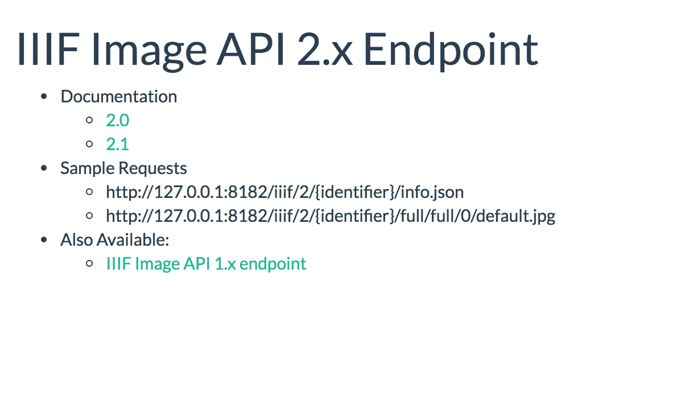
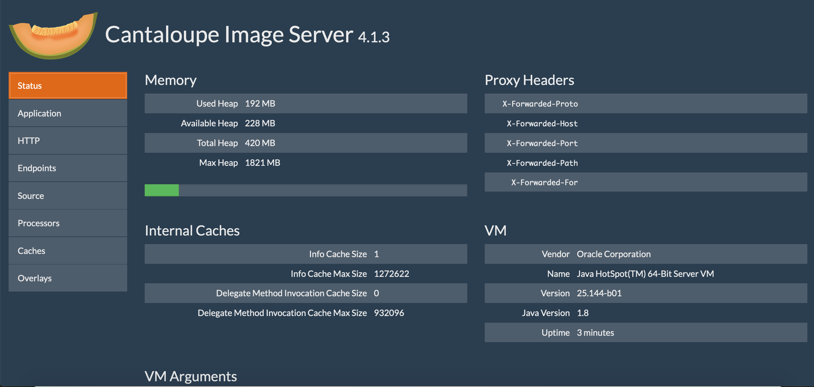
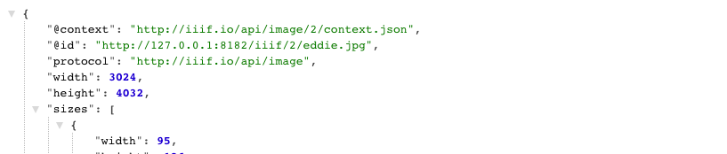

# Setting up Cantaloupe IIIF Image Server

Make sure you have [installed the prerequisites](https://gist.github.com/mejackreed/8ed979425ae702eaf1ebb2dbc1d7313b).

## Download Cantaloupe

For more information, checkout the [Cantaloupe getting started guide](https://medusa-project.github.io/cantaloupe/manual/3.4/getting-started.html).

Download [Cantaloupe v3.4.2](https://github.com/medusa-project/cantaloupe/releases/download/v3.4.2/Cantaloupe-3.4.2.zip)

Open and extract the zip file to your directory of choosing. We suggest `~/Desktop`.

Now change directory to that extracted directory

```sh
$ cd ~/Desktop/Cantaloupe-3.4.2
```

## Configure Cantaloupe

Now lets create a copy of the configuration file:

```sh
$ cp cantaloupe.properties.sample cantaloupe.properties
```

Now lets enable the admin panel where we will modify the rest of the settings.

Scroll to line 104, and change `false` to `true`. Also add a password.

```diff
# Enables the Control Panel, at /admin.
- admin.enabled = false
+ admin.enabled = true
- admin.secret =
+ admin.secret = yolo
```

Save the file.

Now lets try and start the server. Run this command from your Cantaloupe directory

```sh
$ java -Dcantaloupe.config=./cantaloupe.properties -Xmx2g -jar Cantaloupe-3.4.2.war
```

Now navigate to [http://127.0.0.1:8182/iiif/2](http://127.0.0.1:8182/iiif/2) in your browser.

You should see this:



Congrats you successfully installed Cantaloupe!

Also make sure you can get into the admin panel by navigating to [http://127.0.0.1:8182/admin](http://127.0.0.1:8182/admin).

Use the username `admin` and the password you set previously.



# Configuring Cantaloupe to use your images.

Congrats now you have your image server up and running! We need to feed it some images to keep it happy!

## Download some images

Go ahead and download a `*.jpg` image from the Internet into your Cantaloupe directory `Cantaloupe-3.4.2`. Here is one [eddie.jpg](https://github.com/sul-cidr/histonets/raw/master/spec/fixtures/images/eddie.jpg) that you can use.

## Configure Cantaloupe to use the correct path

Now we need to configure Cantaloupe to use that image directory.

Navigate to the admin page [http://127.0.0.1:8182/admin](http://127.0.0.1:8182/admin).

Click on "Resolver", then click "FilesystemResolver" tab.

Next fill in Path Prefix to be `./`


## Check it out in the browser

Now you should be able to navigate to an image's info.json response successfully.

Checkout [http://127.0.0.1:8182/iiif/2/eddie.jpg/info.json](http://127.0.0.1:8182/iiif/2/eddie.jpg/info.json)

And if everything goes right, you should see an `info.json` response.



Let's finally check it using the Leaflet-IIIF image api viewer.

Try this url: [http://mejackreed.github.io/Leaflet-IIIF/examples/?url=http://127.0.0.1:8182/iiif/2/eddie.jpg/info.json](http://mejackreed.github.io/Leaflet-IIIF/examples/?url=http://127.0.0.1:8182/iiif/2/eddie.jpg/info.json)

Notice how we added our local IIIF server's info.json response url as a parameter. This is used by IIIF Image API clients to understand how they can request images/tiles.


Cross our fingers, but you should see a picture of Eddie in a zoomable viewer.
