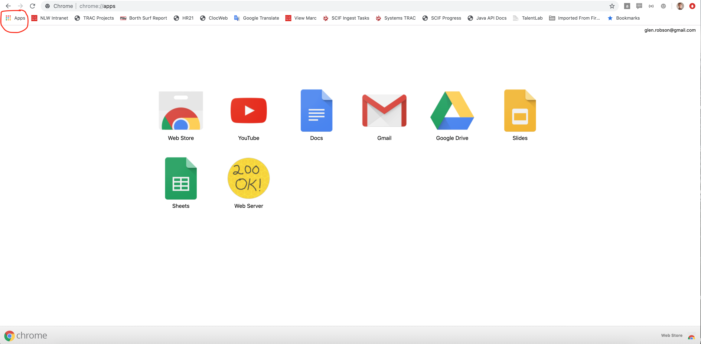

# Generating static tiles

As mentioned in the previous chapter, the IIIF Image API defines the following structure:

`http://host:port/identifier/region/size/rotation/quality.format`

It is possible to generate images that fit this URL structure and conform to the IIIF Image API using a tile generator. This will generate the minimum required amount of files to implement the IIIF Image API. It does have some limitations, the main one being it is not possible to request images of a size that haven't been pre-generated. This type of pre-generated IIIF Image is known as a `Level 0` implementation. 

To generate these IIIF images we are going to use a IIIF tilling program which is available on Github. 

## Step 1: Download the IIIF Tiler

 * Navigate to the release page: https://github.com/glenrobson/iiif-tiler/releases/tag/0.3
 * Click the `assets` drop down
 * Download [iiif-tiler.jar](https://github.com/glenrobson/iiif-tiler/releases/download/0.3/iiif-tiler.jar)
 * Store this jar file in your `~/iiif-workshop` directory

## Step 2: Prepare your image files
 * Move the image files you want to work with into your `~/iiif-workshop` directory

## Step 3: Generate the IIIF Image tiles

Now either:
 * Double click on the `iiif-tiler.jar` file in Finder or Windows.

or 

 * from the command line run:

```sh
cd ~/iiif-workshop
java -jar iiif-tiler.jar
```
 * This will generate the IIIF image tiles in a `iiif` directory for every image it finds in the same directory as the iiif-tiler.jar.

## Step 4: Point the Chrome webserver to your `iiif-workshop` directory

 * Open Chrome
 * Click the Apps button on the top left

 

 * Click on the `Web Server` (if this is not listed ensure you have installed the [prerequisites](../prerequisites.md)).
 * You should see the following:

 

 * Click `choose folder` and select your `iiif-workshop` folder
 * Where it says `Enter port` change it to 8887
 * Click `Show Advanced Settings`
 * Ensure `Set CORS headers` has a tick next to it. 

## Step 5: Serve your IIIF Image through a http server

 * Open a browser and navigate to [http://127.0.0.1:8887/](http://127.0.0.1:8887/)
 * You should see a `iiif` directory and if you click that you should see your image file. 
 * Click this directory then click on the `info.json`.
 * If your image was called picture.png the URL should be.

`http://127.0.0.1:8887/iiif/image/info.json`

 * If you see the info.json you are now ready to view your image in a IIIF Image viewer.

## Step 6: Show your image in a IIIF Viewer

You can now load your image to a IIIF image viewer. The main image viewer is OpenseaDragon. This takes the URL of the info.json. So if your info.json URL is:

```http://127.0.0.1:8887/iiif/image/info.json```

Open it with OpenseaDragon:

[http://iiif.gdmrdigital.com/openseadragon/index.html?image=http://127.0.0.1:8887/iiif/image/info.json](http://iiif.gdmrdigital.com/openseadragon/index.html?image=http://127.0.0.1:8887/iiif/image/info.json)


