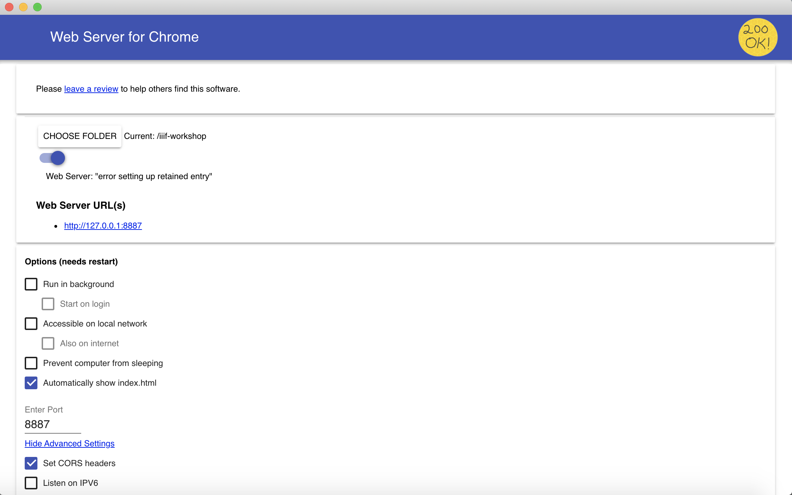

## Create your own manifest

### Building a manifest with a GUI

For this task, we'll use the very handy [Bodleian Manifest Editor](https://github.com/bodleian/iiif-manifest-editor), part of the [Digital Manuscripts Toolkit](http://dmt.bodleian.ox.ac.uk) developed by Text and Bytes for the Bodleian Library at the University of Oxford. It is a lightweight, web-based tool to manipulate existing IIIF manifests and create new ones without needing to edit the JSON-LD directly.

To begin, navigate to:

http://iiif.bodleian.ox.ac.uk/manifest-editor/

Alternative instances of the Bodleian Manifest Editor, in case the link above doesn't work for you:

- https://iiif-manifest-editor.textandbytes.com/
- http://bit.ly/dhsi-manifest-editor

After you've opened the editor interface,

1. Click "New Manifest."
1. Click "Add Canvas" and then click on the empty canvas that appears.

    

1. Now we need to add an image to this canvas. Click on the "Canvas Metadata" accordion panel on the right.
1. Click "Add Image to Canvas."
1. We want to use an image we are already hosting, so we select the "From info.json URI" option, and input our info.json URI from our local IIIF server. Then click "Submit URI."

    `http://127.0.0.1:8182/iiif/2/eddie.jpg/info.json`

    

1. We should now have an image in our view!
1. Finally, let's download the manifest, by clicking "Save Manifest" at the top of the page, and "Save.". Save this manifest in your `iiif-workshop` directory. 

  Great job! You now have created and downloaded a IIIF Presentation API manifest.

### Building a manifest with a GUI

Now you have a manifest you need to serve it using a HTTP server. To do this we will again use the Chrome Web Server. You should have this all setup from previous steps in the workshop but check the following:

 * Your manifest is in your `~/iiif-workshop` directory
 * Your Chrome web server is serving from the `iiif-workshop directory on port 8887 and has CORS enabled. 

    

 * You can access your manifest at the following URL: http://127.0.0.1:8887/manifest.json
